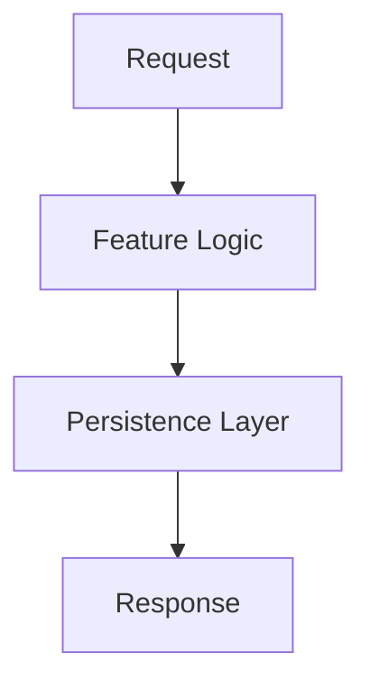

# 🌿 Feature Name (Summary Title)

**A premium, one-sentence description of what this feature achieves for the developer.**

---

## 🚀 Quick Start

Get up and running in under 30 seconds.

```python
# Import the feature
from eden import feature_name

# Minimalistic usage
app = feature_name.setup()
```

---

## 🧠 Conceptual Overview

Provide a deep-dive into "The Why." Why was this feature built? What architectural problem does it solve in high-end applications?

> [!NOTE]
> This is a good place to mention related features like **Multi-Tenancy** or **Dependency Injection**.

### Architectural Flow (Optional)



---

## 🛠️ Detailed Usage

### 1. Basic Usage (The Foundation)
The simplest way to use this feature in a greenfield project.

```python
# Code example here
```

### 2. Intermediate Scenario (Real-World SaaS)
How to apply this feature to a complex problem, such as multi-tenant isolation or background processing.

```python
# Code example here
```

### 3. Advanced Patterns (Power User)
Leveraging edge cases, performance hooks, or internal customizations.

```python
# Code example here
```

---

## 📖 API Reference

Detailed breakdown of classes and functions, sourced directly from the `eden/` codebase.

| Method | Parameters | Return Type | Description |
| :--- | :--- | :--- | :--- |
| `setup()` | `config: Dict` | `App` | Initializes the feature. |

> [!IMPORTANT]
> Mention any mandatory configuration settings or environment variables here.

---

## 💡 Best Practices & Tips

- **Rule 1**: Descriptive tip about performance.
- **Rule 2**: Descriptive tip about security.

> [!TIP]
> Use this feature in conjunction with `QuerySet` for maximum efficiency.

---

## ❓ Troubleshooting & FAQs

**Q: Why does X happen when I do Y?**
**A**: This is usually due to Z. To fix it, try [link to solution].

**Common Error**: `EdenFeatureError: Missing config`
**Solution**: Ensure your `.env` file contains the `EDEN_FEATURE_ID` key.
