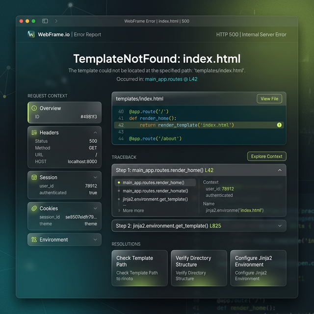

# 🌿 Eden Framework

**The Premium, Developer-First Python Web Framework.**

Eden is a high-performance, async-first web framework designed for developers who value aesthetics, security, and developer experience. Built on top of Starlette and SQLAlchemy 2.0, Eden provides a curated suite of tools that work together seamlessly, allowing you to focus on building "wow" applications from the first line of code.

---

## ✨ Key Features

- **💎 Premium Design System:** Built-in support for modern aesthetics, including Glassmorphism and specialized typography (Plus Jakarta Sans).
- **📝 Gorgeous Templating:** A custom directive-based template engine built on Jinja2 that keeps your HTML clean and readable.
- **🛠️ Zero-Config ORM:** SQLAlchemy 2.0 wrapped in a Django-inspired interface with automatic session injection.
- **🛡️ Built-in Security:** First-class middleware for CSRF, security headers, rate limiting, and API Token authentication.
- **🏢 Native Multi-Tenancy:** Async-safe row-level isolation built into the core ORM.
- **📈 Production Observability:** Unified Prometheus-compatible metrics and request-scoped performance telemetry.
- **🔌 Real-Time Synergy:** Native WebSocket support with secure channel authorization and reactive ORM broadcasts.
- **🚥 Premium Debug UI:** A stunning, glassmorphic error interface for effortless debugging.
- **🎯 Django-Inspired Features:** ControlPanel admin interface, ModelSchema forms, QuerySet managers, ChoiceField enums, and ModelConfig metadata.

---

## 🛠️ Installation

```bash
pip install eden-framework
```

---

## 📚 Documentation

Dive into our comprehensive guides and recipes to master the Eden Framework.

- 🌿 [The Eden Philosophy](docs/guides/philosophy.md): Why we built an "Integrated Framework" and how we solve micro-framework fatigue.

- 🏢 [Multi-Tenancy Master Class](docs/guides/multi-tenancy.md): Dynamic PostgreSQL schemas, row-level isolation, and fail-secure design.

- 🛡️ [Identity & RBAC](docs/guides/auth-and-rbac.md): Tiered admin hierarchies (Global vs. Tenant) and model-level security rules.

- 📝 [Model-to-Form Bridge](docs/recipes/forms-and-validation.md): Automatically deriving high-fidelity forms and UI metadata from your models.

---

## 🚀 Quickstart

Create `app.py`:

```python
from eden import Eden
from eden.db import Database

db = Database("sqlite+aiosqlite:///db.sqlite3")
app = Eden(debug=True)
app.db = db

async def home(request):
    return {"message": "Welcome to Eden! 🌿"}

@app.on_startup
async def startup():
    await db.connect(create_tables=True)

app.get('/')(home)

if __name__ == "__main__":
    app.run(port=8888)
```

Run your app:

```bash
## 🚀 Interactive Demo Dashboard

The best way to experience Eden is to see it in action. We've built a comprehensive interactive demo dashboard that showcases all major features.

To run the demos locally:

```bash
python app/support_app.py
```

Then visit **`http://localhost:8001/demo`** in your browser to explore:
- **HTMX Showcase**: Live search and fragment rendering.
- **WebSockets Chat**: Real-time multi-channel communication.
- **Background Tasks**: Async task queue with live progress tracking.
- **Stripe Payments**: Checkout and billing portal integration.
- **Multi-Tenant Dashboard**: Tenant isolation and resolution strategies.

---

## 💎 Premium Design System

Eden replaces the verbose Jinja2 tags with a clean, brace-based `@directive` syntax. It's fully line-preserving, ensuring that error traces point to the exact location in your original source.

### Control Flows

```html
@if (user.is_authenticated) {
    <div class="welcome">Welcome back, {{ user.name }}!</div>
} @else {
    <a href="/login">Please sign in</a>
}

@for (post in posts) {
    <article>{{ post.title }}</article>
} @empty {
    <p>No posts found.</p>
}
```

## 🧩 Components & Slots
Create reusable UI components with ease.

```html
@component("card", title="Profile", shadow="lg") {
    @slot("header") {
        
    }
    <p>{{ user.bio }}</p>
}
```

### Variable Assignment & Includes
```html
@let accent_color = "#2563EB"
@extends("layouts/base")
@include("partials/nav")
@csrf
```

---

## 🗄️ Fluent ORM

Eden's ORM eliminates the boilerplate of session management. Just define your model and start querying.

```python
from eden.db import EdenModel, StringField, BoolField

class User(EdenModel):
    name: Mapped[str] = StringField(max_length=100)
    email: Mapped[str] = StringField(max_length=255, unique=True)
    is_active: Mapped[bool] = BoolField(default=True)

# 🚀 Session-less queries (Auto-injected)
users = await User.filter(is_active=True)
user = await User.get(id=user_id)

# 📝 Creation & Updates
new_user = await User.create(name="Eden", email="hello@eden.dev")
await new_user.update(name="Eden Framework")
```

---

## 🎯 Django-Inspired Features

Eden now includes powerful Django-inspired features that enhance productivity while maintaining Eden's async-first architecture and type safety.

### ControlPanel - Admin Interface

Build admin interfaces with minimal code using Eden's ControlPanel system.

```python
from eden.panel import ControlPanel, BasePanel

class ArticlePanel(BasePanel):
    display_fields = ["title", "status", "author", "published_at"]
    search_fields = ["title", "content"]
    filter_fields = ["status", "published_at"]
    ordering = ["-published_at"]

# Register with admin
panel = ControlPanel()
panel.register(Article)(ArticlePanel)

# Mount admin routes
app.route("/admin/{path:path}")(panel.handle_request)
```

### ModelSchema - Form Validation

Type-safe form validation with automatic model binding.

```python
from eden.schemas import ModelSchema

class ArticleSchema(ModelSchema):
    async def clean_title(self, value: str) -> str:
        if len(value) < 5:
            raise ValidationError("Title too short")
        return value.strip()

    class Meta:
        model = Article
        required_fields = ["title", "content"]
        read_only_fields = ["id"]
```

### QuerySet Managers - Enhanced Queries

Custom managers with business logic and chainable methods.

```python
from eden.querysets import Manager

class ArticleManager(Manager):
    def published(self):
        return self.filter(status="published")

    def recent(self, days=7):
        cutoff = datetime.now() - timedelta(days=days)
        return self.filter(published_at__gte=cutoff)

# Usage
articles = await Article.objects.published().recent(30).all()
```

### ChoiceField - Enum Validation

Type-safe enums with display names and validation.

```python
from eden.enums import ChoiceField, ChoiceEnum

class Priority(ChoiceEnum):
    LOW = "low"
    HIGH = "high"

    @property
    def display_name(self):
        return self.value.title()

class Task(Model):
    priority = ChoiceField(choices=Priority, default=Priority.LOW)
```

### ModelConfig - Model Metadata

Comprehensive model configuration in a single Meta class.

```python
class Article(Model):
    title = StringField(max_length=200)
    content = TextField()

    class Meta:
        # API configuration
        api_resource = True
        api_required_fields = ["title", "content"]

        # Admin configuration
        admin_list_display = ["title", "status", "published_at"]
        admin_search_fields = ["title", "content"]

        # Database configuration
        db_table = "articles"
        indexes = [{"fields": ["status"]}]
```

---

## 🚥 Premium Debug Experience

Say goodbye to cryptic error messages. Eden's debug page is a full-featured diagnostic tool designed to look as good as your application.

- **High-Fidelity Code Explorer:** A gorgeous, syntax-highlighted code viewer that uses advanced traceback recovery to find the exact line in your original source, even for complex template errors.
- **Fuzzy Suggestions:** Intelligent diagnostics that suggest fixes for undefined variables (e.g., "Did you mean `user`?").
- **Variable Snapshots:** Inspect the live state of your template variables and request context at the moment of failure.
- **Environment Health:** Instant visibility into system, Python, and framework metadata.



---

## 🛡️ Robust Security & Middleware

Eden makes it effortless to protect your application with a unified middleware registry.

```python
from eden import Eden

app = Eden(debug=True)

# 🛡️ Built-in security & optimization
app.add_middleware("security")      # CSP, HSTS, XSS Protection
app.add_middleware("csrf")          # Cross-Site Request Forgery
app.add_middleware("ratelimit", max_requests=60)
app.add_middleware("cors", allow_origins=["*"])
app.add_middleware("gzip")          # Compression

# 🛡️ Role-Based Access Control (RBAC)
from eden.auth import roles_required, permissions_required

@app.get("/admin-only")
@roles_required(["admin"])
async def admin_area():
    return {"message": "Welcome, Admin"}
```

---

## ⚡ Integrated SaaS Features

Eden comes packed with everything you need to build a production-ready SaaS.

### 🔑 API Token Authentication

Securely authenticate requests using hashed API keys.

```python
from eden import APIKey

# Generate a new key for a user
key_obj, raw_key = await APIKey.generate(user_id=user.id, name="Pro Plan Key")
```

### 🏢 Multi-Tenancy

Scope your data automatically to the current tenant.

```python
class Post(EdenModel, TenantMixin):
    title: Mapped[str] = StringField()

# middleware handles scoping; queries are auto-filtered
posts = await Post.all() 
```

### 📧 Mail Service
Send beautiful, template-based emails with SMTP or Console backends.
```python
from eden import send_mail

await send_mail(
    subject="Welcome to Eden",
    recipient="hello@example.com",
    template="emails/welcome.html",
    context={"name": "Developer"}
)
```

### 💳 Payments & Billing
Native Stripe integration for managing customers and subscriptions.
```python
from eden import CustomerMixin

class User(EdenModel, BaseUser, CustomerMixin):
    ...

# Create checkout sessions or handle webhooks with WebhookRouter
```

### ☁️ S3 Storage
Store media files in the cloud with ease.
```python
from eden import storage, S3StorageBackend

storage.register("s3", S3StorageBackend(bucket="my-bucket"))
url = await storage.save("avatar.png", content)
```

### 🛠️ Professional Admin Panel
Manage your models with a premium, auto-generated dashboard.
```python
from eden.admin import admin

admin.register(User)
app.mount_admin() # Dashboard at /admin/
```

## 🏗️ Project Structure

A standard Eden project follows a clean, scalable layout:

```text
my_project/
├── app.py              # Application entry point
├── static/             # Assets (CSS, JS, Images)
├── templates/          # Eden HTML templates
├── models/             # Database models
├── routes/             # Route handlers
└── .env                # Configuration
```

---

## 📜 Roadmap

- [x] **API Token Auth:** Prefix-based secure key management.
- [x] **Multi-Tenancy:** Row-level isolation middleware and mixins.
- [x] **Email Service:** SMTP and template rendering support.
- [x] **Admin Panel:** Premium auto-generated CRUD interface.
- [x] **Payment Integration:** Stripe-first billing primitives.
- [x] **S3 Storage:** Async cloud storage backend.
- [x] **Supabase Storage:** Direct Supabase storage integration.
- [x] **Eden CLI:** Scaffolding and automated migrations.
- [x] **Real-time:** Native WebSocket support for reactive UIs and secure channel isolation.
- [x] **Observability:** Unified Prometheus-compatible metrics engine.
- [x] **Native HTMX Integration:** Deeply integrated partial rendering and fragment control.

---

## 🤝 Contributing

We welcome contributions! Please see our [Contributing Guide](CONTRIBUTING.md) for details on how to get started.

---

**Built with ❤️ for developers who love beautiful code.**
