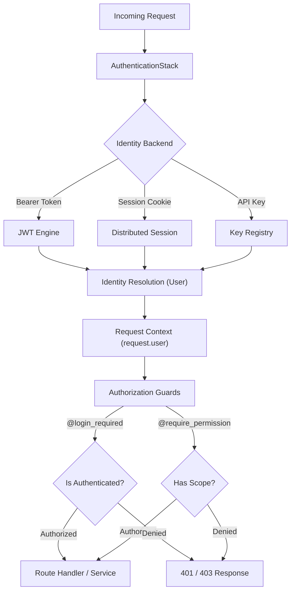
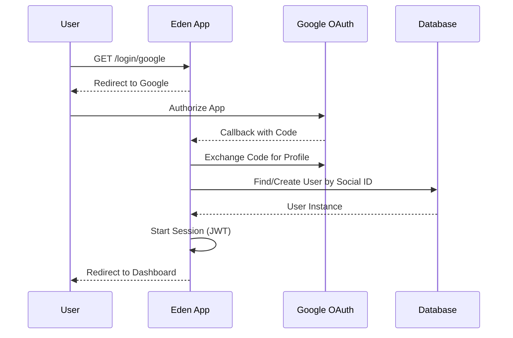

# 🔒 Identity, Authentication & Security

**Eden provides a unified, industrial-grade security suite that handles identity management, multi-backend authentication, and hierarchical RBAC with zero-friction integration.**

---

## 🧠 The Eden Security Pipeline

Security in Eden is built on a "Three Pillars" architecture. Each layer is independent yet works in harmony to provide end-to-end protection from the edge to the database.



---

## 🏗️ Core Identity: The `User` Model

Beyond authentication, Eden provides a robust identity system for managing users, passwords, and profile data. Whether you need the [JSON-Light](./user-identity.md#mode-a-json-light-lightweight) mode for simple apps or [Relational RBAC](./user-identity.md#mode-b-relational-rbac-enterprise) for enterprise scale, the setup is seamless.

Check out the [User Identity Guide](./user-identity.md) for details on:
* **Password Hashing** with Argon2id.
* **CLI Bootstrapping** of superusers.
* **Role Management** (JSON vs Models).

---

## ⚡ 60-Second Auth Setup

Ready to protect your first route? Follow this pattern to bootstrap a fully secure endpoint in under a minute.

```python
from eden import Eden
from eden.auth import login_required

app = Eden(secret_key="top-secret")

@app.get("/vault")
@login_required # 🛡️ The core guard — simple but powerful
async def secret_vault(request):
    return {"data": "This is accessible only to authenticated users."}
```

> [!IMPORTANT]
> **Automatic Security**: By simply adding `login_required`, Eden automatically handles the 401 Unauthorized redirect or response, depending on the request's `Accept` header.

---

## 👤 Identity: The `User` Model

All security revolves around the `User` model. Eden provides a standard implementation, but you can customize it easily by extending `BaseUser` and `Model`.

```python
from eden.auth import BaseUser
from eden.db import Model, f, Mapped

class UserAccount(BaseUser, Model):
    __tablename__ = "users"
    
    # Custom industrial-scale fields
    full_name: Mapped[str] = f(max_length=150)
    is_corporate: Mapped[bool] = f(default=False)
```

### High-Level Auth Actions
Eden provides a unified set of actions in `eden.auth.actions`. These handle password hashing (Argon2), validation, and database persistence in one call.

```python
from eden.auth import create_user, authenticate, login

async def handle_signup(request):
    # 1. Create a secure user (hashed with Argon2id)
    user = await create_user(email="alice@example.com", password="SecurePassword123!")
    
    # 2. Verify credentials
    authenticated_user = await authenticate(email="alice@example.com", password="SecurePassword123!")
    
    # 3. Bind to the session/JWT context
    if authenticated_user:
        await login(request, authenticated_user)
```

---

## 🛡️ Industrial RBAC (Hierarchy & Inheritance)

Eden's Role-Based Access Control (RBAC) supports **inheritance**. If a `manager` inherits from `employee`, they automatically gain all `employee` permissions.

### Defining Your Hierarchy
```python
from eden.auth import rbac

# Build the structural tree
rbac.add_role("employee")
rbac.add_role("manager", parents=["employee"])
rbac.add_role("admin", parents=["manager"])

# Assign functional permissions
rbac.add_permission("employee", "posts:view")
rbac.add_permission("manager", "posts:edit")
rbac.add_permission("admin", "posts:delete")

# Result: 'admin' has all 3 permissions automatically.
```

### Enforcing Permissions
Use decorators to protect your functions or Class-Based Views (CBVs).

```python
from eden.auth import require_role, require_permission

@app.get("/admin/metrics")
@require_role("admin")
async def view_metrics(request):
    return {"metrics": "..."}

@app.post("/posts/create")
@require_permission("posts:edit")
async def create_post(request):
    return {"status": "Post Created"}
```

---

## 🛰️ Social Login (OAuth Strategy)

Eden supports Google, GitHub, and custom OAuth providers out of the box with automated account linking.



To enable:
```python
from eden.auth.oauth import GoogleProvider

app.security.add_oauth_provider(
    GoogleProvider(
        client_id="YOUR_ID",
        client_secret="YOUR_SECRET"
    )
)
```

---

## 🔒 Security Middleware Stack

Protect your application from common web vulnerabilities by enabling the middleware suite.

```python
app = Eden(
    # ...
    middleware=[
        "eden.middleware.SessionMiddleware",
        "eden.middleware.CSRFMiddleware",       # Anti-Replay
        "eden.middleware.SecurityMiddleware",   # CSP, HSTS, XSS protection
        "eden.middleware.RateLimitMiddleware",  # Brute-Force prevention
    ]
)
```

---

## 💡 Best Practices

1. **Principle of Least Privilege**: Assign users the most restrictive roles possible.
2. **Stateless APIs**: Use JWT for mobile and external APIs to ensure horizontal scalability.
3. **Audit Everything**: Use the `AuditTrail` engine to track sensitive authentication events (login failures, password changes).

---

**Next Steps**: [Database & ORM](orm.md) | [SaaS Multi-Tenancy](tenancy.md)
