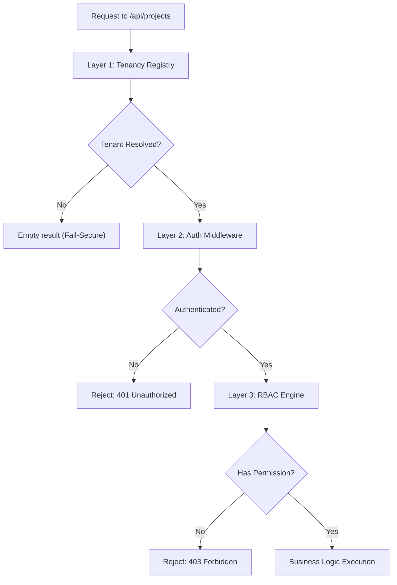

# Identity & RBAC Master Class: Enterprise Access Control

Eden’s Identity and Role-Based Access Control (RBAC) system is engineered for modern SaaS architectures. It provides a robust, "Defense-in-Depth" paradigm that secures your application from the **Database Query** up to the **Middleware**.

---

## 🧠 The Security Handshake

Eden ensures every request is verified at three distinct layers before reaching your business logic:



---

## 🏗️ 1. Tiered Admin Hierarchy

In a multi-tenant world, not all admins are created equal. Eden distinguishes between system-level operators and tenant-level administrators.

### The Global Framework Admin (The "Super Admin")
These users have `is_superuser=True`. They bypass all RBAC and Tenancy filters by default.
- **Scope**: Entire Framework (All Tenants).
- **Responsibilities**: Provisioning tenants, managing system health, global auditing.

### The Single-Tenant Admin
Users scoped to a specific `tenant_id` with an "Admin" role assigned *within that tenant*.
- **Scope**: Single Tenant only.
- **Responsibilities**: Managing tenant users, configuring localized business rules, viewing tenant reports.

---

## 🏗️ 2. Relational RBAC (SQL-Backed)

For enterprise-grade applications, Eden uses relational models to manage complex role hierarchies. This allows you to manage security policy via the **Admin Panel** without code deployments.

### Recursive Role Resolution
Roles in Eden are hierarchical. An "Admin" role can have "Editor" as a parent, inheriting all its permissions automatically.

```python
from eden.auth.models import Role, Permission

# Initialize deep hierarchy
user_role = Role(name="user")
editor_role = Role(name="editor", parents=[user_role])
admin_role = Role(name="admin", parents=[editor_role])

# Assign atomic permissions
view_perm = Permission(name="document:view")
edit_perm = Permission(name="document:edit")

user_role.permissions = [view_perm]
editor_role.permissions = [edit_perm]
```

When you call `user.has_permission("document:view")`, Eden's engine recursively traverses the tree to find the permission in any of the user's roles or their parent lineage.

---

## 🛡️ 3. Model-Level RBAC (Fail-Secure)

Beyond checking permissions in your routes, you should secure your data at the **Model level**. This ensures that even if a developer forgets a check in a view, the ORM will refuse to fetch or mutate the data if the user lacks access.

```python
from eden.db import Model, StringField
from eden.db.access import AccessControl, AllowRoles, AllowOwner

class SecretDocument(Model, AccessControl):
    title: str = StringField(max_length=200)
    user_id: uuid.UUID = f(ForeignKey("users.id"))
    
    __rbac__ = {
        "read": ["user", "admin"],
        "update": [AllowRoles("admin"), AllowOwner()],
        "delete": ["admin"]
    }
```

### Supported Rules:
- **`AllowPublic`**: Open to everyone.
- **`AllowAuthenticated`**: Any logged-in user.
- **`AllowOwner()`**: Checks if the `user_id` on the instance matches the current user.
- **`AllowRoles("editor", "admin")`**: Resolves against both direct and inherited roles.

---

## 🧬 4. Integration with Multi-Tenancy

Eden's RBAC is natively tenant-aware. When a user logs into a specific tenant, their roles are resolved **within that tenant's context**.

```python
# $ eden shell
>>> user = await User.get(email="admin@acme.com")
>>> await user.roles.all()
[<Role: Admin (Acme Corp)>]

# Switching to a different tenant context
>>> with TenantContext(other_tenant_id):
>>>     await user.roles.all()
[] # This user has no roles in the other tenant
```

---

## 🚀 Performance Tuning

Checking hierarchies recursively can be expensive. Eden uses an **Efficient Cache Layer** to store resolved permission maps for the duration of a request.

1. **Request Buffering**: Permissions are loaded once per request and cached in the `EdenContext`.
2. **SQL Optimization**: Relational RBAC uses `selectinload` for role hierarchies to prevent $N+1$ query problems during resolution.

> [!IMPORTANT]
> Always use `eden sync --all-tenants` after adding new Permissions or Roles to your models to ensure the database schema stays in lock-step with your security policy.

---

**Next: [The Master Class: Advanced UI Orchestration](advanced-ui-orchestration.md) →**
