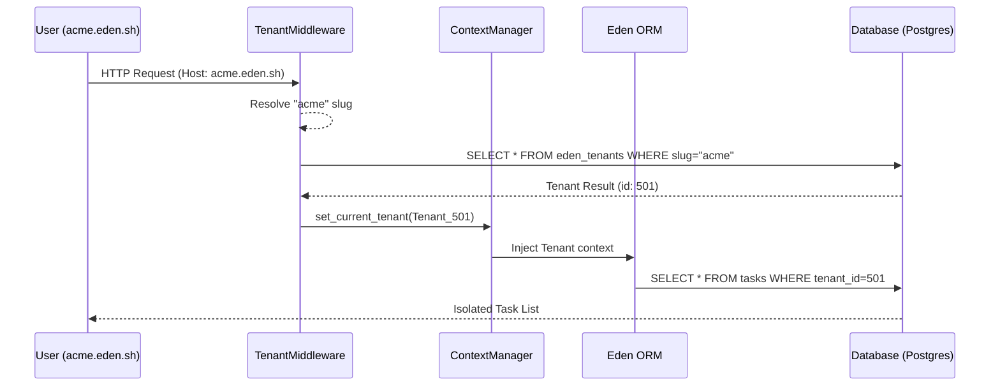

# 🏢 Multi-Tenancy: The SaaS Engine

**Build scalable, enterprise-ready SaaS applications with Eden's native multi-tenancy. Unlike traditional frameworks that require complex 3rd-party packages, Eden provides a "Bulletproof Isolation" engine built directly into the core ORM and Middleware layers.**

---

## 🧠 Architectural Mental Model

Multi-tenancy in Eden is designed around the **Request-Context-Isolation** loop. Every request is automatically scanned for a "Tenant Identifier" (Subdomain, Header, etc.), which is then injected into the framework's context to enforce strict data silos.

### The Tenancy Lifecycle



---

## 🚀 Step 1: Initial Setup

Multi-tenancy works best with a **Complete (Modular)** project structure. If you are starting fresh:

```bash
eden new my_saas
# Choose "Complete (Modular)"
```

### Activate the Middleware

In your `app/__init__.py` (or where you initialize `Eden`), register the `TenantMiddleware`. This middleware is responsible for "Discovering" which tenant is making the request.

```python
from eden import Eden
from eden.tenancy.middleware import TenantMiddleware

def create_app():
    app = Eden(title="Eden SaaS")

    # 🌿 Register Tenancy resolution
    app.add_middleware(
        TenantMiddleware,
        strategy="subdomain",  # Options: subdomain, header, path, session
        base_domain="eden.sh"  # Required for subdomain strategy
    )

    return app
```

---

## 🗄️ Step 2: Tenant-Isolated Data

In Eden, you don't manually filter every query. Instead, you use the `TenantMixin` to mark a model as "Isolated."

### Creating an Isolated Model

```python
from eden.db import Model, f
from eden.tenancy.mixins import TenantMixin

class Task(Model, TenantMixin):
    """
    A Task model that is automatically isolated to its owner Tenant.
    """
    __tablename__ = "tasks"

    title: str = f(max_length=200)
    is_completed: bool = f(default=False)
```

> [!IMPORTANT]
> **No-Leak Guarantee**
> When a model uses `TenantMixin`, Eden's ORM automatically appends `WHERE tenant_id = current_tenant_id` to **every** query. If no tenant is found in the current request context, Eden defaults to a **Fail-Secure** state and returns zero results rather than risk a data leak.

---

## 🛣️ Step 3: Resolution Strategies

Choose how your application identifies tenants based on your business model:

| Strategy | Usage Example | Best For |
| :--- | :--- | :--- |
| **`subdomain`** | `acme.myapp.com` | White-label SaaS, Corporate Portals. |
| **`header`** | `X-Tenant-ID: 123` | Mobile Apps, Internal APIs. |
| **`path`** | `myapp.com/t/acme/` | Developer tools, shared sandboxes. |
| **`session`** | `session["_tenant_id"]` | Simple multi-org apps within one login. |

---

## 🏗️ Step 4: Multi-Tenant Migrations

Eden distinguishes between **Shared Data** (e.g., Plans, Global Configs) and **Tenant Data** (e.g., Invoices, Tasks).

### Generating Migrations

When you run `eden db generate`, use the `--tenant` flag if you have isolated models. This marks the migration script with `__eden_tenant_isolated__ = True`.

```bash
# Generate migration for tenant-isolated models
eden db generate -m "Add tasks table" --tenant
```

### Applying Migrations

You can apply migrations to the shared schema or across all tenant schemas (if using dedicated PostgreSQL schemas):

```bash
# Apply migrations to the main public schema
eden db apply

# Apply tenant migrations across ALL discovered schemas
eden db apply --all-tenants
```

---

## 🛡️ Advanced: Fail-Secure Enforcement

Eden's `TenantMixin` provides a strict mode for development. If you try to query an isolated model without a tenant context (e.g., inside a background task where you forgot to set the tenant), Eden will raise a `TenancyIsolationError`.

### Manually Setting Context

If you are running a background task or high-level script, use the `set_current_tenant` context manager:

```python
from eden.tenancy.context import set_current_tenant

async def send_daily_reports(tenant):
    # Manually enter the tenant's context
    with set_current_tenant(tenant):
        tasks = await Task.all() # Correctly scoped to this tenant
        # ... process report
```

---

## 💡 Summary Checklist

1. **Scaffold**: Start with `eden new` (Complete).
2. **Setup**: Add `TenantMiddleware` in `app/__init__.py`.
3. **Isolate**: Apply `TenantMixin` to sensitive models.
4. **Migrate**: Use the `--tenant` flag for schema changes.
5. **Secure**: Verify isolation in your test suite using the `eden test` runner.

---

**Next Steps**: [Advanced Postgres RLS Isolation](tenancy-postgres.md) | [Billing & Tiering](payments.md)
