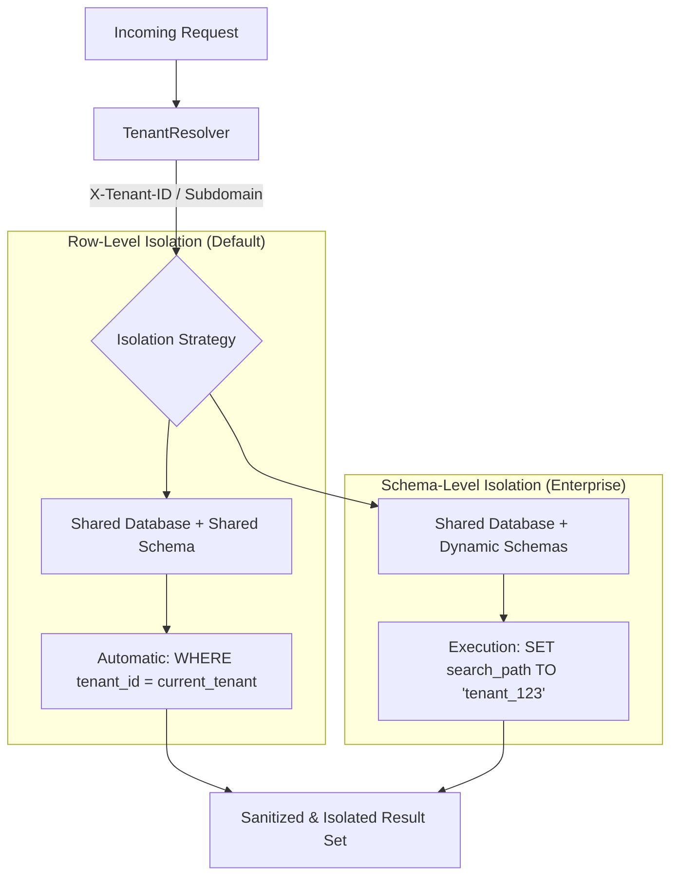

# 🏢 Multi-Tenancy & SaaS Architecture

**Eden is an industrial-grade, multi-tenant framework. It provides transparent data isolation, cross-tenant security guards, and flexible resolution strategies designed for the next generation of SaaS platforms.**

---

## 🧠 The Eden Multi-Tenant Pipeline

Multi-tenancy in Eden is "Invisible by Design." Once a model is marked for isolation, the framework automatically scopes all database queries, cache entries, and background tasks—enforcing a **"Fail-Secure"** default where no data is leaked if a context is missing.



---

## ⚡ 60-Second Multi-Tenancy

To isolate a data model, simply inherit from `TenantMixin` or `OrganizationMixin`.

```python
from eden.db import Model, f, Mapped
from eden.tenancy import TenantMixin, OrganizationMixin

# Scoped to a Client/Tenant
class Project(TenantMixin, Model):
    __tablename__ = "projects"
    name: Mapped[str] = f()

# Scoped to an Internal Organization
class Department(OrganizationMixin, Model):
    __tablename__ = "departments"
    title: Mapped[str] = f()
```

> [!IMPORTANT]
> **Fail-Secure Architecture**: If you attempt to query a `TenantMixin` model without an active tenant context, Eden will return an **empty result set** by default rather than leaking global data.

---

## 🏗️ Managing the Active Tenant

Eden can resolve the current tenant using built-in strategies or custom logic.

| Resolver | Trigger | Typical Use Case |
| :--- | :--- | :--- |
| **`SubdomainResolver`**| `acme.app.com` | Standard B2B SaaS. |
| **`HeaderResolver`** | `X-Tenant-ID` | Mobile Apps / Internal APIs. |
| **`UserResolver`** | `request.user` | Enterprise internal tools. |

### Strict Mode
For high-security environments, enable `TENANCY_STRICT_MODE=True` in your configuration. This causes Eden to raise a `TenancyIsolationError` immediately if an isolated model is queried outside of a valid tenant context.

---

## ⚡ Elite Patterns

### 1. Cross-Tenant Reporting (`AcrossTenants`)
System administrators often need to perform global reporting. Use the `AcrossTenants` context manager to temporarily disable isolation and access the entire database.

```python
from eden.tenancy import AcrossTenants

@app.get("/admin/global-stats")
@require_role("super_admin")
async def global_stats(request):
    async with AcrossTenants():
        # Scoping is disabled within this block
        total_revenue = await Invoice.sum("amount")
        return {"total_revenue": total_revenue}
```

### 2. Live-Sync Isolation
When using `@reactive` or WebSockets, Eden automatically isolates broadcast channels using the following format:
- `tenant:{tenant_id}:{table_name}`
- `org:{org_id}:{table_name}`

This ensures that real-time updates are only received by users within the same tenant.

---

## 📄 API Reference

### `eden.tenancy` Context Helpers

| Function | Returns | Description |
| :--- | :--- | :--- |
| `get_current_tenant_id`| `UUID \| None`| Returns the ID of the active tenant. |
| `set_tenant_context(id)`| `ContextMgr` | Binds a tenant ID to the current async task. |
| `AcrossTenants()` | `ContextMgr` | Bypasses all multi-tenant isolation rules. |

---

## 💡 Best Practices

1. **Test for Leakage**: Always use `TenantClient` in your tests to verify that Tenant A cannot access Tenant B's data.
2. **Audit Compliance**: Always log uses of `AcrossTenants()` to your audit trail.
3. **Global Models**: For models that should be shared across all clients (e.g. `ProductTiers`), simply omit the Mixin.

---

**Next Steps**: [Reactivity & Real-time](reactivity.md) | [Background Tasks](background-tasks.md)
