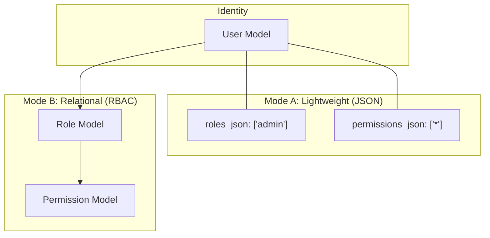

# 👤 Identity, Users & Access Control

**Eden provides a high-fidelity identity management system designed for industrial scalability. Whether you need a simple single-user blog or a multi-tenant enterprise SaaS with complex role hierarchies, Eden's "Secure-by-Default" architecture has you covered.**

---

## 🧠 The Identity Hub

Eden separates **Identity** (who you are) from **Authorization** (what you can do). This separation allows you to swap authentication methods (JWT, Session, OAuth) without changing your permission logic.



---

## ⚡ Creating Users

Eden offers multiple ways to initialize users, from the command line for developers to the service layer for application logic.

### 1. CLI: Initial Superuser

Use the CLI to create your first administrative user during development. This user is automatically granted "God Mode" (`is_superuser=True`).

```bash
# Hardened CLI Creation
eden auth createsuperuser \
    --full-name "Johnson Berko" \
    --email "berkojohnson@gmail.com" \
    --password "abc.123"
```

### 2. Service Helper: `create_user`
The `create_user` helper is the recommended way to handle signups in your routes. It handles validation, hashing, and persistence in one atomic operation.

```python
from eden.auth import create_user

async def register_member(email, password, name):
    # 🛡️ Automatically hashes with Argon2id
    user = await create_user(
        email=email,
        password=password,
        full_name=name,
        is_active=True
    )
    return user
```

### 3. Model-Level: `User.create`

For full control, use the ORM's `create` method.

```python
from eden.auth.models import User

user = await User.create(
    email="dev@eden.dev",
    full_name="Eden Developer",
    is_staff=True,
    roles_json=["developer"] # JSON-Light approach
)
user.set_password("secret-pass")
await user.save()
```

---

## 🔒 Password Management

Eden uses **Argon2id** (the winner of the Password Hashing Competition) by default. You never have to worry about salt management or iteration counts.

### Setting/Updating Passwords

Always use `set_password()`. It hashes the raw string and updates the `password_hash` field.

```python
user = await User.get(email="john@example.com")

# Update password securely
user.set_password("NewSecurePassword!2024")
await user.save()
```

### Verifying Passwords

Use `check_password()` to verify a user's input against the stored hash.

```python
is_valid = user.check_password("AttemptedPassword")
if is_valid:
    print("Welcome back!")
```

---

## 🏗️ Roles & Permissions: Two Modes

Eden supports two distinct modes for access control. You can even mix them if needed.

### Mode A: JSON-Light (Lightweight)

Perfect for fixed roles where you don't need a UI to manage permissions. Roles are stored as a simple `JSON` list on the user record.

* **Attributes**: `roles_json`, `permissions_json`
* **Best for**: "User", "Admin", "Moderator" setups.

```python
# Assigning via JSON
user.roles_json = ["editor", "billing"]
user.permissions_json = ["posts:view", "posts:create"]
await user.save()

# Check:
if "editor" in await user.get_roles():
    pass
```

### Mode B: Relational RBAC (Enterprise)

Best for complex apps where you want to manage roles and their associated permissions via the **Eden Admin Panel**.

* **Attributes**: `Role`, `Permission` models.
* **Best for**: Granular control, role inheritance, and dynamic permission mapping.

```python
from eden.auth.models import Role, Permission

# 1. Create a permission
can_edit = await Permission.create(name="post.edit", description="Ability to edit posts")

# 2. Create a hierarchical role
editor_role = await Role.create(name="Editor")
editor_role.permissions.append(can_edit)
await editor_role.save()

# 3. Assign role to user
user.roles.append(editor_role)
await user.save()
```

---

## 🛡️ Permission Guards

Protecting your code is easy with Eden's decorators.

### Route Protection

```python
from eden.auth import require_permission, login_required

@app.post("/settings/update")
@login_required
@require_permission("settings:write") # Works for both JSON and Model modes
async def update_settings(request):
    return {"status": "updated"}
```

### Template Protection

```html
@can("post:edit") {
    <button class="btn-edit">Edit Post</button>
}
```

---

## 💡 Best Practices

1. **Never store passwords in plain text**: Always use `set_password()`.
2. **Prefer Permissions over Roles**: Check for `post:edit` rather than `is_editor`. This makes your logic more resilient as your role structure evolves.
3. **Use unique index for Email**: Eden's base user already enforces this, but keep it in mind if you customize the model.
4. **God Mode**: Remember that `is_superuser=True` bypasses all permission checks. Use it sparingly.

---

**Next Steps**: [Advanced RBAC](./auth-rbac.md) | [Multi-Tenancy Isolation](./multi-tenancy.md)
