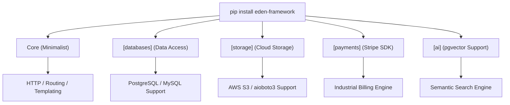

# 🛠️ Installation & Setup

**Setting up Eden is a professional, high-fidelity experience designed to get you from a blank terminal to a production-ready application in under 60 seconds.**

---

## ⚡ The 60-Second Start

If you're already in a virtual environment, run this to bootstrap a standard SaaS project:

```bash
pip install eden-framework[all]
eden new my-project --profile=saas
cd my-project
eden run
```

---

## 📋 Prerequisites

Before you begin, ensure your environment meets these professional specifications:

- **Python 3.11+**: Optimized for the latest `asyncio` performance features.
- **Virtual Environment**: Isolation is non-negotiable for industrial stability.
- **Terminal Engine**: A modern terminal (e.g., Warp, iTerm2, or Windows Terminal).
- **Database**: PostgreSQL (recommended) or SQLite (for local development).

---

## 🚀 Installation Tiers: Pick Your Engine

Eden is modular by design. You only pull in what your architecture requires.



---

### 1. The Core (Minimalist)
Ideal for microservices or lightweight proxies where every byte counts.
```bash
pip install eden-framework
```

### 2. The Data Tier (Standard)
Adds asynchronous drivers for **PostgreSQL** and **MySQL**.
```bash
pip install eden-framework[databases]
```

### 3. The Elite Suite (SaaS Full-Stack)
The recommended choice for building SaaS products. Includes **Stripe**, **AWS S3**, **Redis Caching**, **Background Workers**, and **Email**.
```bash
pip install eden-framework[all]
```

---

## 🏗️ Manual Orchestration

For architects who prefer a custom foundation, follow this manual sequence:

### 1. Environment Isolation

```bash
mkdir my-eden-app && cd my-eden-app
python -m venv .venv

# On Windows: .venv\Scripts\activate
# On Linux/MacOS: source .venv/bin/activate
```

### 2. Initialize the Entry Point

Create an `app.py` file with the following high-performance boilerplate:

```python
from eden import Eden

app = Eden(
    title="Elite Core Service",
    debug=True,
    secret_key="change-this-for-production"
)

@app.get("/")
async def index():
    return {"status": "Eden Architecture Active 🌿"}
```

---

## 🛡️ Verification Check

Execute these diagnostics to verify your engine is correctly tuned:

```bash
# Verify Framework Presence
python -c "import eden; print(f'Eden Version: {eden.__version__}')"

# Verify SQL Engine
python -c "import sqlalchemy; print('Alchemy 2.0+ Active')"

# Verify CLI Integration
eden info
```

---

## 💡 Elite Tips & Best Practices

- **Variable Synchronization**: Use a `.env` file from Day 1. Eden automatically detects it and populates your `app.config`.
- **Database Driver Selection**: For local development, `aiosqlite` is the pre-configured default. Always switch to `asyncpg` for PostgreSQL in production.
- **Global Forge CLI**: We recommend installing `eden-forge` globally to manage projects across different environments safely.

---

### 🚀 Next Steps

Now that your engine is running, dive into the **[Learning Path](learning-path.md)** or follow the **[Quick Start Guide](quickstart.md)**.
