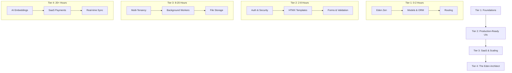

# 🎓 The Eden Master Class: Learning Path

**Mastering the Eden framework is a journey from building simple, beautiful interfaces to architecting high-scale, multi-tenant SaaS engines. This path is designed to guide you through the framework in tiers of complexity, ensuring you build "Wow" applications from Day 1.**

---

## 📍 Your Journey at a Glance

Eden's learning path is structured into four "Tiers" of mastery. Each tier builds upon the previous one, transitioning you from a developer to an architect.

---

## 🏁 Tier 1: The Foundations (Novice)
*Goal: Understand the request lifecycle and how to model data with zero friction.*

- **[The Eden Philosophy](philosophy.md)**: Understand the "Elite-First" mindset and why Eden chose these patterns.
- **[Installation & Setup](installation.md)**: Set up your elite development environment.
- **[Quick Start Guide](quickstart.md)**: Build your first "Hello World" Task Manager in 60 seconds.
- **[ORM & Database Mastery](../guides/orm.md)**: Master the `Mapped` and `f(...)` syntax for persistence without boilerplate.

---

## ⚡ Tier 2: Production-Ready UIs (Professional)
*Goal: Build secure, interactive web applications that feel like modern SPAs.*

- **[UI Master Class (High-Fidelity System)](../guides/ui-components.md)**: Master the Python/HTMX/Alpine trinity for premium SaaS interfaces.
- **[Full-Stack UI Recipes](../guides/recipes.md)**: Verified patterns for AI Search, Payments, and specialized storage.
- **[Forms & Professional Validation](../guides/forms.md)**: Industrial-grade data capture powered by Pydantic v2.
- **[Admin Dashboard](../guides/admin.md)**: Manage your production data with a premium, low-code control room.

---

## 🏗️ Tier 3: SaaS & Scaling (Expert)
*Goal: Scale your application with professional architecture and background infrastructure.*

- **[Multi-Tenancy (The SaaS Core)](../guides/tenancy.md)**: Row-level isolation and automatic data scoping for multi-client apps.
- **[Background Tasks & Resiliency](../guides/background-tasks.md)**: Offload heavy processing with Taskiq workers and distributed coordination.
- **[Atomic File Storage](../guides/storage.md)**: Manage industrial assets with S3, Supabase, or Local backends.
- **[Audit Trails & Governance](../guides/audit.md)**: Industrial-grade change tracking for compliance and debugging.

---

## 🚀 Tier 4: The Eden Architect (Master)
*Goal: Build "Wow" features that define modern, high-value AI and SaaS platforms.*

- **[AI & Semantic Search (RAG)](../guides/ai-search.md)**: Native vector embeddings and hybrid search with pgvector.
- **[SaaS Payments & Metered Billing](../guides/payments.md)**: Professional subscription lifecycles, webhooks, and complex Stripe billing.
- **[Real-time Sync & WebSockets](../guides/realtime.md)**: Live push updates directly from the ORM to the browser UI.
- **[Advanced RBAC & Authorization](../guides/auth-rbac.md)**: Deep permission checks and dynamic policy-based access.

---

## 🎓 Specialized Mastery Tracks

| If you are a... | Focus on... |
| :--- | :--- |
| **API Architect** | [Versioning](../guides/api-versioning.md), [OpenAPI Integration](../guides/openapi.md), [Service Layer](../guides/service-layer.md) |
| **SaaS Founder** | [Multi-Tenancy](../guides/tenancy.md), [SaaS Payments](../guides/payments.md), [Admin Panel](../guides/admin.md) |
| **Fullstack Disruptor** | [HTMX Interactivity](../guides/htmx.md), [Real-time Sync](../guides/realtime.md), AI-First Search |
| **Security Engineer** | [CSRF Protection](../guides/csrf-protection.md), [Role-Based Access](../guides/auth-rbac.md), [Audit Trails](../guides/audit.md) |

---

> [!IMPORTANT]
> **Elite Note**: All code examples in this learning path are **verified** against the Eden core using the `EdenDoc` verification engine.
