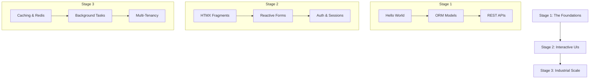

# The Eden Journey: Learning Path 🗺️

**Welcome to the definitive roadmap for mastering the Eden Framework. Whether you are a solo developer building a MVP or an architect scaling an enterprise monolith, this path ensures you learn the right concepts in the right order.**

---

## 📍 Your Journey at a Glance

---

## 🏁 Stage 1: The Foundations (0-2 Hours)

**Goal**: Understand the request lifecycle and how to model data with zero friction.

### 1. The "Eden Zen"

* **What to do**: Read the [Framework Philosophy](philosophy.md).
* **Key Concept**: "Unified Context"—why Eden merges the database, API, and UI into a single logical unit.
* **Achievement**: Understand why you'll never write a manual "Migration" or "Serializer" again.

### 2. Your First App

* **What to do**: Follow the [Quick Start](quickstart.md).
* **Key Concept**: The `Eden()` object and the `@app.route` system.
* **Example Source**: `examples/01_hello.py`

### 3. The Modern ORM

* **What to do**: Learn the `Mapped` and `f(...)` syntax in the [ORM Guide](../guides/orm.md).
* **Key Concept**: Persistence without boilerplate.
* **Example Source**: `examples/02_rest_api.py`

---

## ⚡ Stage 2: Interactive UIs (2-6 Hours)

**Goal**: Build feature-rich web applications that feel like Single Page Apps (SPAs) but use only Python and HTML.

### 4. Directives & Fragments

* **What to do**: Master the template engine. Read [Templating Guide](../guides/templating.md).
* **Key Concept**: `@fragment` and `@csrf`.
* **Achievement**: Render a partial page update without writing a single line of JavaScript.

### 5. Secure Auth & Identity

* **What to do**: Implement a login flow using the [Security Guide](../guides/auth.md).
* **Key Concept**: Cookie-based sessions vs. JWT.
* **Example Source**: `examples/04_authentication.py`

---

## 🏗️ Stage 3: Industrial Scale (6-12+ Hours)

**Goal**: Optimize for high traffic, background processing, and SaaS multi-tenancy.

### 6. Caching & Performance

* **What to do**: Integrate Redis. See the [Caching Guide](../guides/caching.md).
* **Key Concept**: The `app.cache` unified interface.

### 7. Background Automation

* **What to do**: Move heavy logic to workers. See [Background Tasks](../guides/background-tasks.md).
* **Key Concept**: `Taskiq` integration and the `kiq()` method.
* **Example Source**: `examples/07_production.py`

### 8. Multi-Tenancy (The SaaS Layer)

* **What to do**: Build an organization-aware app. Read [Tenancy Guide](../guides/tenancy.md).
* **Key Concept**: `TenantModel` and automatic row-level isolation.
* **Achievement**: Launch a white-label SaaS product where users' data is mathematically isolated by default.

---

## 🎓 Graduation: The Monolith Master

Once you've completed these stages, you're ready to build anything from a simple blog to a global financial system. 

> [!TIP]
> **Pro-Tip**: Keep the [Premium Code Gallery](example-snippets.md) bookmarked. It contains the most efficient ways to solve complex architectural problems in Eden.

---

### 🚀 Ready to Start?

[Install Eden Now](installation.md) or jump straight into the [Quick Start](quickstart.md).

