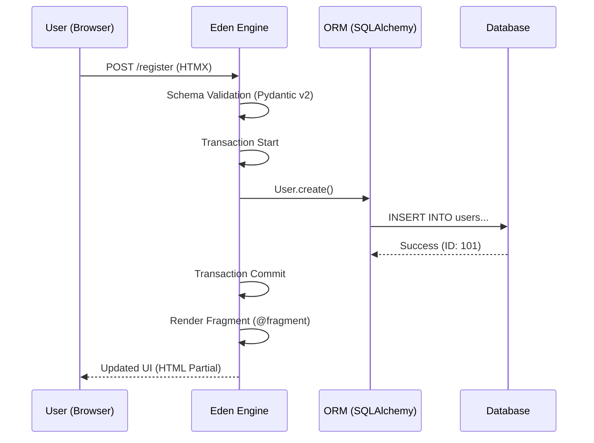

# The Eden Ethos 🌿

**Eden is not just another web framework; it is a philosophy of "Elite-First" development.**

Born from the friction of modern web architecture, Eden was designed for the developer who refuses to choose between **speed (DX)**, **industrial performance**, and **impenetrable security**. In Eden, we believe you should never have to compromise.

---

## 🏛️ The Three Pillars of Eden

### I. Industrial Performance (Async-Native)

Every line of Eden is built for the modern, asynchronous web. From our database drivers to our template rendering engine, everything is non-blocking. This ensures your application handles thousands of concurrent users with the grace of a specialized monolith.

```python
from eden import Model, f, Mapped

class User(Model):
    is_active: Mapped[bool] = f(default=True)

async def get_active_users():
    # Eden supports clean ActiveRecord selection
    return await User.filter(is_active=True).all()
```

### II. The Forge (Developer Joy)

We believe a framework should be your architect, not your master. Our CLI, **The Forge**, acts as an automated partner—scaffolding resources, models, and migrations so you can move from "Idea" to "Production" at the speed of thought.

### III. The Vault (Security as a Primitive)

In Eden, security is not a plugin; it is a first-class citizen. CSRF protection, secure headers, and row-level multi-tenancy are baked into the core engine. Your applications are safe before you even write your first route.

---

## 💎 Core Values

### 🎨 Aesthetics by Default

Professional software should look professional. From built-in design tokens to the glassmorphic debug interface, Eden ensures your project feels premium from day one.

### 📜 Conventional Excellence

We follow "Convention over Configuration," but without the "magic" that obscures logic. Eden provides sane, high-performance defaults that "just work," while giving you the hooks to peel back layers when needed.

### 🛡️ Secure by Design

Security isn't a checkbox; it's the foundation. Argon2 password hashing, automatic CSRF, and strict tenant isolation are not optional additions—they are the heart of the framework.

---

## ⚡ The Eden Difference

| Feature | Legacy Frameworks | The Eden Way |
| :--- | :--- | :--- |
| **IO Model** | Often Sync/Mixed | **100% Async-Native** |
| **Security** | Manual/Opt-in | **The Vault (Automatic)** |
| **Frontend** | Separate SPA / Heavy JS | **HTMX Fragments (unified)** |
| **Multi-Tenancy** | Hand-rolled / Risky | **Built-in Isolation** |
| **Database** | Heavy Migrations | **Automatic Evolution** |

---

## 🧠 The Unified Context

Eden merges the Backend, Database, and Frontend into a single **Unified Context**. This eliminates the "Data Mismatch" between serializing objects for an API and deserializing them in a frontend framework.



---

## 🎓 The Eden Way vs. Traditional

### User Registration Pattern

**The Eden Way** ✅ (Unified, secure, high-performance)

```python
from eden import Eden, Model, f, Mapped
from eden.validators import Schema, field, EmailStr

app = Eden(secret_key="dev-secret")

class User(Model):
    email: Mapped[str] = f(unique=True)

class RegisterSchema(Schema):
    email: EmailStr
    password: str = field(min_length=8)

@app.post("/register")
async def register(request, credentials: RegisterSchema):
    # Validation, CSRF, and Password Hashing are all handled automatically
    user = await User.create(
        email=credentials.email, 
        password=credentials.password
    )
    return {"user": user.to_dict()}
```

---

## 🚫 When *Not* to Use Eden

Eden is powerful but opinionated. You might prefer specialized alternatives if:

- **Total Flexibility**: If you need to manually manage every byte of the HTTP socket.
- **Micro-Optimization**: If you need to write low-level C-extensions for your core routing logic.
- **Legacy Persistence**: If you are tied to a database schema that cannot be mapped to modern ORM principles.

---

### 🚀 Next Steps

Ready to build something elite? [Install the Eden Core](installation.md) or dive into the [Quick Start Guide](quickstart.md).
