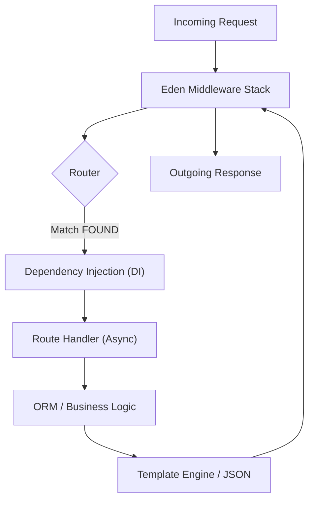

# Quick Start 🚀

**Eden is designed to take you from a single idea to a production-ready application in minutes. This guide walks you through building a feature-rich "Task Manager" with routing, interactive templates, and a database—all while demonstrating the framework's zero-friction philosophy.**

---

## 🏗️ The Eden Lifecycle: From Request to Render

Before we write code, understand how Eden handles your application. It abstracts the complexity of ASGI, database management, and middleware into a unified, high-performance pipeline.



---

## ⚡ Step 1: Your First Eden App

Create a file named `app.py`. Eden's core `Eden` class is a high-level wrapper that handles everything from security to database bootstrapping automatically if configured correctly.

```python
from eden import Eden, Request

# Initialize with a secret_key to enable sessions, CSRF, and security middleware

app = Eden(
    title="Eden Task Manager",
    secret_key="dev-secret-key-change-in-prod",
    debug=True
)

# Root endpoint - Returns a high-performance JSON response

@app.get("/")
async def home():
    return {"status": "online", "message": "Welcome to Eden! 🌿"}

if __name__ == "__main__":
    app.run(host="127.0.0.1", port=8000)
```

> [!IMPORTANT]
> **Automatic Security**: By simply providing a `secret_key`, Eden automatically injects `SessionMiddleware`, `CSRFMiddleware`, and `SecurityMiddleware` into your stack. No manual wiring required.

---

## 💾 Step 2: Defining Industrial Models

Eden's ORM uses modern Python type hints (`Mapped`) combined with a "Zen" helper `f()` that automatically chooses the correct database column type.

Add this task model to your `app.py`:

```python
from eden import Model, f
from sqlalchemy.orm import Mapped

# Configure SQLite - Eden bootstraps the database on the first request

app.state.database_url = "sqlite+aiosqlite:///tasks.db"

class Task(Model):
    """
    A SaaS-ready Task model. 
    Eden automatically adds 'id', 'created_at', and 'updated_at'.
    """
    title: Mapped[str] = f(max_length=200)
    description: Mapped[str | None] = f(nullable=True)
    completed: Mapped[bool] = f(default=False)

# List all tasks with a single line

@app.get("/tasks")
async def list_tasks():
    tasks = await Task.all()
    return {"count": len(tasks), "tasks": tasks}

# Create a task from a JSON request

@app.post("/tasks")
async def create_task(request: Request):
    data = await request.json()
    task = await Task.create(**data)
    return task, 201
```

> [!TIP]
> **ActiveRecord Pattern**: Every Eden model is an "ActiveRecord". You can call `await Task.all()`, `await Task.get(id)`, or `await task.save()` directly without managing a manual session.

---

## 🎨 Step 3: Premium Templating & HTMX

Eden's templating engine is built for "Visual Excellence." It allows you to build interactive UIs using only Python and HTML, powered by built-in **HTMX** integration.

### Create `templates/base.html`

We use a global layout with modern typography and a subtle glassmorphism header.

```html
<!DOCTYPE html>
<html lang="en">
<head>
    <meta charset="utf-8">
    <meta name="viewport" content="width=device-width, initial-scale=1">
    <title>@span(title | default("Eden Tasks"))</title>
    <script src="https://cdn.tailwindcss.com"></script>
</head>
<body class="bg-slate-50 text-slate-900 font-sans">
    <nav class="sticky top-0 z-50 bg-white/80 backdrop-blur-md border-b border-slate-200 py-4 mb-8">
        <div class="max-w-4xl mx-auto px-6 flex justify-between items-center">
            <h1 class="text-2xl font-black bg-gradient-to-r from-blue-600 to-teal-500 bg-clip-text text-transparent">EDEN</h1>
        </div>
    </nav>
    
    <main class="max-w-4xl mx-auto px-6 pb-20">
        @yield("content")
    </main>
</body>
</html>
```

### Create `templates/tasks.html`

Use the `@fragments` directive to allow HTMX to update only parts of the page.

```html
@extends("base")

@section("content") {
    <div class="flex justify-between items-end mb-10">
        <div>
            <h2 class="text-4xl font-extrabold tracking-tight">Your Tasks</h2>
            <p class="text-slate-500 mt-1">Manage your productivity with Eden's reactive ORM.</p>
        </div>
    </div>

    <!-- Task Form -->
    <section class="bg-white p-8 rounded-2xl shadow-sm border border-slate-100 mb-10">
        <form hx-post="/tasks/create" hx-target="#task-list" hx-swap="beforeend" class="flex gap-4">
            @csrf
            <input type="text" name="title" placeholder="What needs to be done?" 
                   class="flex-1 bg-slate-50 border-none rounded-xl px-4 py-3 focus:ring-2 focus:ring-blue-500" required>
            <button class="bg-blue-600 text-white px-6 py-3 rounded-xl font-bold hover:bg-blue-700 transition-all">
                Add Task
            </button>
        </form>
    </section>

    <!-- Interactive Task List -->
    <div id="task-list" class="space-y-4">
        @for (task in tasks) {
            @fragment("task-item") {
                <div class="bg-white p-5 rounded-2xl shadow-sm border border-slate-100 flex items-center justify-between group">
                    <div class="flex items-center gap-4">
                        <div class="w-2 h-2 rounded-full @if(task.completed) bg-slate-300 @else bg-blue-500 @endif"></div>
                        <span class="text-lg font-medium @if(task.completed) line-through text-slate-400 @endif">
                            @span(task.title)
                        </span>
                    </div>
                </div>
            }
        }
    </div>
}
```

---

## 🔗 Step 4: Connecting the Dots

Update your `app.py` to bridge the models and templates.

```python
from eden import render_template

@app.get("/view")
async def view_tasks():
    """Server-side render of current tasks."""
    return render_template("tasks.html", {"tasks": await Task.all()})

@app.post("/tasks/create")
async def create_task_htmx(request: Request):
    """Handles both AJAX (HTMX) and traditional form posts."""
    form = await request.form()
    task = await Task.create(title=form.get("title"))
    
    # If it's an HTMX request, render just the fragment
    if request.headers.get("HX-Request"):
        return render_template("tasks.html", {"task": task}, fragment="task-item")
    
    return request.app.redirect("/view")
```

---

## 🚀 Next Steps: Master the Framework

You've just built a modern, reactive application. Now, dive deeper into the systems that make Eden the platform of choice for SaaS and Enterprise apps.

| Module | Purpose | Guide |
| :--- | :--- | :--- |
| **Project Structure** | Scale from one file to a Domain-Driven Monolith. | [Structure Guide](../getting-started/structure.md) |
| **Authentication** | Multi-backend support (JWT, Session, OAuth). | [Security Guide](../guides/auth.md) |
| **Reactive ORM** | Real-time updates without writing a single line of JS. | [ORM Guide](../guides/orm.md) |
| **DI System** | Enterprise-grade Dependency Injection. | [DI Guide](../guides/dependency-injection.md) |
| **Audit Trails** | Automatic tracking of every database change. | [Audit Guide](../guides/audit.md) |

---

> [!TIP]
> **Elite Tip**: Check out the [Killer Features](../guides/killer-features.md) guide to see how to enable "Automatic Dashboards" and "Reactive WebSockets" with a single line of configuration.
