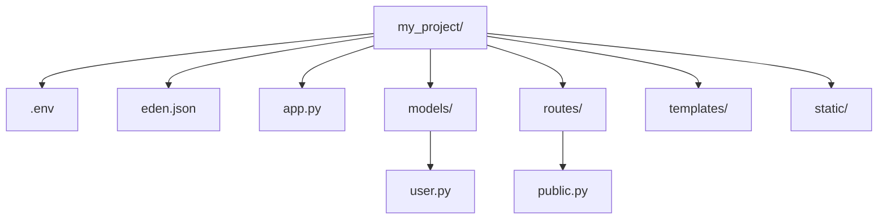

# Project Structure 🏗️

A standard Eden project follows a clean, modular layout designed for both small sites and enterprise-grade SaaS applications.

## The Default Layout

When you run `npx eden new`, your project will look like this:

```text


## Core Configuration

### `.env`
Your project secrets and environment-specific toggles live here. Eden automatically loads these into `app.config`.

```text
DEBUG=True
SECRET_KEY=y0ur-5ecr3t-k3y
DATABASE_URL=sqlite+aiosqlite:///db.sqlite3
```

### `eden.json`
This file contains framework-level metadata used by **The Forge** and the CLI to manage your project's identity and dependencies.

## Core Files Explained

### `app.py`
This is where the `Eden` application is instantiated. It serves as the glue for your middleware, database, and route registrations.

### `/templates`
By default, Eden looks here for your HTML files. Note that Eden templates use the `@directive` syntax (e.g., `@if`, `@for`) instead of traditional curly-brace blocks for control flow.

### `/models`
Domain models inheriting from `EdenModel` live here. Eden automatically handles the mapping to your database via SQLAlchemy 2.0.

### `/routes`
We recommend grouping related routes into sub-folders or modules. Large applications should use the `Router` class to keep `app.py` clean.

### `/static`
Files placed here are served automatically. In production, we recommend serving these via a CDN or a web server like Nginx, but Eden handles them natively for development.

## Scalability Tip
As your project grows, encapsulate your domain logic into **Resources**. A Resource in Eden combines a Model, a Router, and Forms into a single unit of functionality.

---

**Next Steps**: [Routing Guide](../guides/routing.md)
