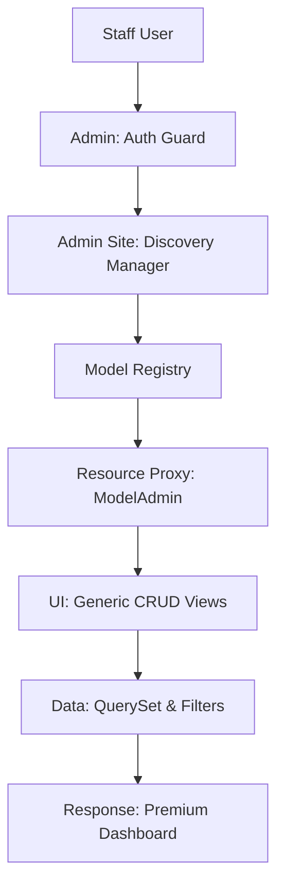

# 🛠️ High-Performance Admin Panel

**Manage your SaaS architecture with style. Eden features a zero-config, auto-generated administration interface that allows you to manage your application's data—from simple records to complex tenant-scoped metrics—using a premium, low-code interface.**

---

## 🧠 The Admin Architecture

Eden's Admin Panel is more than just a CRUD interface; it's a **Resource Controller**. It automatically understands your ORM models, relationships, and multi-tenant constraints, providing a safe and intuitive way for staff to manage production data.



---

## 🚀 Mounting & Registration

To enable the admin panel, simply register your models and mount it to your `Eden` app.

```python
from eden import Eden
from eden.admin import admin, ModelAdmin
from eden.db import Model, f

app = Eden()

class Project(Model):
    name: str = f(max_length=255)
    status: str = f(max_length=50)

# 1. Register with a dedicated class for customization
@admin.register(Project)
class ProjectAdmin(ModelAdmin):
    list_display = ["name", "status_badge", "created_at"]
    search_fields = ["name"]
    
    @admin.display(description="Status")
    def status_badge(self, obj):
        color = "green" if obj.status == "active" else "gray"
        return f'<span class="badge badge-{color}">{obj.status}</span>'

# 2. Mount to your Main app
app.mount_admin(path="/admin")
```

---

## 📊 The Mission Control Dashboard

Build visual summaries of your system health and SaaS metrics using declarative widgets.

```python
from eden.admin import admin, StatWidget, ChartWidget

@admin.dashboard
class SaaSGrowthDashboard:
    def get_widgets(self):
        return [
            # High-level counters
            StatWidget(label="Total Revenue", value="$1.5M", intent="success"),
            StatWidget(label="Active Clusters", value="42"),
            
            # Interactive charts
            ChartWidget(
                label="Signups (30 Days)",
                endpoint="/admin/api/stats/signups",
                type="area"
            )
        ]
```

---

## 🏗️ Advanced UI Control

### 1. Relational Inlines
Manage related models (like Tasks for a Project) directly on the parent edit page.

```python
from eden.admin import TabularInline, admin

class TaskInline(TabularInline):
    from .models import Task
    model = Task
    extra = 3 # Show 3 empty rows for quick entry

@admin.register(Project)
class ProjectAdmin(ModelAdmin):
    inlines = [TaskInline]
```

### 2. Bulk Actions
Perform operations on multiple records at once (e.g., batch-suspending users).

```python
from eden.admin import Action, admin

class SuspendAction(Action):
    name = "suspend_users"
    label = "Suspend Selected Users"
    
    async def execute(self, ids: list[str], model):
        await model.filter(id__in=ids).update(is_active=False)
        return {"message": f"Suspended {len(ids)} users."}

@admin.register(User)
class UserAdmin(ModelAdmin):
    actions = [SuspendAction]
```

---

## 🏢 Multi-Tenancy & Search Scaping

In a SaaS, it is vital that support staff only see the data belonging to their assigned account or tenant. Eden provides hooks to enforce this isolation.

```python
class TenantScopedAdmin(ModelAdmin):
    async def get_queryset(self, request):
        qs = await super().get_queryset(request)
        # If user is not a super-admin, scope all data to their tenant
        if not request.user.is_superuser:
            return qs.filter(tenant_id=request.tenant_id)
        return qs
```

---

## 📄 API Reference

### `ModelAdmin` Settings

| Property | Type | Description |
| :--- | :--- | :--- |
| `list_display` | `list[str]` | Fields to show in the list view. |
| `search_fields` | `list[str]` | Fields included in the search bar. |
| `list_filter` | `list[str]` | Sidebar filter options. |
| `inlines` | `list[Inline]`| Related models to show on edit pages. |
| `actions` | `list[Action]`| Bulk operation classes. |

---

## 💡 Best Practices

1. **Search is King**: Always define `search_fields` to prevent performance degradation when browsing thousands of records.
2. **Permission Gating**: Override `has_permission(request)` on your `AdminSite` to restrict access to internal staff only.
3. **ReadOnly Sensitive Data**: Mark fields like `password_hash` as `readonly_fields` to prevent accidental changes in the UI.
4. **Audit History**: Every change made via the Admin Panel is tracked in the `AuditLog`. Use the "History" view to see a diff of changes.

---

**Next Steps**: [Exploring the CLI](cli.md) | [Background Tasks](background-tasks.md)
