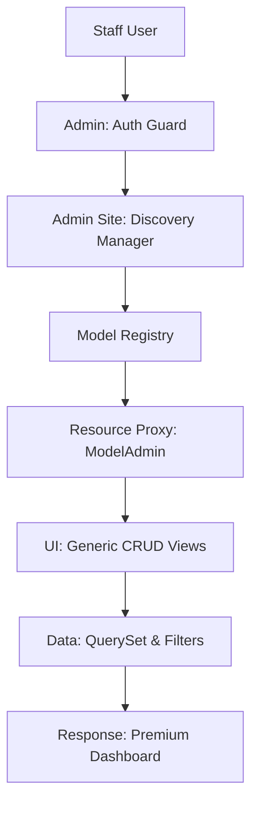

# 🛠️ High-Performance Admin Panel

**Manage your SaaS architecture with style. Eden features a zero-config, auto-generated administration interface that allows you to manage your application's data—from simple records to complex tenant-scoped metrics—using a premium, low-code interface.**

---

## 🧠 Conceptual Overview

Eden's Admin Panel is more than just a CRUD interface; it's a **Resource Controller**. It automatically understands your ORM models, relationships, and multi-tenant constraints, providing a safe and intuitive way for staff to manage production data.

### The Admin Architecture



---

## 🚀 Mounting & Registration

To enable the admin panel, simply register your models and mount it to your `Eden` app.

```python
from eden import Eden
from eden.admin import admin, ModelAdmin
from eden.db import Model, f, Mapped

app = Eden()

class Project(Model):
    name: Mapped[str] = f(max_length=255)
    status: Mapped[str] = f(max_length=50)

# 1. Register with a dedicated class for customization
@admin.register(Project)
class ProjectAdmin(ModelAdmin):
    list_display = ["name", "status", "created_at"]
    search_fields = ["name"]

# 2. Register simple models directly (uses ModelAdmin defaults)
class User(Model):
    email: Mapped[str] = f(unique=True)

admin.register(User)

# 3. Mount to your Main app
app.mount_admin(path="/admin")
```

---

## 📦 Core Model Auto-Registration

Eden's Admin Site is designed to be "batteries-included." By default, the framework automatically registers essential system models during the `build_router` phase so you can manage your application's infrastructure immediately—**no extra code required**.

### Automatically Registered Models

- **`User`**: Full management of staff and customer accounts.
- **`AuditLog`**: A searchable history of every change made via the admin or API.
- **`APIKey`**: Management of server-to-server credentials and permissions.

### Customizing Core Models

If you need to customize the interface for a core model (e.g., adding custom filters to `AuditLog`), simply re-register it with your own `ModelAdmin` class:

```python
from eden.db import Model, f, Mapped
from eden.admin import admin, ModelAdmin

class User(Model):
    email: Mapped[str] = f(unique=True)
    is_active: Mapped[bool] = f(default=True)
    custom_field: Mapped[str] = f(nullable=True)

@admin.register(User)
class MyUserAdmin(ModelAdmin):
    list_display = ["email", "is_active", "custom_field"]
    # This overrides the default registration
```

---

## 📊 The Professional Dashboard

Eden allows you to build a visual "Mission Control" for your SaaS using declarative widgets.

```python
from eden.admin import admin, StatWidget, ChartWidget

@admin.dashboard
class MainDashboard:
    def get_widgets(self):
        return [
            # High-level counters
            StatWidget(label="Total Revenue", value="$1.5M"),
            StatWidget(label="Active Clusters", value="42"),
            
            # Interactive charts (linked to telemetry data)
            ChartWidget(
                label="Signups (30 Days)",
                endpoint="/admin/api/stats/signups",
                type="area"
            )
        ]
```

---

## 🏗️ Advanced UI Control

### 1. The List Interface

Customize how your data is displayed, filtered, and searched.

```python
from eden.admin import admin, ModelAdmin
from eden.db import Model, f, Mapped

class User(Model):
    email: Mapped[str] = f(unique=True)
    is_active: Mapped[bool] = f(default=True)
    is_staff: Mapped[bool] = f(default=False)

class UserAdmin(ModelAdmin):
    # Columns to show in the list view
    list_display = ["avatar_preview", "email", "status_badge", "is_staff"]
    
    # Custom HTML rendering for badges
    @admin.display(description="Status")
    def status_badge(self, obj):
        color = "green" if obj.is_active else "gray"
        return f'<span class="badge badge-{color}">Active</span>'
    
    # Needs actual implementation for snippet to work
    def avatar_preview(self, obj):
        return ""
```

### 2. Inlines (Relational Editing)

Manage related models (like Comments for a Post or Licenses for a User) on the same parent page.

```python
from eden.admin import admin, ModelAdmin, TabularInline
from eden.db import Model, f, Mapped

class License(Model):
    __tablename__ = "licenses"
    key: Mapped[str] = f()

class LicenseInline(TabularInline):
    model = License
    extra = 1

class Subscription(Model):
    __tablename__ = "subscriptions"
    plan: Mapped[str] = f()

@admin.register(Subscription)
class SubscriptionAdmin(ModelAdmin):
    inlines = [LicenseInline]
```

---

## 🏢 Multi-Tenancy & Isolation

In a SaaS, it is vital that support staff only see the data belonging to their assigned account or tenant. Eden provides hooks to enforce this isolation.

```python
from eden.admin import ModelAdmin

class TenantScopedAdmin(ModelAdmin):
    async def get_queryset(self, request):
        qs = await super().get_queryset(request)
        # ❌ NEVER show data from other tenants unless user is a Superuser
        if not request.user.is_superuser:
            return qs.filter(tenant_id=request.tenant.id)
        return qs

    async def save_model(self, request, obj, form_data, change):
        # Automatically assign the current tenant context on creation
        if not change:
            obj.tenant_id = request.tenant.id
        await super().save_model(request, obj, form_data, change)
```

---

## 🎨 Elite Rendering: Widgets & JSON

The Eden admin handles complex data types with ease, using professional components for JSON, Markdown, and Code editing.

```python
from eden.admin import admin, ModelAdmin

class ConfigAdmin(ModelAdmin):
    formfield_overrides = {
        # Renders a sleek Monaco-powered code editor with JSON syntax highlighting
        "metadata": {"widget": admin.widgets.CodeWidget(language="json")},
    }
```

---

## 🛡️ Security & Permissions

Access to the admin panel is gated by a dedicated permission check.

```python
from eden.admin import AdminSite

class MyAdminSite(AdminSite):
    async def has_permission(self, request):
        """Custom gate for administrative access."""
        return request.user.is_authenticated and (
            request.user.is_staff or request.user.is_superuser
        )
```

---

## 💡 Best Practices

1. **Search is King**: Always define `search_fields` to prevent performance degradation when browsing thousands of records.
2. **Display Helpers**: Use `@admin.display` to render human-readable labels for enums or formatted dates.
3. **Low-Privilege Access**: Group related permissions into Roles and restrict the Admin Panel to specific roles, keeping your production data safe.
4. **Audit Logs**: Every change made via the Admin Panel is tracked. Use the "History" view to see who changed what and when.

---

**Next Steps**: [Exploring the CLI](cli.md)
