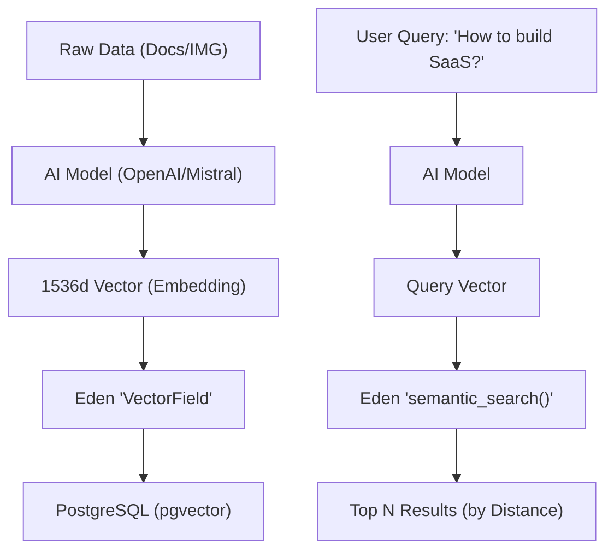

# 🤖 AI & Semantic Search

**Eden's AI extension provides first-class, industrial-grade support for vector embeddings and high-performance semantic search powered by `pgvector` and PostgreSQL.**

---

## 🧠 The Eden AI Pipeline

Unlike traditional keyword search (Lexical), **Semantic Search** understands the intent and meaning behind a query—finding content that is "conceptually similar" even without exact word matches.



---

## ⚡ 60-Second AI Setup

Enable semantic search on any model by inheriting from `VectorModel`.

```python
from eden.db import f, Mapped
from eden.db.ai import VectorModel, VectorField

class Article(VectorModel):
    __tablename__ = "articles"
    
    title: Mapped[str] = f(max_length=255)
    content: Mapped[str] = f()
    
    # 🌟 VectorField handles the complex pgvector interaction
    embedding: Mapped[list[float]] = VectorField(dimensions=1536)

# 🔎 Searching in your View
async def search(query_vector: list[float]):
    results = await Article.semantic_search(embedding=query_vector, limit=5)
    return results
```

> [!IMPORTANT]
> **Dependencies**: You must have `pgvector` extension installed in PostgreSQL and `pip install eden-framework[ai]` in your environment.

---

## 🚀 Industrial Case Study: E-commerce Recommendations

A common real-world use case for AI search is a **"People Also Viewed"** or **Recommendation Engine**.

### 1. Finding Similar Products
Users who view one product often want similar items based on visual or functional descriptions.

```python
from eden.db.ai import VectorModel, VectorField
from sqlalchemy import select

class Product(VectorModel):
    __tablename__ = "products"
    name: Mapped[str] = f()
    description_embedding: Mapped[list[float]] = VectorField(dimensions=1536)

async def recommend_similar(product_id: int):
    # 1. Fetch the source product's embedding
    target = await Product.get(id=product_id)
    
    # 2. Find closest neighbors in vector space (Cosine Distance: <=>)
    return await Product.semantic_search(
        embedding=target.description_embedding, 
        limit=4
    )
```

---

## 🏗️ Elite Pattern: Hybrid Search (RAG Ready)

For high-precision systems, we combine **Lexical (Keyword)** and **Semantic (Meaning)** search. This ensures that specific product codes or names are found while still supporting conceptual queries.

```python
from sqlalchemy import or_

async def hybrid_search(query_text: str, query_vector: list[float]):
    # Combining keyword match and semantic distance
    # 1. Keyword filter (Lexical)
    base_query = Product.query().filter(Product.name.ilike(f"%{query_text}%"))
    
    # 2. Semantic re-order (Meaning)
    return await base_query.order_by(
        Product.description_embedding.cosine_distance(query_vector)
    ).limit(10).all()
```

---

## 📡 RAG (Retrieval-Augmented Generation)

Eden is perfectly suited for RAG architectures. Use the ORM to retrieve "context" and pass it to your LLM for grounded, accurate generation.

```python
async def ask_knowledge_base(question: str):
    # 1. Retrieve most relevant context via semantic search
    context_docs = await KB.semantic_search(embedding=await get_vec(question), limit=3)
    
    # 2. Construct context-aware prompt
    context_str = "\n".join([d.text for d in context_docs])
    prompt = f"Using this context: {context_str}\n\nAnswer: {question}"
    
    # 3. Ask the LLM (GPT-4 / Claude 3)
    return await llm.complete(prompt)
```

---

## ⚡ Performance Tuning (HNSW Indexes)

For datasets with >50,000 records, default linear scans become slow. Eden recommends adding an **HNSW** (Hierarchical Navigable Small World) index for O(log n) approximate search performance.

```sql
-- In your Eden Migration
CREATE INDEX ON articles 
USING hnsw (embedding vector_cosine_ops)
WITH (m = 16, ef_construction = 64);
```

---

## 💡 Best Practices

1. **Normalization**: Ensure your embeddings are normalized (typically handled by OpenAI/Mistral) for consistent cosine similarity.
2. **Dimension Sync**: Ensure your `dimensions` (e.g., 1536) exactly match the output of your embedding provider.
3. **Partitioning**: For multi-tenant SaaS, always use `TenantModel` with vectors to ensure cross-tenant data isolation at the index level.

---

**Next Steps**: [Multi-Tenancy Guide](tenancy-postgres.md) | [Background Tasks](background-tasks.md)
