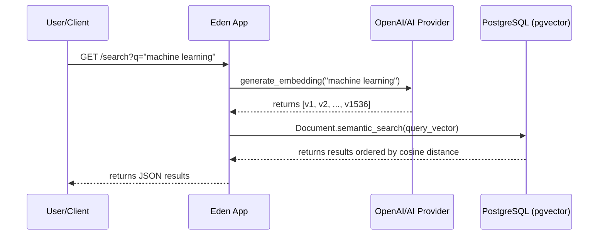

# AI & Semantic Search 🤖

The Eden AI extension provides first-class support for vector embeddings and semantic search powered by **pgvector** and PostgreSQL. It allows you to build modern AI features like recommendation engines, semantic document search, and RAG (Retrieval-Augmented Generation) systems directly within the Eden ORM.

---

## Overview

Unlike traditional keyword search that relies on exact word matches, **semantic search** understands the meaning behind the query. It uses vector embeddings—mathematical representations of text—to find content that is "conceptually similar."

### How Semantic Search Works in Eden:

1. **Embed**: Convert your content (e.g., product descriptions, blog posts) into a high-dimensional vector using an AI model (like OpenAI or HuggingFace).
2. **Store**: Save these vectors in a PostgreSQL `VectorField`.
3. **Search**: When a user queries, embed the query and use `semantic_search()` to find the nearest neighbors in vector space.

---

## Foundational: Defining Vector Models

To enable semantic search on a model, inherit from `VectorModel`. Use the `VectorField` to define the column where embeddings will be stored.

```python
from eden.db import f, Mapped
from eden.db.ai import VectorModel, VectorField

class Document(VectorModel):
    __tablename__ = "documents"
    
    title: Mapped[str] = f(max_length=255)
    content: Mapped[str] = f()
    
    # 1536 is the default dimension for OpenAI's text-embedding-3-small
    embedding: Mapped[list[float]] = VectorField(dimensions=1536)
```

> [!IMPORTANT]
> **Dependencies Required**
> You must have the `pgvector` extension installed in your PostgreSQL database and the `pgvector` package in your Python environment:
> ```bash
> pip install eden-framework[ai]
> ```

---

## Integration: Search Lifecycle

The following sequence traces the lifecycle of a semantic search request through the Eden layers:



---

## Advanced Usage: RAG Pattern

RAG (Retrieval-Augmented Generation) is a technique where you retrieve relevant documents and pass them as "context" to an LLM to generate an accurate answer.

### Sample Recipe: Knowledge Base RAG

```python
import openai
from eden.db.ai import VectorModel, VectorField

class KnowledgeBase(VectorModel):
    content: Mapped[str] = f()
    embedding: Mapped[list[float]] = VectorField(dimensions=1536)

async def ask_question(question: str):
    # 1. Embed the question
    resp = await openai.embeddings.create(
        input=[question],
        model="text-embedding-3-small"
    )
    q_vector = resp.data[0].embedding
    
    # 2. Retrieve relevant context (Semantic Search)
    context_docs = await KnowledgeBase.semantic_search(
        embedding=q_vector,
        limit=3
    )
    context_text = "\n\n".join([d.content for d in context_docs])
    
    # 3. Generate Answer with Context
    prompt = f"Using the context below, answer the question: {question}\n\nContext: {context_text}"
    answer = await openai.chat.completions.create(
        messages=[{"role": "user", "content": prompt}],
        model="gpt-4o"
    )
    
    return answer.choices[0].message.content
```

---

## Scalability: Performance Tuning

Semantic search over millions of records can be slow without indexing. Eden supports standard PostgreSQL vector indexes.

### Adding an Index (Recommended for >10k rows)

Add an HNSW (Hierarchical Navigable Small World) index to your migration for ultra-fast approximate search:

```sql
CREATE INDEX ON documents USING hnsw (embedding vector_cosine_ops);
```

> [!TIP]
> **Cosine vs Europe Distance**
> Eden defaults to **cosine distance** (`<=>` in PostgreSQL), which is standardized for most LLM embeddings. If your model requires Euclidean distance, you can customize the query builder.

---

## Related Guides

- [ORM Querying](orm-querying.md)
- [Optional Extras](optional-extras.md)
- [Background Tasks](background-tasks.md)
