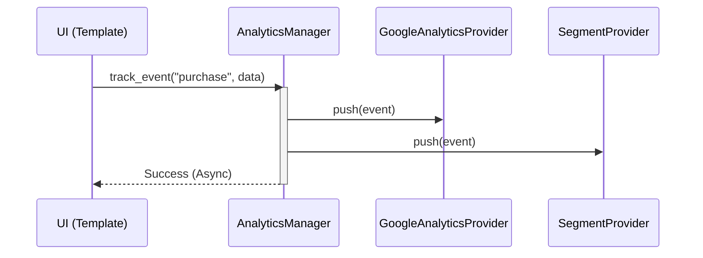

# 📊 Analytics & Feature Flags

**Eden includes built-in engines for multi-provider analytics and sophisticated feature flag management. Drive data-informed decisions with zero-latency tracking and progressive rollouts.**

---

## 📈 Multi-Provider Analytics

The `AnalyticsManager` allows you to track user behavior across multiple platforms (Google Analytics, Segment, Mixpanel) with a single unified API.

### 🧩 Architectural Flow



### 1. Configuration

Initialize the `AnalyticsManager` and add your preferred providers.

```python
from eden.analytics import AnalyticsManager, GoogleAnalyticsProvider, MixpanelProvider

analytics = AnalyticsManager()

# Add Google Analytics
analytics.add_provider(
    GoogleAnalyticsProvider(tracking_id="UA-XXXXXXXX-X")
)

# Add Mixpanel with batching enabled
analytics.add_provider(
    MixpanelProvider(token="your-token", batch_size=20)
)
```

### 2. Tracking Events

Track user interactions, page views, and identity changes.

```python
# Track a generic event
await analytics.track_event(
    "purchase_completed", 
    {"plan": "premium", "amount": 99.00}
)

# Track page view
await analytics.track_page("/dashboard", {"referrer": "/login"})

# Identify user
await analytics.identify(
    user_id="user_123", 
    email="alice@example.com", 
    plan="premium"
)
```

### 3. Template Integration

Eden provides a convenient `@analytics` directive (or you can use `{{ analytics }}`) to inject tracking scripts into your head.

```html
<head>
    @eden_head
    <!-- Analytics providers will inject their specific scripts here -->
</head>
```

---

## 🚩 Feature Flags

The `FlagManager` allows you to toggle features on and off safely, perform percentage rollouts, and isolate experimental features to specific tenants or users.

### 1. Defining Flags

Register flags with specific strategies.

```python
from eden.flags import FlagManager, Flag, FlagStrategy

flags = FlagManager()

# Always On
flags.register_flag(Flag("new_ui", strategy=FlagStrategy.ALWAYS_ON))

# Percentage Rollout (50% of users)
flags.register_flag(
    Flag("beta_search", strategy=FlagStrategy.PERCENTAGE_ROLLOUT, percentage=50)
)
```

### 2. Context-Aware Evaluation

Flags can be evaluated against the current request context (user, tenant).

```python
# In your controller
if app.flags.is_enabled("beta_search", user_id=request.user.id):
    # Show new search
    pass
```

### 3. Template Usage

Use the `@if` directive to check flags in your UI.

```html
@if(flags.is_enabled('new_ui')) {
    <div class="new-dashboard">...</div>
} @else {
    <div class="old-dashboard">...</div>
}
```

---

## 🏗️ Advanced Strategies

### Custom Strategies
You can define custom flag strategies for complex logic (e.g., "only users with more than 100 points").

```python
@flags.strategy("loyal_users")
def loyal_users_strategy(context):
    return context.user.points > 100
```

### Provider Batching
To avoid blocking request execution, providers can batch events and flush them periodically or at the end of a request cycle.

```python
await analytics.flush() # Manually trigger an upload of cached events
```

---

## 🔗 The Connective Tissue: Integration

### Using Flags to Toggle Database Logic

Feature flags in Eden are not just for UI. They can be injected into your service layer to dynamically modify query logic.

```python
from eden.db import q

async def get_search_results(query: str, request):
    base_query = Product.filter(q.title.icontains(query))
    
    # Integration: Only apply AI relevance sorting if the flag is on
    if app.flags.is_enabled("ai_search_v2", user_id=request.user.id):
        return await base_query.order_by("-ai_relevance_score").all()
    
    return await base_query.order_by("-created_at").all()
```

### Analytics in Background Tasks

Keep your request cycle fast by offloading analytics tracking to the `EdenBroker`.

```python
@app.task()
async def track_long_iteration(user_id: int, data: dict):
    # This runs on the worker, keeping the web request latency zero
    await app.analytics.track_event("complex_process_finished", data)
    await app.analytics.identify(user_id=user_id)
```

---

**Next Steps**: [Background Tasks](background-tasks.md) | [Multi-Tenancy](tenancy.md)
