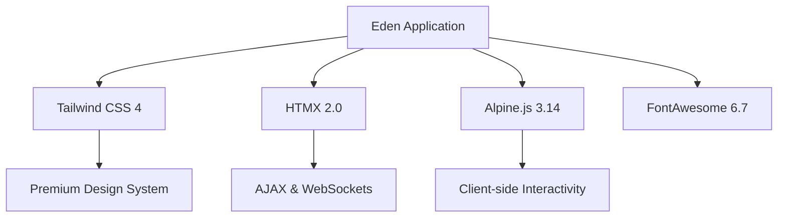

# 🎨 Assets & Premium UI Stack

**Eden provides a zero-config, high-performance asset pipeline and a curated front-end stack designed to deliver a "Premium" look and feel out of the box.**

---

## 🧠 The Premium Stack

Eden is built on a modern, reactive front-end philosophy. Instead of large JavaScript bundles, we leverage lightweight, industry-standard libraries delivered via version-pinned CDNs.

### Included Technologies



| Library | Version | Role |
| :--- | :--- | :--- |
| **Tailwind CSS 4** | `4.x` | Utility-first styling with modern CSS features. |
| **HTMX** | `2.0.4` | Server-driven interactivity (AJAX, WebSockets, Server-Sent Events). |
| **Alpine.js** | `3.14.9` | "Tailwind for JavaScript" – lightweight client-side reactivity. |
| **FontAwesome** | `6.7.2` | Scalable vector icons for a professional interface. |

---

## 🏗️ Quick Start: The `@eden_head`

The easiest way to boot your UI is by using the `@eden_head` directive in your base template. This injects all necessary meta tags, CSS resets, and CDN links.

```html
<!DOCTYPE html>
<html lang="en">
<head>
    @eden_head
    <title>My Project</title>
</head>
<body>
    @yield('content')
    @eden_scripts
</body>
</html>
```

### What `@eden_head` Injects:
-   **Typography**: Google Fonts integration for **Plus Jakarta Sans** (Body) and **Outfit** (Headings).
-   **Premium Reset**: Custom CSS for smooth scrolling, antialiasing, and Obsidian-dark mode defaults.
-   **Design Tokens**: Built-in CSS variables like `--eden-obsidian` and `.glass` (glassmorphism) utilities.
-   **Micro-animations**: Pre-configured classes like `.hover-lift` for premium interaction feedback.

---

## 🚀 Real-Time Sync (`eden-sync`)

One of Eden's most powerful features is the automatic WebSocket synchronization. When you include `@eden_scripts`, Eden injects the `eden-sync` HTMX extension.

### How it Works
1.  **Automatic Connection**: On page load, a WebSocket connection is established to `/_eden/sync`.
2.  **Component Subscription**: Elements with the `hx-sync="channel_name"` attribute automatically subscribe to updates for that channel.
3.  **Live Updates**: When the server broadcasts an event to that channel, HTMX triggers a refresh or an event on the matching elements.

```html
<!-- This div will automatically refresh whenever 'orders' are updated on the server -->
<div hx-get="/orders/summary" hx-sync="orders" hx-trigger="orders:updated from:body">
    @render_orders_summary
</div>
```

---

## 💬 Real-Time Messaging & Toasts

Eden includes a premium toast notification system that handles both **session-based flashes** and **real-time WebSocket messages**.

### 1. The `@eden_toasts` Container
Place this directive once in your base template. It renders the container and a listener for incoming messages.

```html
@eden_toasts
```

### 2. Triggering Toasts
Toasts can be triggered from Python logic using the `messages` framework or directly via the real-time sync.

```python
from eden.messages import success, error

@app.post("/settings")
async def save_settings(request):
    # This will appear as a premium toast on the next page load
    success("Settings saved successfully!")
    return redirect("/")
```

### 3. Toast Categories
| Category | Visual Style | Use Case |
| :--- | :--- | :--- |
| **Success** | Emerald Border | Resource creation, successful saves. |
| **Error** | Rose Border | Validation failures, system errors. |
| **Warning** | Amber Border | Non-critical issues, confirmation needed. |
| **Info** | Sky Blue Border | General status updates. |

---

## 💡 Best Practices

1.  **Selective Assets**: You can disable specific libraries in `@eden_head` if not needed: `@eden_head(alpine=False, fontawesome=False)`.
2.  **Use `.glass`**: Leverage the built-in `.glass` class for cards and panels to immediately achieve a premium, modern aesthetic.
3.  **HTMX over JS**: Prefer HTMX attributes for server communication before reaching for custom Alpine.js or vanilla JavaScript.
4.  **Local Static Files**: For your own project-specific assets, place them in the `/static` directory and reference them via `@static('path/to/file.png')`.

---

**Next Steps**: [Background Tasks](background-tasks.md)
