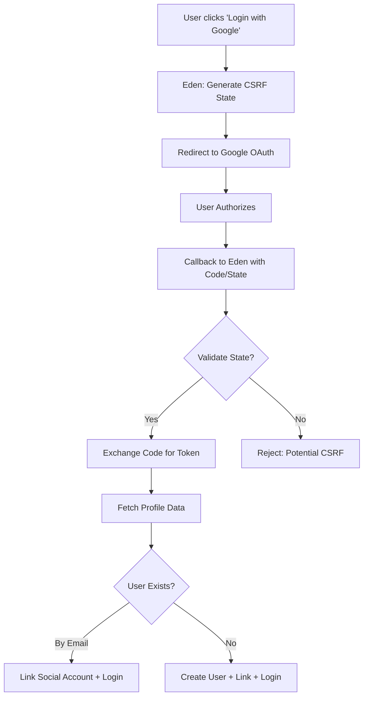

# 🌐 Social Login & OAuth 2.0 Integration

**Modern identity management for global SaaS. Eden provides a seamless, high-security OAuth2 integration that allows your users to sign in with Google, GitHub, and more—with automated account linking and profile synchronization out of the box.**

---

## 🧠 Conceptual Overview

Eden’s OAuth system is designed for "Frictionless Onboarding." It handles the complex handshake between your app and external providers, automatically merging identities based on verified email addresses to prevent duplicate accounts.

### The OAuth Handshake



---

## 🚀 Quick Start: Google & GitHub

### 1. Configuration

Obtain your credentials from the [Google Cloud Console](https://console.cloud.google.com/) or [GitHub Settings](https://github.com/settings/developers).

```bash
# .env
GOOGLE_CLIENT_ID=your_id.apps.googleusercontent.com
GOOGLE_CLIENT_SECRET=your_secret

GITHUB_CLIENT_ID=your_id
GITHUB_CLIENT_SECRET=your_secret
```

### 2. Registration & Mounting

Register the providers with the `OAuthManager` and mount the routes in your `app.py`.

```python
import os
from eden import Eden
from eden.auth.oauth import OAuthManager

app = Eden()
oauth = OAuthManager()

# Register providers
oauth.register_google(
    client_id=os.getenv("GOOGLE_CLIENT_ID", "mock_id"),
    client_secret=os.getenv("GOOGLE_CLIENT_SECRET", "mock_secret")
)

oauth.register_github(
    client_id=os.getenv("GITHUB_CLIENT_ID", "mock_id"),
    client_secret=os.getenv("GITHUB_CLIENT_SECRET", "mock_secret")
)

# This mounts: /auth/oauth/google/login, /auth/oauth/github/login, etc.
oauth.mount(app)
```

---

## ⚡ Elite Patterns

### 1. Automated Account Linking

If a user signs in with GitHub using `alice@example.com`, and an account with that email already exists in your database, Eden will automatically link the GitHub identity to the existing user. This prevents data fragmentation and improves the user experience.

### 2. Account Management & Unlinking

Eden includes a built-in profile manager (`/profile`) that allows users to see their linked accounts and unlink them—with a security guard that prevents users from unlinking their **last** login method.

```html
<!-- In your template -->
<a href="{{ url_for('oauth_google_login') }}" class="btn btn-google">
    <svg>...</svg> Sign in with Google
</a>
```

### 3. Custom Post-Login Handlers

Need to perform custom logic after a successful OAuth login (e.g., pulling a user's GitHub bio or setting a default team)? Use the `on_login` callback.

```python
from eden.responses import RedirectResponse
from eden.auth.oauth import OAuthManager

oauth = OAuthManager()

async def handle_google_login(request, user_info: dict):
    # user_info contains 'email', 'name', 'picture', etc.
    print(f"User {user_info['email']} just logged in!")
    return RedirectResponse(url="/custom-onboarding")

oauth.register_google(
    client_id="id", 
    client_secret="secret", 
    on_login=handle_google_login
)
```

---

## 🛡️ Industrial-Grade Security

1. **CSRF State Guard**: Eden generates a unique `state` token for every login attempt and validates it against the user's session during the callback.
2. **Email Verification**: Accounts are only linked if the OAuth provider confirms the email address is verified.
3. **Encrypted Sessions**: Once authenticated, the user ID is stored in a secure, encrypted session cookie compatible with the rest of the Eden security suite.

---

## 📄 API Reference

### `OAuthManager` (`eden.auth.oauth`)

| Method | Parameters | Description |
| :--- | :--- | :--- |
| `register_google` | `client_id, client_secret, scopes` | Fast-path for Google Identity. |
| `register_github` | `client_id, client_secret, scopes` | Fast-path for GitHub Identity. |
| `mount` | `app, prefix="/auth/oauth"` | Registers all routes and the `/profile` view. |

### Configuration Options

| Option | Default | Description |
| :--- | :--- | :--- |
| `scopes` | `["openid", "email", "profile"]` | Permissions requested from the provider. |
| `prefix` | `"/auth/oauth"` | Global URL prefix for OAuth routes. |

---

## 💡 Best Practices

1. **Consistent Redirects**: Always use the standard internal URL format for your provider settings: `https://your-app.com/auth/oauth/{provider}/callback`.
2. **Scope Minimization**: Only request the scopes you absolutely need (e.g., `email` and `profile`). Users are more likely to approve less intrusive permission requests.
3. **Provider Branding**: Use official SVG icons for your login buttons. Eden provides a set in `/static/auth/` for all supported providers.

---

**Next Steps**: [Multi-Tenacy & SaaS Architecture](tenancy.md)
