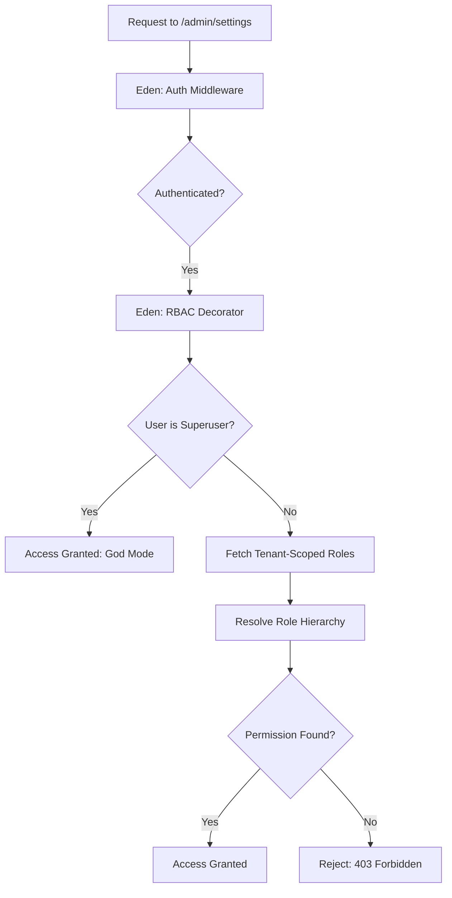

# 👑 Role-Based Access Control (RBAC)

**Granular, tenant-aware identity management. Eden provides a high-security access control system that allows you to secure your SaaS architecture at the role and permission levels—across both backend routes and frontend templates.**

---

## 🧠 Conceptual Overview

Eden’s RBAC system is built for Enterprise SaaS. It supports hierarchical roles (where an "Admin" automatically inherits "User" permissions) and understands that in a multi-tenant world, a user’s role changes depending on which Organization they are currently viewing.

### The Security Handshake



---

## 🏗️ Hierarchy & Permissions

Define your domain-specific roles and their inheritance relationships. Inheritance simplifies management by allowing higher roles to naturally perform the actions of lower ones.

```python
from eden.auth import RoleHierarchy

# 1. Initialize the Hierarchy Handler
rbac = RoleHierarchy()

# 2. Define Hierarchy (Role, Parents - roles it inherits FROM)
# Inheritance simplifies management: higher roles 'are' also their parents.
rbac.add_role("user")
rbac.add_role("editor", parents=["user"])
rbac.add_role("admin", parents=["editor", "user"])

# 3. Assign Atomic Permissions to Roles
rbac.add_permission("user", "view_posts")
rbac.add_permission("editor", "create_posts")
rbac.add_permission("admin", "delete_posts")

# 'admin' now automatically resolves all 3 permissions via deep inheritance
```

---

## 🚀 Securing Backend Routes

Eden provides a suite of decorators designed for readability and reliability. They automatically handle the current request context and support both function-based views and class-based views.

### 1. Simple Role Guards

```python
from eden.auth import require_role, roles_required

@app.get("/admin/logs")
@require_role("admin")
async def view_logs(request):
    return {"logs": "..."}

# Requires multiple roles
@app.get("/billing")
@roles_required(["admin", "billing_manager"])
async def billing_view(request):
    ...
```

### 2. Fine-Grained Permission Guards

Avoid hardcoding roles in your logic. Instead, check for specific *permissions*. This makes your code more resilient to role structure changes.

```python
from eden.auth import require_permission, permissions_required

@app.post("/posts/delete/{id}")
@require_permission("delete_posts")
async def delete_post(request, id: int):
    ...
```

### 3. Class-Based View (CBV) Protection

Secure an entire resource by applying decorators to the class.

```python
from eden.auth import view_decorator, roles_required

@view_decorator(roles_required(["admin"]))
class AdminPanel(View):
    async def get(self, request):
        return app.render("admin.html")
        
    async def post(self, request):
        # Also protected automatically
        ...
```

---

## ⚡ Tenant-Aware RBAC

In SaaS, a user is rarely "just an Admin." They are an "Admin of Organization A" but perhaps only a "Member of Organization B." Eden's guards automatically call `request.user.get_roles_for_tenant(tenant_id)` to resolve roles in context.

```python
# In your User model
class User(Model):
    async def get_roles_for_tenant(self, tenant_id: str) -> list[str]:
        # Fetch role from memberships table
        membership = await Membership.get_by(user_id=self.id, tenant_id=tenant_id)
        return [membership.role] if membership else []
```

---

## 🎨 RBAC in Templates

Eden’s templating engine provides semantic directives for controlling your UI based on identity.

### `@can` / `@cannot` (Permissions)

```html
@can("delete_posts") {
    <button class="btn btn-danger" hx-delete="/posts/{{ post.id }}">
        Delete Post
    </button>
}
```

### `@auth` / `@guest` (Status & Role)

```html
@auth("admin") {
    <a href="/admin">Admin Dashboard</a>
}

@guest {
    <a href="/login" class="btn">Sign In</a>
}
```

---

## 📄 API Reference

### RBAC Decorators

| Decorator | Description |
| :--- | :--- |
| `@require_role` | User must have a specific role (supports hierarchical parents). |
| `@require_permission` | User must have a specific functional permission. |
| `@roles_required` | User must possess **ALL** of the listed roles. |
| `@permissions_required` | User must possess **ALL** listed permissions. |
| `@require_any_role` | Access granted if user has **AT LEAST ONE** listed role. |
| `@require_any_permission` | Access granted if user has **AT LEAST ONE** listed permission. |

### Superuser Bypass

All checks include a "God Mode" bypass. If `request.user.is_superuser` is `True`, all decorators automatically grant access. This is essential for administrative troubleshooting.

---

## 💡 Best Practices

1. **Prefer Permissions over Roles**: Check for `@can("edit_settings")` rather than `@auth("admin")`. This allows you to create custom roles later without changing your code.
2. **Audit Logs**: Use Eden’s `telemetry` features to log whenever a permission check fails—this is an early warning sign for potential security probes.
3. **Fail-Secure**: Eden’s decorators return a `403 Forbidden` response by default if any check fails, ensuring your application remains "Secure by Default."

---

**Next Steps**: [Social Login (OAuth)](auth-oauth.md)
