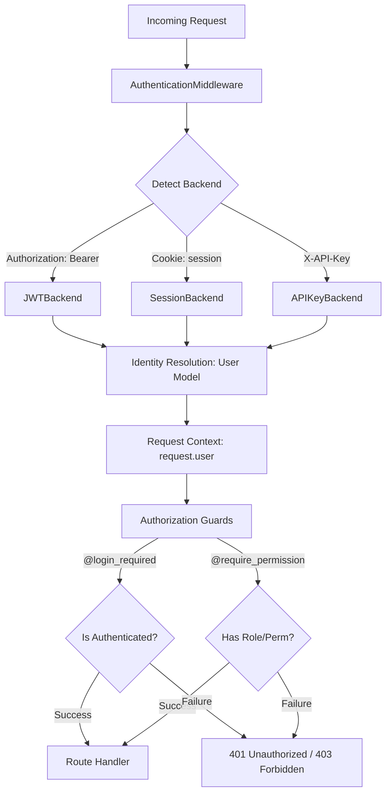

# 🔒 Identity, Authentication & Security

**Eden provides a unified, industrial-grade security suite that handles identity management, multi-backend authentication, and hierarchical RBAC with zero-friction integration.**

---

## 🧠 Conceptual Overview

Security in Eden is built on a "Three Pillars" architecture. Each layer is independent yet works in harmony to provide end-to-end protection.

### The Security Lifecycle



### Core Philosophy

1. **Identity is Pluggable**: Use the default `User` model or roll your own by extending `BaseUser`.
2. **Multi-Backend Support**: Protect your API with JWT and your admin panel with Sessions simultaneously.
3. **Hierarchical Authorization**: Roles inherit permissions from parents, reducing boilerplate in complex RBAC systems.

---

## ⚡ 60-Second Auth Setup

Ready to protect your first route? Follow this pattern to bootstrap a fully secure endpoint in under a minute.

```python
from eden import Eden, render_template
from eden.auth import login_required, create_user

app = Eden()

@app.get("/secret-dashboard")
@login_required # 🛡️ The core guard
async def dashboard(request):
    return render_template("dashboard.html", user=request.user)

# Pro-tip: Create your first user via the CLI or bootstrap script

# await create_user(email="admin@example.com", password="secure_password")

```

---

## 👤 Identity: The `User` Model

All security revolves around the `User` model. Eden provides a standard implementation using SQLAlchemy, but you can customize it easily by extending `BaseUser`.

```python
from eden.auth import BaseUser, User
from eden.db import Model, f, Mapped

# Example: Custom User extending the framework's identity base

class MyUser(BaseUser, Model):
    __tablename__ = "users"
    phone: Mapped[str] = f(nullable=True)
    
    # Custom role resolution logic
    async def get_roles(self):
        return ["member"]
```

### Accessing the Current User

The user is automatically injected into the request object by the `AuthenticationMiddleware`.

```python

# In your view

if request.user.is_authenticated:
    print(f"User ID: {request.user.id}")
    print(f"Roles: {request.user.roles}")
```

### High-Level Convenience Functions

Eden provides a unified set of actions for identity tasks in `eden.auth`. These handle password hashing, session binding, and database persistence in one call, ensuring a consistent security posture across the framework.

```python
from eden.auth import create_user, authenticate, login

# Create a new user with hashed password (validates email & password strength)
user = await create_user(email="alice@example.com", password="secure_password_123")

# Verify credentials against the registered User model
user = await authenticate(email="alice@example.com", password="password_123")

# Bind to the current request (Session/JWT) and set global context
if user:
    await login(request, user)
```

---

## 🔑 Authentication Backends

Eden supports multiple concurrent authentication methods.

| Backend | Logic | Use Case |
| :--- | :--- | :--- |
| **`JWTBackend`** | Stateless tokens (Bearer) | Mobile apps, SPA, Public APIs. |
| **`SessionBackend`** | Stateful cookies | Traditional Web Apps, Admin Panels. |
| **`APIKeyBackend`** | Header-based keys | Server-to-server communication, Webhooks. |

### Configuring JWT

```python
from eden.auth import JWTBackend

jwt_backend = JWTBackend(
    secret="top-secret-key",
    access_token_expire_minutes=60
)

# Create a token manually

token = jwt_backend.encode({"sub": user.id})
```

---

## 🛡️ Authorization & RBAC

Eden's Role-Based Access Control (RBAC) supports **inheritance**. If a `manager` inherits from `employee`, they automatically gain all `employee` permissions.

### Defining Hierarchy

```python
from eden.auth import default_rbac as rbac

# Build the hierarchy

rbac.add_role("employee")
rbac.add_role("manager", parents=["employee"])
rbac.add_role("admin", parents=["manager"])

# Assign permissions

rbac.add_permission("employee", "post:view")
rbac.add_permission("manager", "post:edit")
rbac.add_permission("admin", "post:delete")

# 'admin' now has all 3 permissions

```

Use decorators to enforce your RBAC rules at the entry point. Eden decorators are powerful: they support both function-based handlers and **Class-Based Views (CBVs)**.

### Function-Based Views

```python
@app.get("/analytics")
@require_role("manager")
async def view_analytics(request):
    ...
```

### Class-Based Views

Use `view_decorator` to apply a guard to an entire class:

```python
from eden.auth import view_decorator, login_required
from eden import View

@view_decorator(login_required)
class ProtectedView(View):
    async def get(self, request):
        return {"data": "secret"}
```

> [!TIP]
> **Superuser Bypass**: All decorators automatically bypass checks for users with `is_superuser=True`, ensuring your admins never get locked out.

---

## 🏗️ Audit & Security Middleware

Enable automatic protection across your entire application.

```python

# In your app configuration

app.add_middleware("security")  # Sets CSP, X-Frame-Options, HSTS
app.add_middleware("csrf")      # Automatic CSRF protection for forms
app.add_middleware("ratelimit") # Protect against brute force
```

---

## 📖 API Reference

### Core Functions (`eden.auth`)

| Function | Parameters | Return Type | Description |
| :--- | :--- | :--- | :--- |
| `authenticate` | `email, password, user_model=None` | `User \| None` | Validates credentials. Auto-detects custom User models. |
| `login` | `request, user` | `None` | Binds user to request and setting global context. |
| `logout` | `request` | `None` | Clears request, context, and session identity. |
| `create_user` | `email, password, **kwargs` | `User` | Creates user, hashes password, and persists to DB. |

### Authorization Guards

| Decorator | Argument | Description |
| :--- | :--- | :--- |
| `@login_required` | - | Requires any authenticated user. |
| `@require_role` | `role: str` | Requires user to have specific role (supports hierarchy). |
| `@require_permission` | `perm: str` | Requires specific functional permission (e.g. "user:read"). |
| `@staff_required` | - | Shorthand for users with `is_staff=True`. |

### `EdenRBAC` (Role Manager)

| Method | Parameters | Description |
| :--- | :--- | :--- |
| `add_role` | `name, parents=None` | Register a role and its inheritance tree. |
| `add_permission` | `role, permission` | Bind an atomic permission to a specific role. |
| `has_permission` | `user_roles, perm` | Recursively check permissions across hierarchy. |

---

## ⚡ Elite Pattern: Query-Level Protection

Instead of checking permissions in the controller, filter the data at the database level based on the user's role.

```python
from eden.auth import apply_rbac_filter

@app.get("/documents")
@login_required
async def list_documents(request):
    # This automatically adds WHERE clauses to restrict access based on user roles
    query = apply_rbac_filter(Document.query(), request.user)
    return await query.all()
```

---

## 💡 Best Practices

1. **Use Hierarchy**: Don't manually add 50 permissions to an `admin` role. Add them to sub-roles and have `admin` inherit them.
2. **Stateless First**: Use `JWTBackend` for your API to ensure global scalability.
3. **Always Secure Cookies**: In production, ensure `SESSION_COOKIE_SECURE=True` is enabled.

---

**Next Steps**: [Database & ORM](orm.md)
