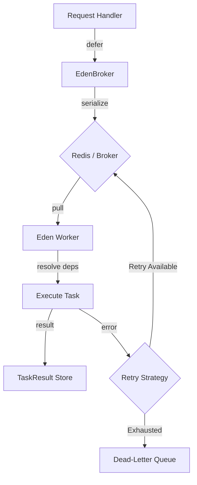

# ⚙️ Background Tasks & Distributed Workers

**Eden offloads heavy processes and recurring logic to a high-performance worker system powered by Taskiq and the EdenBroker. Maintain a snappy UI while Eden handles the heavy lifting in the background.**

---

## 🧠 Conceptual Overview

In a modern web application, responsiveness is paramount. Eden enables you to maintain a snappy UI by deferring long-running computations, email sending, or data processing to a dedicated background worker—with full support for Dependency Injection and distributed coordination.

### The Task Lifecycle



---

## ⚡ 60-Second Task Setup

Offload heavy processes in under a minute with the `@app.task` decorator.

```python
from eden import Eden

app = Eden()

async def generate_heavy_pdf(user_id: int): 
    # Mock for documentation example
    pass

@app.task()
async def process_report(user_id: int):
    # This runs in a separate worker process
    await generate_heavy_pdf(user_id)

# Trigger it from your view
@app.get("/generate")
async def trigger(request):
    await app.task.defer(process_report, user_id=1)
    return {"status": "Processing..."}
```

---

## 🏗️ Core Architecture: The EdenBroker

Eden uses a "Broker" to manage the task queue. We recommend **Redis** for production and an **In-Memory** broker for local development/testing.

```python
from eden import Eden, create_broker

app = Eden()

# Development: In-memory (no extra setup)

app.task = create_broker()

# Production: Redis (requires taskiq-redis)

app.task = create_broker(redis_url="redis://localhost:6379")
```

---

## 🚀 Defining & Invoking Tasks

Tasks are simple Python functions decorated with `@app.task()`. Eden's **Dependency Injection** system is fully available within tasks, mirroring the experience of writing request handlers.

### 1. Define the Task

```python
from eden import Depends, Eden, Model, f
from typing import Any

app = Eden()

class User(Model):
    email: str = f(unique=True)

class MailService:
    async def send_welcome(self, email: str): pass

@app.task()
async def send_welcome_email(user_id: int, mailer: MailService = Depends(MailService)):
    # Logic is executed in the background worker
    user = await User.get(user_id)
    if user:
        await mailer.send_welcome(user.email)
```

### 2. Invoke the Task

Trigger your tasks using the `.kiq()` method (from Taskiq) or Eden's shorthand API.

```python
from eden import Eden
app = Eden()


@app.task()
async def send_welcome_email(user_id: int): pass

# Start the broker first
await app.task.startup()

# Shorthand (Recommended)
await app.task.defer(send_welcome_email, user_id=123)

# With Delay (Schedule for 60 seconds from now)
await app.task.schedule(send_welcome_email, delay=60, user_id=123)
```

---

## 🕰️ Periodic & Scheduled Tasks

Eden makes scheduling recurring tasks a first-class citizen with the `.every()` decorator. It supports intervals and standard **Cron expressions**.

```python
from eden import Eden
app = Eden()

# Run every 5 minutes
@app.task.every(minutes=5)
async def check_inventory():
    pass

# Run every night at midnight (Standard Cron)
@app.task.every(cron="0 0 * * *")
async def generate_daily_reports():
    pass
```

### 🛡️ Distributed Coordination

When scaling horizontally across multiple servers, you don't want your periodic tasks to run N times. Eden's `PeriodicTask` engine uses **distributed locks** (via Redis) to ensure only one instance of your app executes a scheduled task per interval.

---

## 🔁 Resiliency: Retries & Dead-Letter Queue

Background tasks can sometimes fail due to network issues or external API downtime. Eden provides a resilient execution loop with **Exponential Backoff**.

### Automatic Retries

```python
from eden import Eden
app = Eden()

@app.task(
    max_retries=5,                # Total attempts
    retry_delays=[1, 2, 4, 8, 16], # Delays in seconds
    exponential_backoff=True      # Multiplies delay by 2 on each fail
)
async def fetch_api_stats():
    pass
```

### The Dead-Letter Queue (DLQ)

When a task exhausts all its retries, it enters the **Dead-Letter Queue**.

- **Traceback Tracking**: Captures the full Python traceback and error message.
- **Correlation ID**: Automatically propagates the `correlation_id` from the original web request, allowing you to trace the lifecycle of a request from the UI down to the worker logs.
- **Monitoring**: Query the DLQ via `app.task._result_backend.get_dead_letter_tasks()`.

---

## 📊 Monitoring & Task Results

Every execution is tracked in the `TaskResult` store, allowing you to monitor the health of your background processes.

| Field | Description |
| :--- | :--- |
| **`status`** | `pending`, `success`, `failed`, or `dead_letter`. |
| **`result`** | The JSON-serialized return value of the task. |
| **`correlation_id`** | Link between the task and the request that spawned it. |
| **`retries`** | The number of times the task was retried before completing. |

---

## 💡 Best Practices

1. **Idempotency**: Ensure your tasks are safe to run multiple times. If a task fails halfway through, a retry should not create duplicate side effects.
2. **Pass IDs, Not Objects**: Instead of `send_email(user_obj)`, use `send_email(user_id)`. Large objects increase serialization overhead and may contain stale data.
3. **Keep Payloads Small**: Broker memory is valuable. Avoid passing large binary blobs or excessive JSON as task arguments.
4. **Graceful Shutdown**: Eden's `shutdown` lifecycle automatically waits for active tasks to complete before killing the worker process.

---

**Next Steps**: [Advanced SaaS & Multi-Tenancy](tenancy.md)
