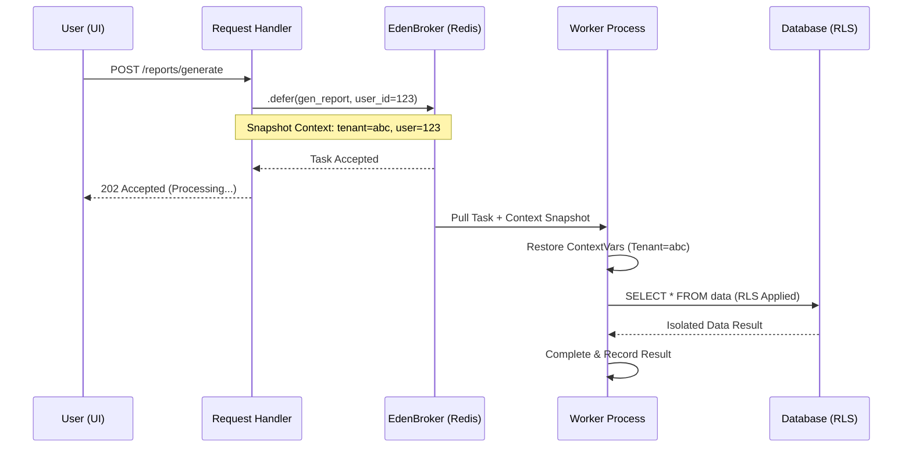
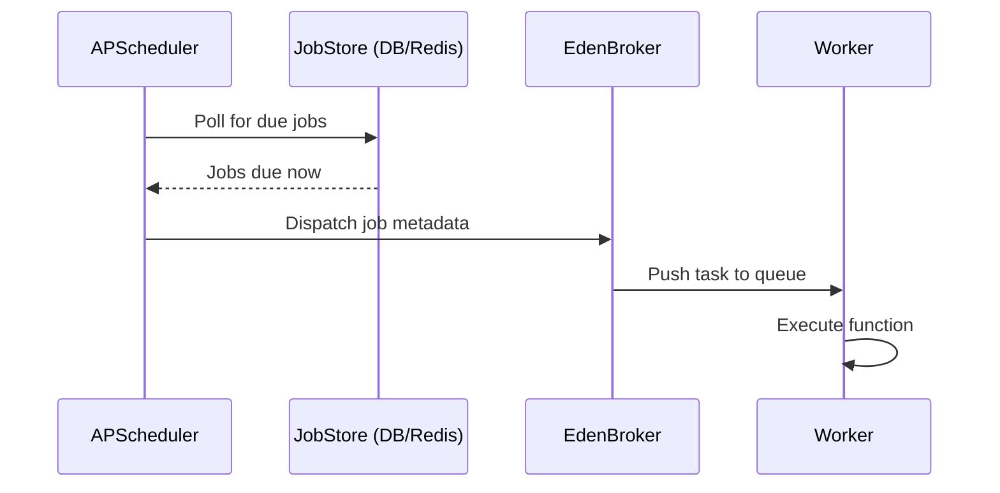

# ⚙️ Background Tasks & Distributed Workers

**Eden offloads heavy processes and recurring logic to a high-performance worker system powered by Taskiq and the EdenBroker. Maintain a zero-latency UI while Eden handles the heavy lifting in the background.**

---

> [!TIP]
> **🚀 Live Demo Available!**
> You can see Background Tasks in action in the Eden Framework example application. Run `python app/support_app.py` and visit **`http://localhost:8001/demo/tasks`** to see async task queueing with live HTMX progress bars.

## 🧠 The Eden Task Pipeline

Eden's Task system is designed for **Context Awareness**. When you defer a task from a web request, Eden automatically serializes the current `tenant_id`, `user_id`, and `correlation_id` and restores them in the background worker—ensuring RLS and Audit trails remain intact.



---

## ⚡ 60-Second Task Setup

Offload heavy processes in under a minute with the `@app.task` decorator.

```python
from eden import Eden

app = Eden()

@app.task()
async def send_system_alert(message: str):
    # This logic executes in a separate worker process
    await mailer.send(message)

# Trigger from your controller
@app.get("/trigger")
async def trigger_view(request):
    await app.task.defer(send_system_alert, message="System is operational!")
    return {"status": "Task Queued"}
```

---

## 🏗️ Core Architecture: The EdenBroker

Eden uses a "Broker" to manage the task queue. We recommend **Redis** for production and an **In-Memory** broker for local development/testing.

```python
from eden.tasks import create_broker, EdenBroker

# Development (In-Memory)
app.task = EdenBroker(create_broker())

# Production (Redis Streams)
app.task = EdenBroker(create_broker(redis_url="redis://localhost:6379"))
---

## 📅 Advanced Scheduling: APScheduler

While `@app.task.every` covers basic interval/cron needs, Eden provides a robust **APSchedulerBackend** for complex scheduling requirements, such as persistent job stores and per-job configuration.

### 🧩 Architectural Flow



### 1. Configuration

```python
from eden.apscheduler_backend import APSchedulerBackend, SchedulerConfig

# Configure with max workers and persistent store (optional)
app.scheduler = APSchedulerBackend(
    config=SchedulerConfig(max_workers=5)
)

await app.scheduler.start()
```

### 2. Adding Dynamic Jobs

Add jobs programmatically with fine-grained control over execution.

```python
async def send_welcome_email(user_id: int):
    # Logic...
    pass

# Schedule for a specific date/time
await app.scheduler.add_job(
    send_welcome_email,
    trigger="date",
    run_date=datetime.now() + timedelta(hours=2),
    kwargs={"user_id": 123}
)

# Schedule for a specific interval
await app.scheduler.add_job(
    send_welcome_email,
    trigger="interval",
    hours=24,
    kwargs={"user_id": 123}
)
```

### 3. Job Management

List, retrieve, or remove scheduled jobs at runtime.

```python
# Get all active jobs
jobs = await app.scheduler.get_all_jobs()

# Remove a specific job by ID
await app.scheduler.remove_job("job_id_123")
```

---

## 🚀 Industrial Usage Patterns

### 1. The "Tenant-Aware" Worker
Because Eden propagates context, your background tasks automatically obey Multi-Tenant isolation rules (RLS) and Audit logging.

```python
@app.task()
async def process_batch_invoices():
    # Eden restores the 'tenant_id' from the web request that triggered this.
    # The following query ONLY returns invoices for that tenant.
    invoices = await Invoice.all() 
    for inv in invoices:
        await inv.process()
```

### 2. Periodic Tasks (Cron & Intervals)
Schedule recurring maintenance or reporting tasks with simple decorators.

```python
# Run every 10 minutes
@app.task.every(minutes=10)
async def heartbeat():
    pass

# Run every night at midnight (Standard Cron)
@app.task.every(cron="0 0 * * *")
async def daily_aggregates():
    pass
```

### 3. Distributed Coordination
Eden's periodic engine uses **Distributed Locks** (via your DistributedBackend) to ensure that if you scale to 10 workers, your "Daily Report" task only runs **once**.

---

## 📊 Real-time Progress Tracking

For long-running tasks like CSV exports or data migrations, Eden provides a premium API to report progress back to the UI in real-time.

### 1. Reporting Status from a Task
Use `update_task_state()` inside any background task. Eden automatically resolves the current `task_id` and `broker` context.

```python
from eden.tasks import update_task_state

@app.task()
async def long_running_export():
    total = 1000
    for i in range(total):
        # Processing logic...
        
        # Update state every 10%
        if (i + 1) % 100 == 0:
            progress = ((i + 1) / total) * 100
            await update_task_state(
                progress=progress,
                status_message=f"Processed {i+1} of {total} records",
                metadata={"current_row": i}
            )
```

### 2. Real-time UI Tracking (HTMX)
Eden includes a pre-styled, high-fidelity `TaskProgress` component that polls the backend automatically.

```python
from eden.tasks.components import TaskProgress

@app.get("/export")
async def start_export(request):
    task = await app.task.defer(long_running_export)
    # Render the progress bar immediately
    return TaskProgress(task.task_id)
```

---

## 🔁 Resiliency: Retries & Dead-Letter Queue

Background tasks can fail due to external API downtime. Eden provides a resilient execution loop with **Exponential Backoff**.

```python
@app.task(
    max_retries=5,
    retry_delays=[10, 60, 300], # Initial delays in seconds
    exponential_backoff=True    # Multiplies delay by 2 on each fail
)
async def sync_remote_api():
    # If this raises an exception, Eden will retry automatically
    await api.call()
```

### The Dead-Letter Queue (DLQ)
When a task exhausts all retries, it enters the **Dead-Letter Queue**.
- **Traceback**: The full Python traceback is stored.
- **Correlation**: Link the failed task back to the specific User or Request ID via the `correlation_id`.

---

## 📊 Monitoring Task Health

Every execution is tracked in the `TaskResult` store.

| Field | Description |
| :--- | :--- |
| `status` | `success`, `failed`, or `dead_letter`. |
| `retries` | How many attempts were made. |
| `correlation_id` | Original Request ID that spawned the task. |
| `error_traceback` | Detailed logic failure logs for debugging. |

---

## 💡 Best Practices

1. **Pass IDs, Not Objects**: Never pass heavy database objects (e.g. `User`) to a task. Pass the `user_id` and refetch it in the worker to ensure you are working with the freshest data.
2. **Idempotency**: Ensure tasks can be safely retried. A task to "Send Invoice" should check if the invoice was already sent before emailing.
3. **Atomic Writes**: Wrap multi-model updates in `async with app.db.transaction():` within the task.

---

**Next Steps**: [SaaS Multi-Tenancy](tenancy.md) | [Real-time Events](realtime.md)
