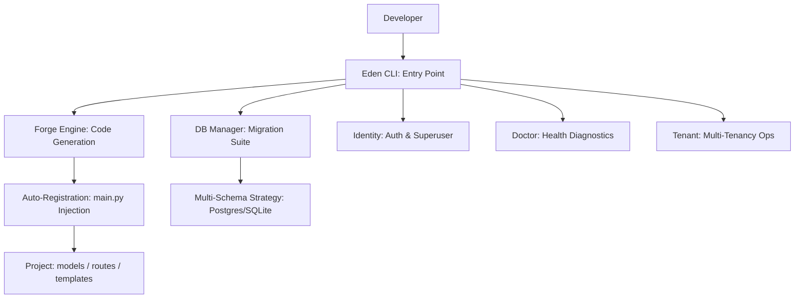

# 🛠️ CLI Suite: High-Speed Scaffolding

**Accelerate your development cycle with the Eden CLI—a professional command-line suite designed for rapid prototyping and enterprise-grade code generation. From initial project architecture to complex multi-tenant migrations, Eden provides an "Elite Forge" to handle the boilerplate for you.**

---

## 🧠 Conceptual Overview

The Eden CLI is more than just a task runner; it's a **Project Lifecycle Manager**. It interacts directly with the Eden application context to understand your models, routes, and configuration, ensuring that all generated code is automatically registered and follows the framework's strict architectural patterns.

### The CLI Architecture



---

## 🌿 Project Initiation: `eden new`

Start every high-fidelity project with the interactive project wizard.

```bash
# Basic setup
eden new my-enterprise-app

# Verbose setup (detailed logs)
eden new my-enterprise-app --verbose
```

The wizard allows you to select your **Scale** and **Features** upfront:
-   **Scale**: `Minimal` (Single-file) for microservices or `Complete` (Modular) for SaaS.
-   **Database**: Automatic setup for `SQLite` (Local) or `Postgres` (Production).
-   **Elite Features**: Pre-configure **Stripe**, **Redis Caching**, and **Social Auth** with zero manual wiring.

---

## 🩺 Health & Diagnostics: `eden doctor`

Ensure your development environment is in peak condition with automated health checks.

```bash
eden doctor
```

The `doctor` command performs a 360-degree audit of your project:
-   ✅ **PyVersion**: Validates Python version compatibility.
-   ✅ **OS Check**: Detects operating system and architecture.
-   ✅ **Structure**: Verifies essential files (`eden.json`, `main.py`, `.env`).
-   ✅ **Database**: Tests connectivity to your configured database.

---

## 🔨 The Elite Forge: `eden generate`

The "Forge" is the crown jewel of the Eden CLI. It doesn't just create files; it understands your project structure and **auto-registers** your new code into the main application.

### 1. Generating Models & Routes
Scaffold core application components with full validation and auto-registration.

```bash
# Create a tenant-aware model
eden generate model Task --tenant-aware --audit

# Create a modular router mapped to /api/v1/billing
eden generate router billing --path /api/v1/billing
```

### 2. Generating Middleware & Tasks
Expand framework capabilities with a single command.

```bash
# Create custom middleware (e.g., logging)
eden generate middleware RequestLogger

# Create a background task
eden generate task SyncInventory
```

### 3. Automated Testing
Generate test scaffolds linked to your existing components.

```bash
# Create unit tests for a specific module
eden generate test auth --type unit
```

---

## 🗄️ Database & Environment: `eden db` & `eden sync`

Manage your schema evolution with integrated migrations that support multi-schema SaaS strategies out of the box.

| Command | Elite Capability |
| :--- | :--- |
| `eden db init` | Initializes the `alembic` environment for async migrations. |
| `eden db generate -m "..."` | Auto-detects model changes and generates a revision script. |
| `eden db migrate` | Applies pending migrations (Handles multiple schemas for Postgres). |
| `eden db history` | **Premium View**: Shows a Rich-powered table of all schema revisions. |
| `eden db check` | Verifies the physical database matches your ORM definitions. |
| `eden sync` | **Atomic Sync**: Runs `check` and `migrate` in one command. |

---

## 🏢 SaaS Operations: `eden tenant`

Manage your multi-tenant infrastructure directly from the terminal without manual SQL.

```bash
# List all registered tenants and their status
eden tenant list

# Provision schemas for all active tenants
eden tenant provision

# Detailed inspection of a specific tenant
eden tenant info acme-corp
```

---

## 🏎️ Developer Power Tools: `shell` & `test`

Eden provides high-utility commands to reduce context switching during core feature development.

### 1. The Interactive Shell: `eden shell`
Launch a premium IPython shell with your entire application context pre-loaded.

```python
# $ eden shell
# Welcome to Eden Shell! Context: app, db, config, models, f, Q
>>> await User.filter_one(email="admin@eden.sh")
<User: admin@eden.sh>
```

### 2. The Integrated Test Runner: `eden test`
A wrapper around `pytest` that enforces Eden's testing standards.

```bash
# Run all tests
eden test

# Run specific module with fail-fast
eden test tests/test_auth_rbac.py --fail-fast
```

---

## 🚀 Execution & Monitoring

### `eden run`
Launch your development server with high-fidelity logging and auto-reload.

```bash
eden run --port 8000 --workers 4
```

### `eden tasks`
Manage and monitor background task queues with Rich status tables.

```bash
# Start a task worker
eden tasks worker

# Monitor task status and history
eden tasks status
eden tasks list
```

---

## 💡 Best Practices

1.  **Forge First**: Never create a model or route from scratch. Use the `forge` to ensure all registration is handled correctly.
2.  **Regular Health Checks**: Run `eden doctor` whenever you update dependencies or change your environment.
3.  **Migration Safety**: Use `eden db history` and `eden db check` to verify schema state before deployment.
4.  **Audit Your Code**: Use `eden generate test` to maintain high coverage as you build new features.

---

**Next Steps**: [Deployment & Scaling](deployment.md)
