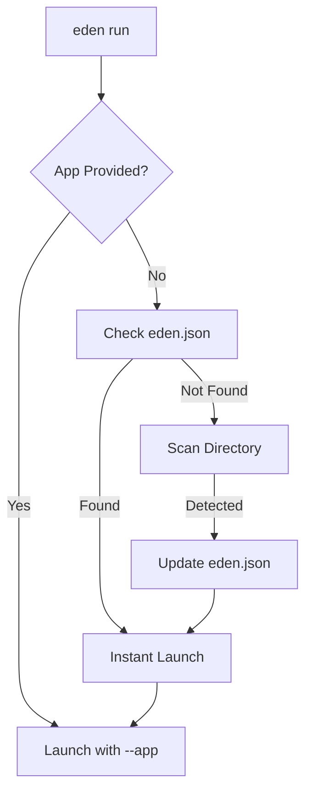

# 🛠️ CLI Suite: High-Speed Scaffolding

**Accelerate your development cycle with the Eden CLI—a professional command-line suite designed for rapid prototyping and enterprise-grade code generation. From initial project architecture to complex multi-tenant migrations, Eden provides an "Elite Forge" to handle the boilerplate for you.**

---

## 🧠 Conceptual Overview

The Eden CLI is more than just a task runner; it's a **Project Lifecycle Manager**. It interacts directly with the Eden application context to understand your models, routes, and configuration.

### The CLI "Smart Hub"

Eden follows a "Zero-Configuration" philosophy. When you run a command, it performs **Smart Discovery** to locate your application entry point:

1. **Direct Check**: Checks if `--app` was passed.
2. **State Check**: Inspects `eden.json` (the CLI's persistent memory).
3. **Discovery Check**: Scans for `app.py`, `main.py`, or `nexus.py` and looks for an `Eden` instance.



---

### 🚀 Execution & Monitoring: `eden run`

Launch your development server with high-fidelity logging, auto-reload, and **Integrated Health Probes**.

```bash
# Basic run with auto-reload and smart discovery
eden run

# Industrial Mode: Multi-worker with SSL and specific host
eden run --host 0.0.0.0 --port 443 --workers 4 --ssl-keyfile key.pem --ssl-certfile cert.pem
```

> [!TIP]
> **Proactive Health Monitoring**
> When running with `eden run`, the CLI automatically mounts an internal `/health` endpoint cluster-wide, allowing your load balancer or kubernetes liveness probes to verify the application's peak condition without manual configuration.

> [!TIP]
> **Why `eden.json`?**
> The CLI saves your detected app path to `eden.json` after the first run. This speeds up subsequent launches by nearly 300ms by skipping the file system scan.

### Smart Reloading

The `run` command automatically configures `uvicorn` to watch for changes not just in `.py` files, but across your entire stack:

- **Static Assets**: `.css`, `.js`
- **Templates**: `.html`, `.j2`
- **Config**: `.env`, `.yaml`, `.json`, `.ini`

Exclusions are handled automatically for `.sqlite`, `.venv`, and `__pycache__` to prevent reload loops.

---

## 🗄️ Database Suite: `eden db`

Eden's database management is built for SaaS-ready schema evolution.

| Command | Elite Capability |
| :--- | :--- |
| **`eden db init`** | Initializes the `alembic` environment for async migrations. |
| **`eden db generate`** | Auto-detects model changes and generates a revision script. |
| **`eden db apply`** | **(Alias: migrate, upgrade)**. Executes pending migrations. |
| **`eden db history`** | **Premium View**: Shows a Rich-powered table of all schema revisions. |
| **`eden db check`** | Verifies the physical database matches your ORM definitions. |

### Advanced Migration Logic

When scaling from a shared schema to a multi-tenant architecture, use the `--tenant` flag:

```bash
# Generate a migration for shared models (Users, Plans, etc.)
eden db generate -m "Add plan type"

# Generate a migration ONLY for isolated tenant models
eden db generate -m "Add task priority" --tenant
```

> [!IMPORTANT]
> **Tenant Isolation Flow**
> If you use `--tenant` during generation, the resulting script will be marked with `__eden_tenant_isolated__ = True`. This ensures that `eden db apply --all-tenants` knows exactly which migrations to run against individual tenant schemas and which to run once against the public schema.

---

## 🔨 The Elite Forge: `eden generate`

The "Forge" creates architectural scaffolds and handles the **Auto-Registration** into your main application.

### 1. Interactive Model Forge

Scaffold models through a guided interactive process. The Forge will ask for field names, types, and constraints, automatically generating the `Mapped` attributes and `f()` metadata.

```bash
# Start the interactive model wizard
eden generate model
```

> [!NOTE]
> **Auto-Registration**
> Every model created via the Forge is automatically registered in your application's `models/__init__.py`, ensuring migrations and the Admin Panel pick it up instantly.

### 2. Router Scaffolding

Create a full CRUD-ready router with versioned path mapping.

```bash
# Create a router mapped to /api/v1/billing
eden generate router billing --path /api/v1/billing
```

---

## 🏎️ Interactive Power: `eden shell`

Launch a premium IPython shell with your entire application context pre-loaded.

```pycon
# $ eden shell
# 🌿 Eden Shell v1.0.0
# 📜 Context: app, db, config, models, f, Q
>>> user = await models.User.filter_one(email="admin@eden.sh")
>>> await user.update(is_superuser=True)
>>> print(f"User: {user.email} perm: {user.is_superuser}")
```

### Context Variables Available

- **`app`**: The running `Eden` application instance.
- **`db`**: The `DatabaseManager` (aliased to `app.db`).
- **`models`**: A namespace containing all discovered `Model` classes.
- **`f` / `Q`**: Field and Query assistants for ORM operations.
- **`config`**: The application's `Settings` instance.

---

## 🩺 System Health: `eden doctor`

Ensure your development environment is in peak condition.

```bash
# Run 360-degree audit
eden doctor
```

The `doctor` performs deep inspections:

1. **Environment**: Validates Python, OS, and Architecture.
2. **Integrity**: Verifies required files and `eden.json` health.
3. **Network**: Tests database connectivity and external service heartbeats.
4. **Security**: Checks for exposed `.env` variables and open permissions.

---

## 🧪 Integrated Test Runner: `eden test`

Eden provides a high-fidelity wrapper around `pytest` that enforces framework-specific standards and pre-loads the test database.

```bash
# Run specific module with fail-fast
eden test tests/test_auth_rbac.py --fail-fast
```

---

## 🔒 Security Suite: `eden auth`

Eden's Security CLI handles the foundational identity setup of your application, ensuring you can quickly bootstrap administrative access safely.

| Command | Elite Capability |
| :--- | :--- |
| **`createsuperuser`** | Creates a global administrator with "God Mode" (`is_superuser=True`). |

### 1. Bootstrapping Superusers

Use this command to create your first administrative user. This user bypasses all RBAC guards and is granted full access to the **Eden Admin Panel**.

```bash
# Detailed superuser creation with full profile
eden auth createsuperuser \
    --full-name "Johnson Berko" \
    --email "berkojohnson@gmail.com" \
    --password "abc.123"
```

> [!TIP]
> **Production Best Practice**
> For industrial deployments, the CLI should be the *only* way to create initial root users. All other user creation should flow through your application's service or domain layer for proper auditing.

For a deep dive into user lifecycles, password hashing, and role modes (JSON vs models), see the [User Identity Guide](./user-identity.md).

---

## 🏗️ Project Creation: `eden new`

Start a brand new Eden application through an interactive wizard that configures your database, auth, and extras automatically.

```bash
# Start the interactive wizard
eden new my_project

# Non-interactive scaffolding to a specific path
eden new my_project ./custom-path --verbose
```

---

## ⏰ Background Jobs: `eden tasks`

Eden integrates tightly with Taskiq for asynchronous background processing. Control your worker fleet from here.

| Command | Elite Capability |
| :--- | :--- |
| **`eden tasks worker`** | Starts the worker process to consume background tasks in real-time. |
| **`eden tasks scheduler`** | Boots up the cron scheduler for dispatching periodic tasks. |
| **`eden tasks status`** | Shows execution statistics, queue lengths, and processing rates. |
| **`eden tasks list`** | Lists all registered periodic tasks and their schedules. |
| **`eden tasks dead-letter`** | Inspect processes that completely failed after exhausting retries. |

---

## 🏢 Fleet Management: `eden tenant`

A dedicated toolkit to control multi-tenant provisioning (schema creation) directly from the terminal.

| Command | Elite Capability |
| :--- | :--- |
| **`eden tenant create`** | Instantly scaffolds a new tenant, registers them, and rigorously executes database lifecycle signals. |
| **`eden tenant list`** | Shows all registered tenants (customer organizations) globally. |
| **`eden tenant info`** | Deep dive into a specific tenant's resource allocation and status. |
| **`eden tenant provision`** | Forces the schema creation & migration lifecycle for isolated tenants. |

### The Creation Lifecycle

When using `eden tenant create [name]`, Eden performs a high-fidelity instantiation process:
1. Validates the tenant name ensuring isolation criteria are met.
2. Creates the centralized Tenant entity record.
3. Automatically fires internal lifecycle signals (e.g. `on_tenant_created`) allowing the rest of the framework to intercept, allocate schema resources, and establish isolated metadata seamlessly.

---

## 💡 Best Practices

1. **Forge First**: Never manually write a model; use `generate model` to ensure correct metadata and registration.
2. **Sync Often**: Run `eden sync` (which executes `check` then `migrate`) before any feature deployment.
3. **Shell for Prototyping**: Test complex ORM queries in `eden shell` before coding them into a view.
4. **Tenant Safety**: Always verify your migrations with `eden db history` to ensure `--tenant` flags are correctly set for isolated models.

---

**Next Steps**: [Security & Identity](./security-and-identity.md) | [Multi-Tenancy Masterclass](./multi-tenancy-masterclass.md)
