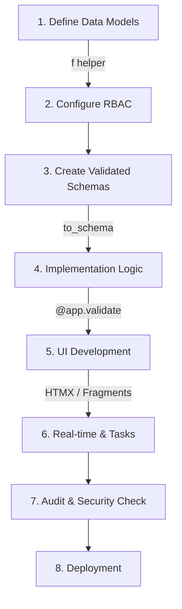

# 🔄 Eden Application Development Cycle

Building professional, high-performance web applications with Eden follows a refined, "Elite-First" workflow. This guide outlines the standard development cycle to help you build structured and scalable SaaS engines.

---

## 🗺️ The Eden Workflow at a Glance



---

## 🏗️ Phase 1: Data Architecture

In Eden, the **Database Model** is the single source of truth.

1.  **Define Models**: Use the `f()` helper to define columns with UI metadata (labels, widgets).
2.  **Initial Database Sync**: You must initialize the repository, generate a migration, and apply it before using the database.
    ```bash
    eden db init
    eden db generate -m "initial"
    eden db migrate
    ```
3.  **Enable RBAC**: Define `__rbac__` rules on the model for Row-Level Security.
4.  **Add Logic**: Implement properties and methods for business rules.

```python
class Project(Model):
    __rbac__ = {"read": AllowOwner(), "update": AllowRole("manager")}
    
    name: Mapped[str] = f(max_length=100, label="Project Name")
    status: Mapped[str] = f(default="active", widget="select", choices=[("active", "Active"), ("archived", "Archived")])
```

---

## 🛂 Phase 2: Validation & Schemas

Bridge the gap between your DB and the Request.

1.  **Generate Schemas**: Use `Model.to_schema()` to create Pydantic schemas that inherit constraints.
2.  **Define Forms**: Use `Schema.as_form()` for server-side form rendering.
3.  **Cross-Validation**: Use Pydantic `@model_validator` for multi-field business logic.

---

## 🛣️ Phase 3: Route Implementation

Eden routes are clean and declarative.

1.  **Decorators**: Use `@app.get` / `@app.post`.
2.  **Auto-Validation**: Use `@app.validate(Schema)` to handle input parsing and error re-rendering automatically.
3.  **Context Magic**: Access `request.user` and `request.tenant` natively.

```python
@app.post("/projects/new")
@app.validate(ProjectSchema, template="projects/form.html")
async def create_project(data: ProjectSchema, request):
    # 'data' is already validated and typed!
    project = await Project.create_from(data)
    return redirect(url_for("projects:list"), flash="Project Created!")
```

---

## 🎨 Phase 4: UI & Templating

Build stunning interfaces with zero-friction directives.

1.  **Layouts**: Define a `base.html` and use `@extends`.
2.  **Directives**: Use `@auth`, `@can`, and `@url` for dynamic logic.
3.  **Elite Components**: Encapsulate complex UI into `@component` tags.
4.  **High-Fidelity Diagnostics**: Leverage the diagnostic error page to fix template issues instantly with integrated code exploration and context inspection.

```html
@extends("base")

@section("content") {
    @for (project in projects) {
        @component("project_card", project=project)
    }
}
```

---

## ⚡ Phase 5: Interactivity & Performance

Take your app to the "Killer" level.

1.  **HTMX Integration**: Use `hx-get` and `@fragment` for surgical updates.
2.  **Reactive ORM**: Set `__reactive__ = True` for instant updates via WebSocket.
3.  **Background Tasks**: Offload heavy work (Email, AI) to `@app.task`.

---

## 🛡️ Phase 6: Security & Auditing

Before shiping, Eden helps you verify integrity.

1.  **RBAC Check**: Verify template auth with `@can` / `@cannot`.
2.  **CSRF Protections**: Ensure all forms have `@csrf`.
3.  **Multi-Tenancy**: Check that `tenant_id` is automatically applied to all queries.

---

## 🚀 Phase 7: Deployment

Eden is built for modern cloud environments.

1.  **CLI Migrations**: `eden db migrate "initial"`
2.  **Production Server**: Run via `uvicorn` or `gunicorn`.
3.  **Static Assets**: Use `@vite` for premium asset bundling.

---

**Ready to start?** Follow the **[Task 1: Project Setup](../tutorial/task1_setup.md)** tutorial.
