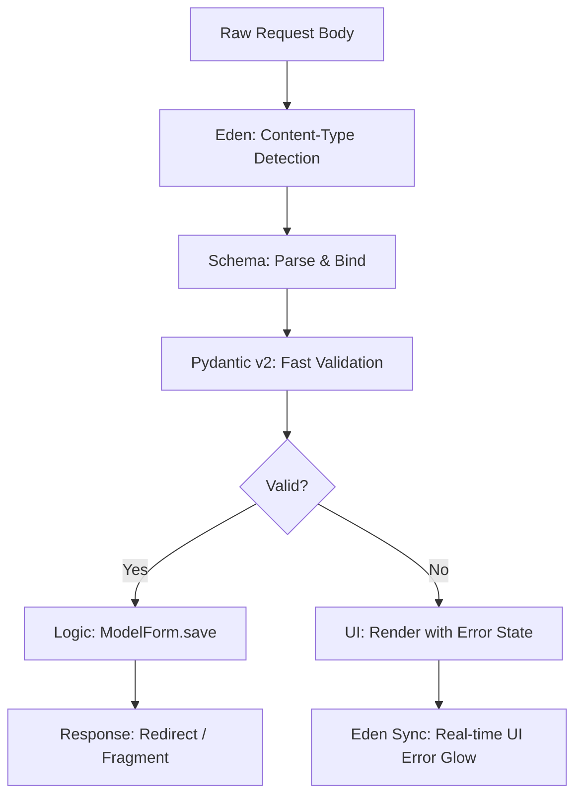

# 📝 High-Fidelity Forms & Validation

**Define your data architecture, complex validation logic, and premium UI rendering in a single, unified declarative layer. Eden forms bridge the gap between your Database Models and the User Interface.**

---

## 🧠 Conceptual Overview

Eden's form system follows a **Unified Schema** architecture. Instead of separating "Validation Logic" from "UI Rendering," you define a single `Schema` that orchestrates the entire lifecycle of a user-submitted resource.

### The High-Fidelity Lifecycle



### Key Pillars
1.  **Pydantic v2 Powered**: Industry-leading speed and type safety out of the box.
2.  **Model Inheritance**: Forms can be automatically derived from ORM models using `class Meta`.
3.  **Fragment-Native**: Designed to work seamlessly with HTMX for real-time validation without page reloads.

---

## 🏗️ Unified Schemas

A `Schema` is your source of truth. It defines the constraints (min-length, regex, range) and the UI metadata (labels, widgets, help text).

```python
from eden import Schema, field, EmailStr

class RegistrationSchema(Schema):
    email: EmailStr = field(
        label="Business Email",
        placeholder="you@company.com",
        widget="email"
    )
    password: str = field(
        min_length=12,
        widget="password",
        help_text="Must contain at least 12 characters."
    )
    accept_tos: bool = field(
        label="I accept the Terms of Service",
        default=False
    )
```

---

## 🧬 Field Types & Widgets

Eden maps Python types to HTML5 widgets automatically, but you can override them for advanced UI.

| Python Type | Default Widget | Description |
| :--- | :--- | :--- |
| `str` | `text` | Standard input. |
| `int` / `float` | `number` | Numeric input with `min`/`max` support. |
| `EmailStr` | `email` | Native browser email validation. |
| `bool` | `checkbox` | Boolean toggle. |
| `datetime` | `datetime-local` | Date/Time picker. |
| `UploadedFile` | `file` | Multi-part file upload with [Storage integration](storage.md). |

### Customizing Widgets
```python
bio: str = field(widget="textarea", rows=5)
category: str = field(widget="select", choices=[("tech", "Technology"), ("life", "Lifestyle")])
```

---

## 🚀 Model-Bound Forms (`ModelForm`)

`ModelForm` is the "Elite" way to handle CRUD. It automatically generates a schema from your Database Model and provides a `save()` method that handles creating or updating records.

```python
from eden.forms import ModelForm
from app.models import Project

class ProjectForm(ModelForm):
    class Meta:
        model = Project
        fields = ["name", "description", "start_date"]
        
    # Override model field with form-specific UI
    description = FormField(widget="textarea", placeholder="Describe your project...")

@app.post("/projects/create")
async def create_project(request):
    form = await ProjectForm.from_request(request)
    if form.is_valid():
        # Atomically creates the Project record
        project = await form.save()
        return redirect(f"/projects/{project.id}")
```

---

## 📤 Advanced File Handling

Eden’s `FileField` supports secure, multi-part uploads with built-in progress tracking.

### Secure Uploads
```python
class AttachmentSchema(Schema):
    doc: UploadedFile = field(label="Report (PDF)", widget="file")

@app.post("/upload")
async def upload_file(request):
    form = await AttachmentSchema.from_request(request)
    if form.is_valid():
        file = form.files["doc"]
        
        # Save to Local, S3, or Supabase via Storage Layer
        path = await storage.save(f"uploads/{file.filename}", file.data)
        ...
```

### Real-time Progress Tracking
Enable the `show_progress` flag to inject a functional progress bar into the UI.
```html
{{ form['doc'].as_file(show_progress=True) }}
```

---

## 🎨 High-Fidelity Rendering

### Directives
Eden provides short-hand directives for common rendering patterns.

```html
<form method="POST" enctype="multipart/form-data">
    @csrf
    
    @render_field(form['email'], class="input-primary")
    @render_field(form['password'], class="input-primary")
    
    <button type="submit" class="btn">Register</button>
</form>
```

### Manual Rendering (The "Pro" Way)
When you need complete control over the HTML structure, access the field attributes directly.

```html
<div class="field-container @if(form['email'].error) { has-error }">
    {{ form['email'].render_label(class="top-label") }}
    {{ form['email'].render(class="form-input", hx_post="/validate/email") }}
    
    @if(form['email'].error) {
        <span class="error-msg">{{ form['email'].error }}</span>
    }
</div>
```

---

## 💡 Best Practices

1.  **Use `ModelForm` for CRUD**: It reduces boilerplate and ensures your database constraints are respected in the UI.
2.  **Explicit CSRF**: Always use the `@csrf` directive in your forms to protect against cross-site request forgery.
3.  **Async Validation**: Handle complex verification (like scanning for viruses or checking unique email addresses) inside your service layer, calling `form.add_error()` if they fail.
4.  **HTMX Inline Validation**: Use `hx-post` on individual fields to trigger server-side validation as the user types, providing instant feedback.

---

**Next Steps**: [Database & Models (ORM)](orm.md)
