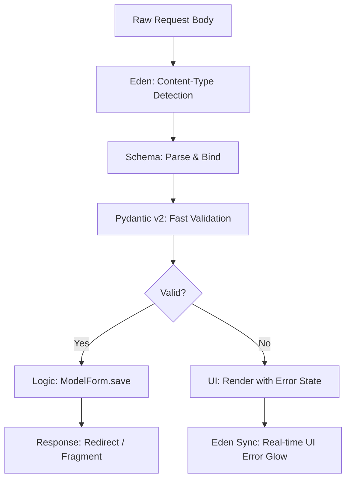

# 📝 High-Fidelity Forms & Validation

**Define your data architecture, complex validation logic, and premium UI rendering in a single, unified declarative layer. Eden forms bridge the gap between your Database Models and the User Interface.**

---

## 🧠 Conceptual Overview

Eden's form system follows a **Unified Schema** architecture. Instead of separating "Validation Logic" from "UI Rendering," you define a single `Schema` that orchestrates the entire lifecycle of a user-submitted resource.

### The High-Fidelity Lifecycle



### Key Pillars

1.  **Pydantic v2 Powered**: Industry-leading speed and type safety out of the box.
2.  **Model Inheritance**: Forms can be automatically derived from ORM models using `class Meta`.
3.  **Fragment-Native**: Designed to work seamlessly with HTMX for real-time validation without page reloads.

---

## 🏗️ Unified Schemas

A `Schema` is your source of truth. It defines the constraints (min-length, regex, range) and the UI metadata (labels, widgets, help text).

```python
from eden import Schema, field, EmailStr

class RegistrationSchema(Schema):
    email: EmailStr = field(
        label="Business Email",
        placeholder="you@company.com",
        widget="email"
    )
    password: str = field(
        min_length=12,
        widget="password",
        help_text="Must contain at least 12 characters."
    )
    accept_tos: bool = field(
        label="I accept the Terms of Service",
        default=False
    )
```

---

## 🧬 Schema Inheritance & Extensions

Eden support standard Python inheritance for Schemas. Field definitions and type annotations are correctly propagated and merged in subclasses, allowing for modular form design.

```python
class BaseContactSchema(Schema):
    email: EmailStr = field(label="Email Address")
    subject: str = field(min_length=5)

class SupportSchema(BaseContactSchema):
    # Inherits email and subject
    # Adds priority and category
    priority: str = field(widget="select", choices=[("low", "Low"), ("high", "High")])
    category: str = field(default="general")

# You can also override inherited fields
class CorporateContactSchema(BaseContactSchema):
    email: EmailStr = field(label="Corporate Email ONLY")
```

> [!TIP]
> Use inheritance to share common fields like `address`, `user_metadata`, or `audit_trails` across different parts of your application.

---

## 🧬 Field Types & Widgets

Eden maps Python types to HTML5 widgets automatically, but you can override them for advanced UI.

| Python Type | Default Widget | Description |
| :--- | :--- | :--- |
| `str` | `text` | Standard input. |
| `int` / `float` | `number` | Numeric input with `min`/`max` support. |
| `EmailStr` | `email` | Native browser email validation. |
| `bool` | `checkbox` | Boolean toggle. |
| `datetime` | `datetime-local` | Date/Time picker. |
| `UploadedFile` | `file` | Multi-part file upload with [Storage integration](storage.md). |

### Customizing Widgets

```python
bio: str = field(widget="textarea", rows=5)
category: str = field(widget="select", choices=[("tech", "Technology"), ("life", "Lifestyle")])
```

---

## 🚀 Model-Bound Forms (`ModelForm`)

`ModelForm` automatically generates a schema from your ORM models. It includes a `.save()` method that handles instantiation and persistence.

```python
from eden.forms import ModelForm
from app.models import Project

class ProjectForm(ModelForm):
    class Meta:
        model = Project
        fields = ["name", "description", "status"]
        
    # Override model field with form-specific UI
    description = field(widget="textarea", placeholder="Enter project details...")

@app.post("/projects/{id}/edit")
async def edit_project(request, id: int):
    project = await Project.query().get(id)
    form = await ProjectForm.from_request(request, instance=project)
    
    if form.is_valid():
        await form.save() # Updates the existing record
        return redirect(f"/projects/{id}")
```

---

## 📤 Advanced File Handling

Eden’s `FileField` supports secure, multi-part uploads with built-in progress tracking.

### File Schemas

```python
class AvatarSchema(Schema):
    avatar: UploadedFile = field(widget="file", label="Profile Picture")
```

### High-Fidelity Rendering

Enable `show_progress` to automatically inject an HTMX-compatible progress bar.

```html
<form hx-post="/upload" hx-encoding="multipart/form-data">
    @csrf
    {{ form['avatar'].as_file(show_progress=True, accept="image/*") }}
    <button type="submit">Upload</button>
</form>
```

---

## 🎨 Dual-Mode Rendering

Eden supports both "Quick-Start" composite rendering and "Pro-Logic" manual rendering.

### 1. Composite Rendering (Fast)

The `@render_field` directive renders the label, input, and error message in a standard container.

```html
@render_field(form['email'], class="input-primary")
```

### 2. Manual Rendering (Granular)

For complete control over the markup, access the field properties directly.

```html
<div class="group @if(form['email'].error) { border-red-500 }">
    <label>{{ form['email'].label }}</label>
    
    {{ form['email'].render(class="form-control", placeholder="Override...") }}
    
    @if(form['email'].error) {
        <p class="text-red-500">{{ form['email'].error }}</p>
    }
</div>
```

---

## ⚡ HTMX Inline Validation

You can provide instant feedback by targeting specific fields using HTMX.

```html
{{ form['username'].render(hx_post="/validate/username", hx_trigger="blur") }}
```

In the backend:

```python
@app.post("/validate/username")
async def validate_username(request):
    form = await RegistrationSchema.from_request(request)
    form.is_valid() # Run validation
    
    # Return just the field fragment with current error state
    return form['username'].render()
```

---

## 💡 Best Practices

1.  **Use `v()` for Speed**: The `v` alias makes large schemas much more readable.
2.  **Atomic Saves**: Always use `ModelForm.save()` for CRUD to ensure transactional integrity.
3.  **Progress Bars**: Always enable `show_progress` for files larger than 5MB to improve user perceived performance.
4.  **CSRF Enforcement**: Never omit `@csrf` inside a `<form>`. Eden will automatically detect its absence in development.

---

**Next Steps**: [Database & Models (ORM)](orm.md)
