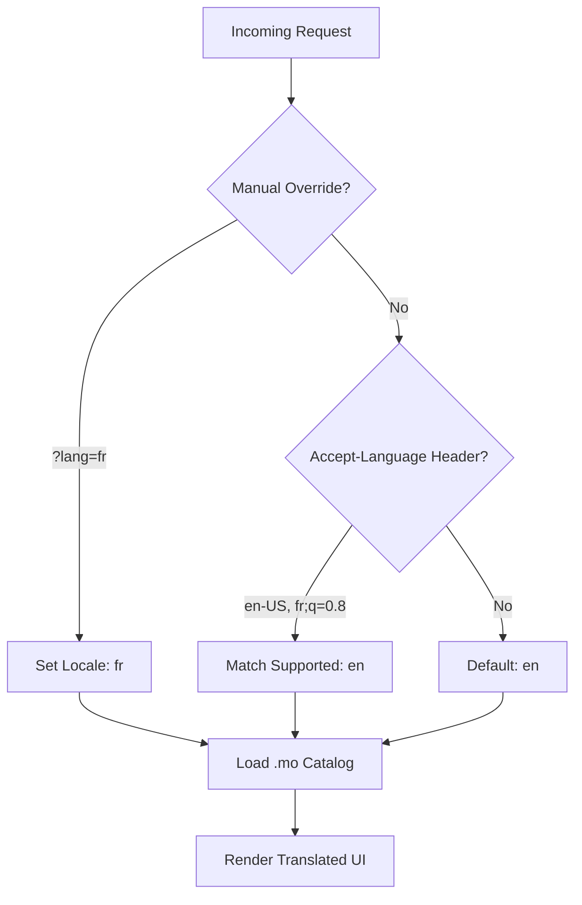

# 🌍 Internationalization (i18n) & Localization

**Global by design. Eden provides a seamless, standard-compliant translation engine based on `gettext`, allowing you to localize your SaaS for international markets with minimal overhead.**

---

## 🧠 Conceptual Overview

Eden’s i18n system automates the detection, resolution, and application of locales across your entire application stack—from Python logic to Jinja2 templates.

### The Locale Resolution Pipeline



---

## 🚀 Setting Up the Global Engine

### 1. Configuration
Define your supported languages and the default fallback in your configuration.

```python
# settings.py
SUPPORTED_LOCALES = ["en", "fr", "es", "de"]
DEFAULT_LOCALE = "en"
LOCALE_DIR = "locales"
```

### 2. Activate Middleware
Enable the i18n middleware in `app.py` to handle automatic detection per request.

```python
app.add_middleware("i18n")
```

---

## 🖊️ Marking Strings for Translation

### In Python Logic
Use the `_()` function to mark strings. These are extracted by the CLI into translation catalogs.

```python
from eden.i18n import _

async def welcome_view(request):
    title = _("Welcome back, {name}!").format(name=request.user.name)
    return {"title": title}
```

### In Templates
The `_()` and `ngettext()` functions are automatically available in all Eden templates.

```html
<h1>{{ _("Dashboard Overview") }}</h1>

<!-- Pluralization support -->
<p>
    {{ ngettext(
        "You have {count} active project.", 
        "You have {count} active projects.", 
        project_count
    ).format(count=project_count) }}
</p>
```

---

## ⚡ Elite Patterns

### 1. Locale-Aware Formatting Filters
Eden includes industrial-grade Jinja2 filters that automatically format data according to the current user's locale.

| Filter | Description | Output (EN) | Output (DE) |
| :--- | :--- | :--- | :--- |
| `{{ val\|date }}` | Localized Date | `Mar 18, 2024` | `18.03.2024` |
| `{{ val\|number }}`| Format Number | `1,500.50` | `1.500,50` |
| `{{ val\|currency }}`| Localized Currency| `$50.00` | `50,00 €` |

### 2. The Language Switcher
Create a premium language picker that updates the user's session and reloads the page.

```html
<div class="flex gap-4" x-data>
    <a href="?lang=en" :class="current_locale == 'en' ? 'text-emerald-500' : 'text-slate-400'">
        English
    </a>
    <a href="?lang=fr" :class="current_locale == 'fr' ? 'text-emerald-500' : 'text-slate-400'">
        Français
    </a>
</div>
```

### 3. CLI Workflow (Continuous Localization)
Eden’s CLI makes it easy to maintain your translations as your app grows.

```bash
# 1. Extract all strings from code/templates into a .pot template
eden i18n extract

# 2. Update existing language catalogs with new strings
eden i18n update

# 3. Compile .po files into binary .mo files for high-speed lookup
eden i18n compile
```

---

## 📄 API Reference

### Core Functions (`eden.i18n`)

| Function | Parameters | Description |
| :--- | :--- | :--- |
| `_` | `message: str` | Translates a single string. |
| `ngettext` | `singular, plural, n` | Handles complex pluralization logic. |
| `get_current_locale` | - | Returns the active locale for the current request context. |

### `Translations` Manager

| Method | Description |
| :--- | :--- |
| `activate(locale)` | Manually switches the translation context (e.g., in background tasks). |
| `available_locales` | Returns a list of all installed language packs. |

---

## 💡 Best Practices

1.  **Use Named Placeholders**: Always use `_("Welcome, {name}").format(name=...)`. Positional arguments (`%s`) are difficult for translators to reorder for different grammars.
2.  **Breadcrumbs in Text**: Provide context in your strings if they are ambiguous (e.g., `_("Log In (Button Text)")`).
3.  **Default to English**: Keep your source strings in English as it is the most common "pivot" language for translation services.
4.  **Version Control**: Always commit your `.po` files, but you can usually ignore the compiled `.mo` files as they are artifacts of the build process.

---

**Next Steps**: [Multi-Tenancy & SaaS Architecture](tenancy.md)
