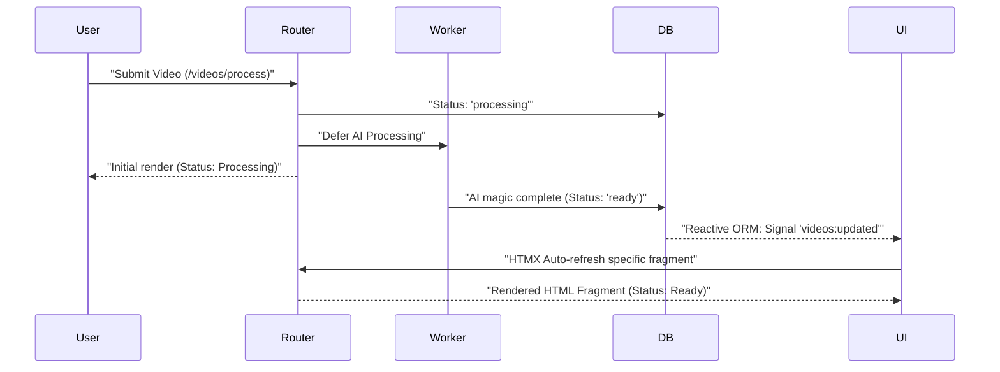

# 🚀 Killer Features & Elite Architecture

**Eden isn't just a library; it's a curated developer ecosystem. By eliminating the friction of integrating disparate tools, Eden provides a unified "Zero-Configuration" experience that allows you to build high-fidelity applications with unprecedented speed.**

---

## 💎 1. The Unified Developer API

One of the most significant advantages of Eden is the **Consolidated Import Pattern**. By abstracting the complexities of Starlette, SQLAlchemy, and Pydantic into a single interface, Eden reduces mental context switching.

### The "Eden Way" (Clean & Direct)
```python
# Before (Legacy/Messy)
from sqlalchemy.orm import Mapped, relationship
from sqlalchemy import select, func
from starlette.requests import Request
from pydantic import BaseModel

# After (Eden Elite 🌿)
from eden import Model, f, Mapped, select, func, Request, json, Schema, v
```

---

## ⚡ 2. Native Real-time Sync (Reactive ORM)

Eden features a "Zero-Configuration" real-time layer. Any change in your database can be instantly reflected on every connected user's screen—without a single line of client-side JavaScript.

### Deep Dive: Reactive Models
To make a model reactive, simply set `__reactive__ = True`. Eden will automatically broadcast events to a WebSocket channel whenever a record is created, updated, or deleted.

```python
class Notification(Model):
    __reactive__ = True
    message: Mapped[str] = f()
```

---

## 🎯 3. Fragment-Based HTMX Workflow

Eden's templating engine is uniquely aware of HTMX. You can mark specific regions of your template and have Eden render **only those regions** during an AJAX request, without creating separate partial files.

```html
<div id="stats">
    @fragment("stats_grid") {
        <!-- This block is rendered surgically when HX-Target is 'stats' -->
        <div class="stat">...</div>
    }
</div>
```

---

## 🏗️ 4. Server-Side "Elite" Components

Eden introduces a revolutionary component system that allows you to build interactive UI widgets entirely in Python. These components manage their own state and handle interactivity via HTMX.

### The "WOW" Factor: No-JS Interactivity
```python
@register("newsletter")
class NewsletterComponent(Component):
    template_name = "newsletter.html"
    
    @action
    async def subscribe(self, request, email: str):
        await db.save_subscriber(email)
        self.is_subscribed = True
        return await self.render()
```

---

## 🎪 The "Killer" Synergy: The AI Video Loop

The true power of Eden is how these features work together. Let's look at an AI-powered processing pipeline:

### The Synergy Flow



### Why this is a "Killer" Scenario:
1.  **Reactive ORM**: `video.save()` automatically sent the event.
2.  **WebSockets**: The bridge carried that event to the browser.
3.  **HTMX**: The `hx-trigger` matched the event and requested a refresh.
4.  **Auto-Fragments**: Eden rendered **only** the `status_badge` fragment.

**Total JavaScript written: 0 lines.**

---

## 🛡️ 5. Integrated Multi-Tenancy

Eden isn't just "tenant-aware"; it's **Tenant-Native**. Isolation is enforced at the ORM level, preventing data leaks by default.

```python
# All queries are automatically scoped to the current tenant context
projects = await Project.all()
# SELECT * FROM projects WHERE tenant_id = 'current-tenant-uuid'
```

---

**Next Steps**: [The Eden Development Cycle](development-cycle.md)
