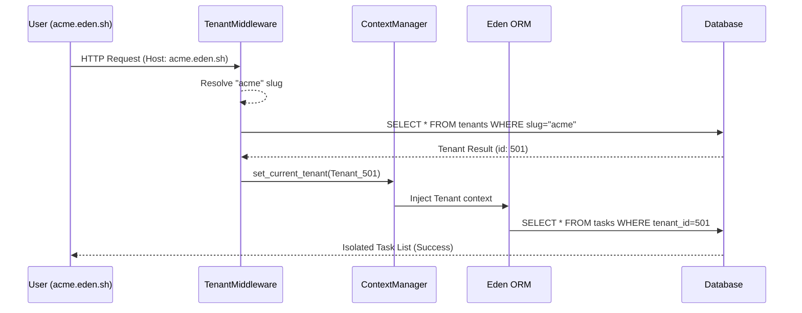

# 🏢 Multi-Tenancy & SaaS Masterclass

**Build scalable, enterprise-ready SaaS applications with Eden's native multi-tenancy. Eden provides a "Bulletproof Isolation" engine built directly into the core ORM and Middleware layers, ensuring data privacy by default.**

---

## 🧠 Architectural Mental Model

Multi-tenancy in Eden is designed around the **Request-Context-Isolation** loop. Every request is automatically scanned for a "Tenant Identifier," which is then injected into the framework's context to enforce strict data silos.



---

## 🚀 1. Setup & Configuration

### Activate the Middleware

In your application entry point, register the `TenantMiddleware`. This handles "discovering" the tenant for every incoming request.

```python
from eden import Eden
from eden.tenancy.middleware import TenantMiddleware

app = Eden(title="Eden SaaS")

app.add_middleware(
    TenantMiddleware,
    strategy="subdomain",  # Options: subdomain, header, path, session
    base_domain="eden.sh"  # Required for subdomain strategy
)
```

### Resolution Strategies

| Strategy | Target | Best For |
| :--- | :--- | :--- |
| **`subdomain`** | `acme.myapp.com` | White-label SaaS, Corporate Portals. |
| **`header`** | `X-Tenant-ID: 123` | Mobile Apps, Internal APIs. |
| **`session`** | `session["_tid"]` | Single-domain apps with a tenant switcher. |
| **`path`** | `/t/acme/dashboard` | Developer tools, shared sandboxes. |

---

## 🗄️ 2. Data Isolation (The ORM Layer)

Eden ensures you never "forget" a `WHERE tenant_id = ...` clause.

### Row-Level Isolation (`TenantMixin`)

Simply inherit from `TenantMixin` to mark a model as isolated.

```python
from eden.db import Model, f
from eden.tenancy.mixins import TenantMixin

class Project(Model, TenantMixin):
    """
    Automatically adds 'tenant_id' and enforces scoping on ALL queries.
    """
    name: str = f(max_length=200)
```

> [!IMPORTANT]
> **No-Leak Guarantee**: If a model uses `TenantMixin` and no tenant is found in the current request context, Eden defaults to a **Fail-Secure** state, returning zero results rather than risking a global data leak.

---

## 🏗️ 3. Enterprise Schema Isolation (Postgres)

For high-compliance environments, Eden supports **Schema-Level Isolation** using PostgreSQL namespaces.

### How it Works

Eden leverages the PostgreSQL `search_path` to dynamically route queries to a physical schema dedicated to that tenant.

```python
# .env
TENANCY_STRATEGY=schema
TENANCY_DEFAULT_SCHEMA=public
```

### Automated Provisioning

Eden can automatically create a physical schema and run all migrations when a new tenant signs up:

```python
await tenant.provision_schema(session) # Creates schema + runs migrations
```

---

## ⚡ 4. Elite Patterns

### Cross-Tenant Reporting (`AcrossTenants`)

System administrators often need to perform global reporting. Use the `AcrossTenants` context manager to temporarily bypass isolation.

```python
from eden.tenancy import AcrossTenants

async with AcrossTenants():
    # Scoping is disabled within this block
    total_revenue = await Invoice.sum("amount")
```

### Live-Sync Isolation

When using `@reactive` or WebSockets, Eden automatically isolates broadcast channels using the following format:

* `tenant:{tenant_id}:{table_name}`
* `org:{org_id}:{table_name}`

---

## 🛠️ 5. Fleet Lifecycle Management

### Multi-Tenant Migrations

When generating migrations for isolated models, use the `--tenant` flag. To apply migrations across your entire fleet:

```bash
# Upgrade EVERY tenant schema to the latest version
eden migrate upgrade --all-tenants
```

### Lifecycle Signals
When using the CLI or API to create a new tenant (e.g. `eden tenant create`), Eden triggers strict lifecycle signals. 

```python
from eden.tenancy.signals import tenant_created

@tenant_created.connect
async def provision_tenant_resources(tenant: "Tenant", session):
    # This automatically runs when 'eden tenant create' is invoked!
    await tenant.provision_schema(session)
```
Using signals guarantees your fleet management stays decoupled and extensible.

### Tenant Seeding

Always seed essential data (roles, default settings) immediately after tenant creation using a context manager:

```python
from eden.tenancy import set_current_tenant

async with set_current_tenant(new_tenant.id):
    await Role.create(name="Admin", permissions=["*"])
```

---

## 💡 Best Practices

1. **Prefer Permissions over Roles**: Check for `feature:billing` instead of `is_pro_tenant`.
2. **Test for Leakage**: Use `TenantClient` in your tests to verify that Tenant A can never see Tenant B's data.
3. **Audit Compliance**: Always log uses of `AcrossTenants()` to your security audit trail.
4. **Strict Mode**: Enable `TENANCY_STRICT_MODE=True` in development to raise errors when isolation is missing.

---

**Next Steps**: [Identity & Security Masterclass](security-and-identity.md) | [Background Tasks](background-tasks.md)
