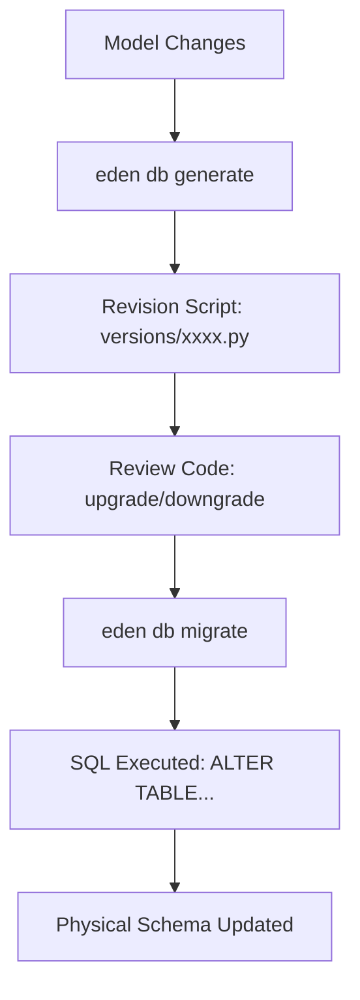

# 🏗️ Database Migrations

**Eden uses Alembic under the hood to provide a robust, version-controlled migration system that evolves your schema as your models change.**

---

## 🧠 Conceptual Overview

Database migrations are the bridge between your **Python Models** and your **Physical Database**. Eden manages this bridge automatically by inspecting your models and generating the necessary SQL revision scripts.

### The Migration Lifecycle



### Core Philosophy
1.  **Automation First**: Eden automatically detects additions, moves, and deletions in your `Model` fields.
2.  **Version Controlled**: Every schema change is captured in a Python script that should be committed to your repository.
3.  **Atomic Upgrades**: Migrations are executed within transactions (where supported), ensuring a fail-safe schema evolution.

---

## 🏗️ CLI Reference

Eden provides a unified CLI for all database management tasks.

| Command | Description |
| :--- | :--- |
| **`eden db init`** | Initializes the `migrations/` directory and `alembic.ini`. |
| **`eden db generate -m "..."`** | Auto-detects model changes and creates a new revision script. |
| **`eden db migrate`** | Shorthand for `upgrade head`. Applies all pending migrations. |
| **`eden db upgrade head`** | Upgrades the database to the latest available version. |
| **`eden db downgrade -1`** | Reverts the last applied migration. |
| **`eden db history`** | Lists all versions and their application status. |
| **`eden db check`** | Scans for "schema drift" between your models and the DB. |

---

## 🚀 Scenario: Initial Setup

When starting a new project, follow this exact sequence to prepare your database environment:

### 1. Initialize the Environment
This command creates the `migrations/` folder and configures your connection strings from your `.env`.
```bash
eden db init
```

### 2. Generate the Base Migration
Eden scans its internal models (Users, Tenancy) and your project models to create the initial tables.
```bash
eden db generate -m "initial setup"
```

### 3. Apply the Migration
Physically create the tables in your database (PostgreSQL, SQLite, etc.).
```bash
eden db migrate
```

---

## 🧬 Scenario: Adding a New Field

### 1. Update the Model
Add your new field using the `f()` helper.
```python
class Post(Model):
    title: Mapped[str] = f()
    views: Mapped[int] = f(default=0) # New field
```

### 2. Generate & Review
Generate the script and review the `upgrade()` and `downgrade()` functions inside `migrations/versions/`.
```bash
eden db generate -m "add views to post"
```

### 3. Deploy
Apply the change to your database.
```bash
eden db migrate
```

---

## 🌩️ Multi-Tenancy Migrations

In a multi-tenant environment (using schemas or separate databases), Eden's migration system can be configured to execute across all environments.

| Task | Command |
| :--- | :--- |
| **Global Upgrade** | `eden db migrate --all-tenants` |
| **Tenant Specific** | `eden db migrate --tenant=customer_a` |
| **Sync Check** | `eden db check --all-tenants` |

---

## 💡 Best Practices

1.  **Never Edit History**: If a migration is flawed, don't delete the file. Generate a new "Fix" migration to revert or amend the change.
2.  **Commit Your Scripts**: Always commit the `migrations/` directory to Git. This ensures all team members and production servers are in sync.
3.  **Default Values**: When adding a `NOT NULL` column to an existing table, always provide a `default` or `server_default` to prevent errors during the upgrade of existing data.
4.  **Schema Drift**: Run `eden db check` in your CI/CD pipeline to ensure your database hasn't been manually altered outside of migrations.

---

**Next Steps**: [Relationship Patterns](orm-relationships.md)
