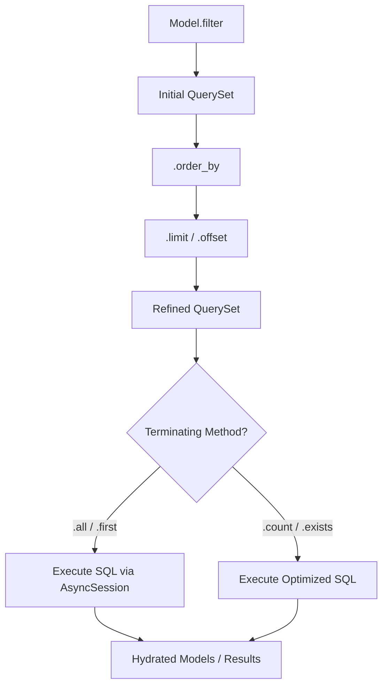

# 🔍 Querying & High-Fidelity Lookups

**Eden provides a powerful, Django-inspired QuerySet API that allows you to express complex database logic in clean, readable Python code.**

---

## 🧠 Conceptual Overview

The `QuerySet` is the core engine of Eden's data retrieval. It acts as a **lazy** proxy to your database, allowing you to chain filters, orders, and limits without executing SQL until the very last moment.

### The Query Lifecycle



### Key Pillars
1.  **Lazy Execution**: Database hits only occur when you explicitly request data (e.g., via `.all()`).
2.  **Chaining Architecture**: Methods like `.filter()` and `.order_by()` return a *new* QuerySet, allowing for functional-style composition.
3.  **Type Safety**: Query results are automatically hydrated into typed Model instances with support for Pydantic serialization.

---

## 🏗️ The QuerySet Interface

### Terminating Methods
These methods trigger the actual database communication.

| Method | Return Type | Description |
| :--- | :--- | :--- |
| `.all()` | `list[Model]` | Returns all matching records as model instances. |
| `.first()` | `Model \| None` | Returns the first result or `None` if empty. |
| `.get(id)` | `Model` | High-performance primary key lookup (raises `LookupError` if missing). |
| `.count()` | `int` | Executes a `SELECT COUNT(*)` on the current filters. |
| `.exists()` | `bool` | Optimized check for the existence of any match. |
| `.paginate()` | `Page` | Returns a paginated result set with metadata and links. |

---

## 🎯 Filtering with Lookups

Eden uses the `field__lookup` syntax for expressive filtering.

```python
# Case-insensitive substring match
search = await Product.filter(title__icontains="Eden").all()

# Date range filtering
recent = await Order.filter(created_at__gte=datetime.now() - timedelta(days=7)).all()

# Membership check
status_filter = await User.filter(status__in=["active", "pending"]).all()
```

### Supported Lookups

| Lookup | SQL Equivalent | Description |
| :--- | :--- | :--- |
| `exact` | `=` | Exact match (case-sensitive). |
| `iexact` | `ILIKE` | Case-insensitive exact match. |
| `contains` | `LIKE %...%` | Substring match. |
| `icontains` | `ILIKE %...%` | Case-insensitive substring match. |
| `gt` / `gte` | `>` / `>=` | Greater than (or equal to). |
| `lt` / `lte` | `<` / `<=` | Less than (or equal to). |
| `in` | `IN (...)` | Value exists in the provided list/tuple. |
| `isnull` | `IS NULL` | Check for null values (True/False). |

---

## 🧩 Complex Logic with `Q` and `F`

### `Q` Objects: Advanced Logic
Use `Q` to handle `OR` conditions and complex nested filters.

```python
from eden.db import Q

# Logic: (Category is 'pro') OR (Status is 'active' AND Points > 100)
query = Q(category="pro") | (Q(status="active") & Q(points__gt=100))
users = await User.filter(query).all()
```

### `F` Expressions: Field Math
Reference other fields in the same record for comparison or database-side updates.

```python
from eden.db import F

# Find products where current stock is below safety threshold
danger_zone = await Product.filter(stock__lt=F("min_stock")).all()

# Atomic increment on the DB side (no race conditions)
await User.filter(id=1).update(points=F("points") + 10)
```

---

## 📈 Aggregations & Annotations

### Aggregates: Summary Data
Calculate totals across a result set.

```python
from eden.db import Sum, Avg, Count

stats = await Order.filter(status="paid").aggregate(
    revenue=Sum("total_amount"),
    avg_order=Avg("total_amount"),
    count=Count("id")
)
# Returns: {"revenue": 10500.25, "avg_order": 125.00, "count": 84}
```

### Annotations: Virtual Fields
Inject calculated values into each record in a list.

```python
from eden.db import Count

# Fetch users and include their post count as a virtual field
users = await User.all().annotate(post_count=Count("posts")).all()

print(f"User {users[0].name} has {users[0].post_count} posts")
```

---

## ⚡ Performance Optimization

### 1. Partial Loading (`values`)
When you only need a few columns, use `.values()` to skip full model hydration.

```python
# Returns a list of dicts: [{"id": 1, "email": "..."}, ...]
emails = await User.all().values("id", "email")
```

### 2. Relationship Loading
Avoid N+1 problems by explicitly declaring which relationships to load.

```python
# selectinload (default) for fast async relation fetching
posts = await Post.all().selectinload("author", "comments").all()

# joinedload for one-to-one relations in a single SQL query
profiles = await User.all().joinedload("profile").all()
```

---

## 💡 Best Practices

1.  **Prefer `icontains`**: For search inputs, `icontains` is almost always better than `contains`.
2.  **Index Your Filter Fields**: Any field used frequently in `.filter()` should be marked as `index=True` in your model.
3.  **Atomic Updates**: Always use `F()` expressions for increments (`points = F("points") + 1`) to prevent data corruption from concurrent requests.

---

**Next Steps**: [Relationship Patterns](orm-relationships.md)
