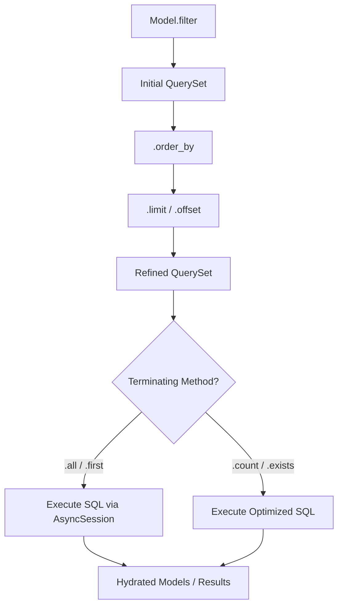
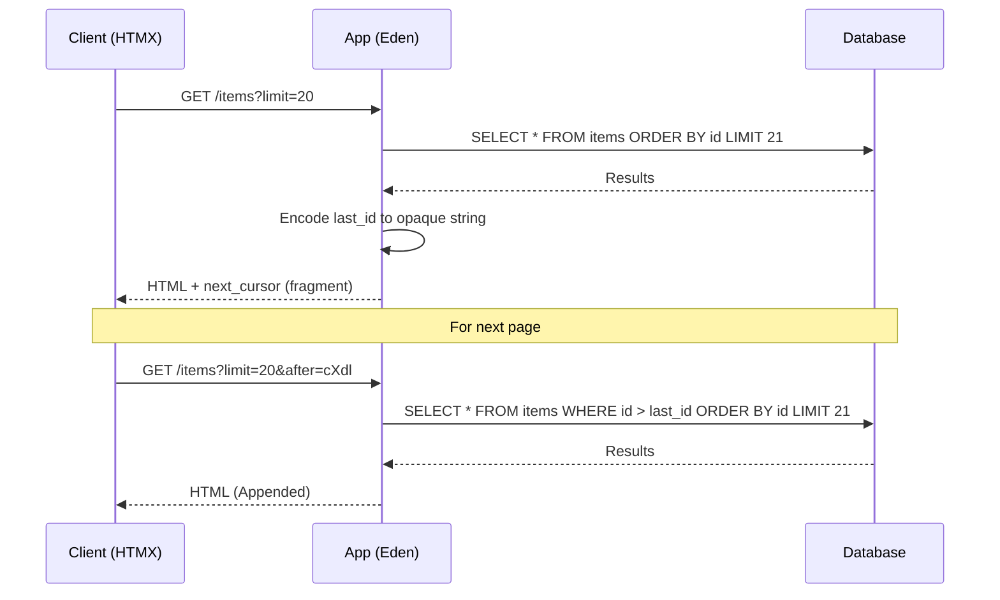

# 🔍 Querying & High-Fidelity Lookups

**Eden provides a powerful, Django-inspired QuerySet API that allows you to express complex database logic in clean, readable Python code.**

---

## 🧠 Conceptual Overview

The `QuerySet` is the core engine of Eden's data retrieval. It acts as a **lazy** proxy to your database, allowing you to chain filters, orders, and limits without executing SQL until the very last moment.

### The Query Lifecycle



### Key Pillars
1.  **Lazy Execution**: Database hits only occur when you explicitly request data (e.g., via `.all()`).
2.  **Chaining Architecture**: Methods like `.filter()` and `.order_by()` return a *new* QuerySet, allowing for functional-style composition.
3.  **Type Safety**: Query results are automatically hydrated into typed Model instances with support for Pydantic serialization.

---

## 🏗️ The QuerySet Interface

### Terminating Methods
These methods trigger the actual database communication.

| Method | Return Type | Description |
| :--- | :--- | :--- |
| `.all()` | `list[Model]` | Returns all matching records as model instances. |
| `.first()` | `Model \| None` | Returns the first result or `None` if empty. |
| `.last()` | `Model \| None` | Returns the last result or `None` if empty. |
| `.get(id)` | `Model \| None` | High-performance primary key lookup (auto-converts UUID strings). |
| `.count()` | `int` | Executes a `SELECT COUNT(*)` on the current filters. |
| `.exists()` | `bool` | Optimized check for the existence of any match. |
| `.paginate()` | `Page` | Returns a paginated result set with metadata and links. |

### Single Record Retrieval Examples

```python
from eden.db import q, Q

# Get all records
users = await User.filter(status="active").all()  # Returns list

# Get first matching record
user = await User.filter(status="active").first()  # Returns User | None
if user:
    print(f"Found: {user.name}")

# Get last matching record
latest_user = await User.order_by("-created_at").last()

# Get by primary key (fastest)
user = await User.get(123)  # Direct ID lookup, most efficient

# Check existence without loading data
exists = await User.filter(email="alice@example.com").exists()  # Returns bool

# Get and handle not found
user = await User.get(999)
if user is None:
    print("User not found")
```

> [!TIP]
> Use `.get(id)` for lookups by primary key—it's the fastest method. Use `.first()` for other queries as it stops after finding one result.

---

## 🎯 Filtering with Lookups

Eden supports **three syntaxes** for filtering, each offering different benefits. Choose the style that best fits your use case—all produce identical SQL.

### Syntax 1: Django-Style Lookups (String Keys)

The classic Django convention using `field__lookup` string syntax:

```python
# Case-insensitive substring match
search = await Product.filter(title__icontains="Eden").all()

# Date range filtering
recent = await Order.filter(created_at__gte=datetime.now() - timedelta(days=7)).all()

# Membership check
status_filter = await User.filter(status__in=["active", "pending"]).all()

# Complex conditions with Q objects
from eden.db import Q
users = await User.filter(
    Q(status__in=["active", "trial"]) |
    Q(points__gte=100)
).all()
```

**Best for**: Compatibility with Django projects, kwargs-based dynamic filtering.

### Syntax 2: Modern Proxy (SQL-Like Operators)

Use the modern `q` proxy for a more SQL-like, type-safe experience:

```python
from eden.db import q

# Cleaner, more Pythonic syntax
search = await Product.filter(q.title.icontains("Eden")).all()

# Comparison operators
recent = await Order.filter(q.created_at >= datetime.now() - timedelta(days=7)).all()

# IN clause
status_filter = await User.filter(q.status.in_(["active", "pending"])).all()

# Complex boolean logic with operators
users = await User.filter(
    ((q.status.in_(["active", "trial"])) | (q.points >= 100))
).all()
```

**Best for**: Modern Python projects, IDE autocompletion, explicit code clarity.

### Syntax 3: Q Objects (Advanced Logic)

Explicit `Q` objects with operators for maximum flexibility:

```python
from eden.db import Q

# Build complex boolean expressions
logic = (
    Q(status__in=["active", "trial"]) |
    Q(points__gte=100)
)
users = await User.filter(logic).all()

# Combine syntaxes (all work together!)
from eden.db import q
combined = await User.filter(
    q.verified == True,  # Modern q
    Q(status="active") | Q(tier="premium"),  # Q objects
    age__gte=18  # Django-style kwargs
).all()
```

**Best for**: Dynamic filter building, complex nested logic.

### Supported Lookups

| Lookup | SQL Equivalent | Django Style | Modern q Proxy |
| :--- | :--- | :--- | :--- |
| `exact` | `=` | `field__exact=val` | `q.field == val` |
| `iexact` | `ILIKE` | `field__iexact=val` | `q.field.iexact(val)` |
| `contains` | `LIKE %...%` | `field__contains=val` | `q.field.contains(val)` |
| `icontains` | `ILIKE %...%` | `field__icontains=val` | `q.field.icontains(val)` |
| `gt` / `gte` | `>` / `>=` | `field__gt=val` | `q.field > val` / `q.field >= val` |
| `lt` / `lte` | `<` / `<=` | `field__lt=val` | `q.field < val` / `q.field <= val` |
| `in` | `IN (...)` | `field__in=[...]` | `q.field.in_([...])` |
| `isnull` | `IS NULL` | `field__isnull=True` | `q.field.isnull(True)` |

---

## 🧩 Complex Logic with `Q` and `F`

### `Q` Objects: Advanced Logic
Use `Q` to handle `OR` conditions and complex nested filters.

```python
from eden.db import Q

# Logic: (Category is 'pro') OR (Status is 'active' AND Points > 100)
query = Q(category="pro") | (Q(status="active") & Q(points__gt=100))
users = await User.filter(query).all()
```

### `F` Expressions: Field Math
Reference other fields in the same record for comparison or database-side updates.

```python
from eden.db import F

# Find products where current stock is below safety threshold
danger_zone = await Product.filter(stock__lt=F("min_stock")).all()

# Atomic increment on the DB side (no race conditions)
await User.filter(id=1).update(points=F("points") + 10)
```

---

## 📈 Aggregations & Annotations

### Aggregates: Summary Data
Calculate totals across a result set.

```python
from eden.db import Sum, Avg, Count

stats = await Order.filter(status="paid").aggregate(
    revenue=Sum("total_amount"),
    avg_order=Avg("total_amount"),
    count=Count("id")
)
# Returns: {"revenue": 10500.25, "avg_order": 125.00, "count": 84}
```

#### Aggregation Arithmetic
Eden supports performing math directly within the `aggregate()` and `annotate()` methods. This is processed on the database side for maximum efficiency.

```python
from eden.db import Sum, Count

# Calculate conversion rates or ratios in a single DB hit
stats = await Order.aggregate(
    conversion_rate=Sum("successful_checkouts") / Count("id"),
    average_yield=(Sum("revenue") - Sum("costs")) / Sum("revenue")
)
```

### Annotations: Virtual Fields
Inject calculated values into each record in a list.

```python
from eden.db import Count

# Fetch users and include their post count as a virtual field
users = await User.all().annotate(post_count=Count("posts")).all()

print(f"User {users[0].name} has {users[0].post_count} posts")
```

---

## ⚡ Performance Optimization

### 1. Partial Loading (`values`)
When you only need a few columns, use `.values()` to skip full model hydration.

```python
# Returns a list of dicts: [{"id": 1, "email": "..."}, ...]
emails = await User.all().values("id", "email")
```

### 2. Relationship Loading
Avoid N+1 problems by explicitly declaring which relationships to load.

```python
# selectinload (default) for fast async relation fetching
posts = await Post.all().selectinload("author", "comments").all()

# joinedload for one-to-one relations in a single SQL query
profiles = await User.all().joinedload("profile").all()
```

### 3. Query Diagnostics (`explain`)
If a query feels slow, you can output exactly how the database is planning to execute it. This is invaluable for catching missing indexes or hidden `Seq Scans` caused by joining misconfigured relationships.

```python
# Returns the Postgres EXPLAIN (ANALYZE) text string
plan = await User.query().filter(company__name="Acme").explain(analyze=True)
print(plan)
```
> [!TIP]
> `explain()` resolves all prefetch and joins before generating the diagnostic log, making it a perfectly accurate representation of how deeply optimized your ORM chaining is.

---

## 📑 Optimization: Cursor Pagination

For datasets with millions of records, traditional `OFFSET` pagination becomes increasingly slow as the database must "skip" thousands of rows. Eden provides **Cursor Pagination** (also known as Keyset Pagination) for consistent O(1) performance.

### 🧩 Architectural Flow



### 1. Basic Usage

Use the `.paginate_cursor()` method on any QuerySet.

```python
# First page
page = await User.order_by("id").paginate_cursor(limit=20)

# Get items and the next cursor
items = page.items
next_cursor = page.next_cursor # Opaque string for next page

# Subsequent page
next_page = await User.order_by("id").paginate_cursor(
    after=next_cursor, 
    limit=20
)
```

### 2. Bidirectional Navigation

Eden's paginator supports moving backwards using `before`.

```python
# Previous page
prev_page = await User.order_by("id").paginate_cursor(
    before=page.prev_cursor, 
    limit=20
)
```

### 3. Requirements

- **Strict Ordering**: Cursors require a consistent sort order. The field(s) used in `order_by()` must be unique (usually including the Primary Key).
- **No Offset**: Cursors do not support jumping to arbitrary page numbers (e.g., "Page 10") because they rely on knowing where the previous page ended.

---

---

## 🏗️ Complex Patterns

For production-ready patterns covering multi-table filtering, aggregations, dynamic filters, and performance optimization, see:

**[Complex Query Patterns Guide](orm-complex-patterns.md)** – Real-world examples including:
- Multi-table deep filtering (author → profile → city)
- Boolean logic combinations (OR, AND, NOT)
- Date range and relative filtering
- Aggregation with HAVING clauses
- Dynamic filter building for search endpoints
- Performance optimization (prefetch, select_related, exists)
- Common mistakes and how to avoid them

---

## 💡 Best Practices

1.  **Prefer `icontains`**: For search inputs, `icontains` is almost always better than `contains`.
2.  **Index Your Filter Fields**: Any field used frequently in `.filter()` should be marked as `index=True` in your model.
3.  **Atomic Updates**: Always use `F()` expressions for increments (`points = F("points") + 1`) to prevent data corruption from concurrent requests.
4.  **Choose Your Syntax Consistently**: Pick one syntax (Django-style, modern q, or Q objects) for your codebase. All three work, but mixing styles reduces readability.
5.  **Use `.distinct()`**: When filtering through multi-join paths, always use `.distinct()` to avoid duplicate rows.

---

**Next Steps**: [Complex Query Patterns](orm-complex-patterns.md) | [Relationship Patterns](orm-relationships.md)
