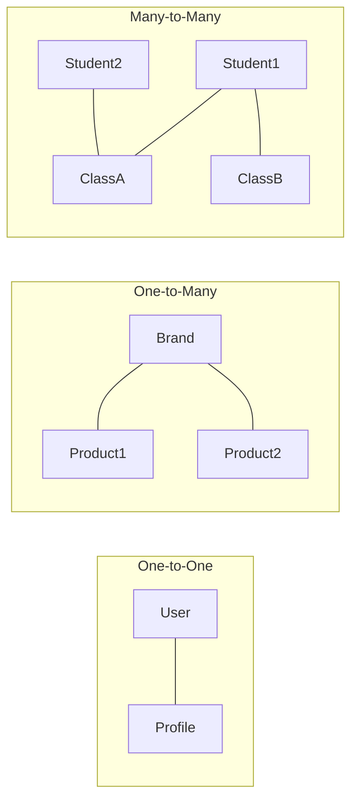

# 🔗 Relationship Patterns

**Eden simplifies complex database associations with high-level abstractions that handle foreign keys, back-references, and eager loading automatically.**

---

## 🧠 Conceptual Overview

Relationships in Eden are first-class citizens. By combining SQLAlchemy's powerful mapping engine with Eden's **Automatic Join Inference**, you can query across tables as if they were a single unified object.

### Common Relationship Archetypes



---

## 🏗️ Core Relationship Types

### 1. One-to-Many (1:N)
The most common pattern. A single parent has many children (e.g., a Company has many Employees).

```python
from typing import List
from eden.db import Model, f, Mapped, relationship

class Company(Model):
    name: Mapped[str] = f()
    # One Company -> Many Employees
    employees: Mapped[List["Employee"]] = relationship(back_populates="company")

class Employee(Model):
    name: Mapped[str] = f()
    # Foreign Key defines the link
    company_id: Mapped[int] = f(foreign_key="companies.id")
    # Reference back to Parent
    company: Mapped["Company"] = relationship(back_populates="employees")
```

### 2. Many-to-Many (N:M)
Requires an intermediate **Association Table**. Eden manages this link transparently.

```python
from sqlalchemy import Table, Column, Integer, ForeignKey

# The bridge table
user_groups = Table(
    "user_groups",
    Model.metadata,
    Column("user_id", Integer, ForeignKey("users.id")),
    Column("group_id", Integer, ForeignKey("groups.id"))
)

class User(Model):
    name: Mapped[str] = f()
    groups: Mapped[List["Group"]] = relationship(
        secondary=user_groups, back_populates="users"
    )

class Group(Model):
    name: Mapped[str] = f()
    users: Mapped[List["User"]] = relationship(
        secondary=user_groups, back_populates="groups"
    )
```

---

## 🚀 Advanced Querying: Automatic Join Inference

Eden's `QuerySet` can "see" through your relationships. You can filter by related model attributes using the `__` separator.

```python
# Find all employees working for 'Eden Corp'
# Eden automatically performs the INNER JOIN under the hood
staff = await Employee.filter(company__name="Eden Corp").all()

# Logic: Find posts written by users with a specific role
featured_posts = await Post.filter(author__role="editor").all()
```

---

## ⚡ Solving the N+1 Problem: Eager Loading

The **N+1 problem** occurs when you load a list of items and then trigger a separate database query for *each* related object. In an async environment, this is catastrophic for performance.

### Loading Strategies

| Strategy | SQLAlchemy Method | Description |
| :--- | :--- | :--- |
| **`selectinload`** | `selectinload()` | **Default**. Emits a second bulk query using `IN (...)`. Fast and safe for collections. |
| **`joinedload`** | `joinedload()` | Uses a `LEFT OUTER JOIN` in the same query. Best for 1:1 or 1:N with few results. |
| **`subqueryload`** | `subqueryload()` | Emits a subquery to fetch children. Used for complex legacy schemas. |

### Using `.prefetch()`
Eden's `.prefetch()` helper uses `selectinload` by default.

```python
# Query 1: Fetch 100 posts
# Query 2: Fetch all authors for those 100 posts in ONE query
posts = await Post.query().prefetch("author", "comments").all()

for post in posts:
    # This access is now instantaneous (already loaded in memory)
    print(f"{post.title} by {post.author.name}")
```

### Deep Prefetching
Use dot notation to pre-load nested relationships (e.g., `Post` -> `Author` -> `Brand`).
```python
results = await Post.query().prefetch("author.brand").all()
```

---

## 💡 Best Practices

1.  **Explicit `back_populates`**: Always define `back_populates` on both sides of a relationship to ensure SQLAlchemy's identity map remains consistent.
2.  **Default to `selectinload`**: For async applications, `selectinload` is almost always the most efficient choice as it avoids the massive result-set multiplication of `joinedload`.
3.  **Unique Constraints for 1:1**: On a One-to-One relationship, always ensure the foreign key column is marked as `unique=True` in the child model.

---

**Next Steps**: [Transactions & Atomicity](orm-transactions.md)
