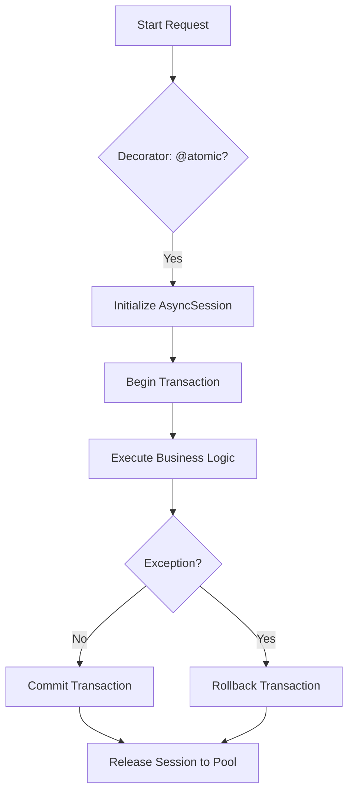

# 🛡️ Transactions & Atomicity

**Eden provides robust tools for ensuring data integrity through atomic operations, nested savepoints, and automatic session management.**

---

## 🧠 Conceptual Overview

In a high-concurrency async environment, managing database state requires precision. Eden handles the complexities of the **SQLAlchemy AsyncSession** by providing high-level abstractions like the `@atomic` decorator and context-managed transactions.

### The Transaction Lifecycle



### Core Philosophy
1.  **All-or-Nothing**: Every operation inside an `atomic` block must succeed for any to be committed.
2.  **Context Discovery**: Eden models automatically "discover" the active transaction context, removing the need to pass `session` objects manually in most cases.
3.  **Safe-by-Default**: If a request handler crashes, Eden automatically rolls back any pending changes to prevent data corruption.

---

## 🏗️ Implementing Atomicity

### 1. The `@atomic` Decorator
The simplest way to protect a controller or service method.

```python
from eden.db import atomic

@app.post("/checkout")
@atomic
async def process_checkout(request):
    # This entire block is wrapped in a single transaction
    order = await Order.create(user=request.user, total=request.json["total"])
    await Inventory.decrement(items=request.json["items"])
    await Payment.record(order=order)
    
    # If any error occurs above, everything is rolled back
    return {"status": "success"}
```

### 2. Manual Context Control
For fine-grained control or logic that spans multiple separate transactions.

```python
from eden.db import get_session

async def update_user_profile(user_id, data):
    async with get_session() as session:
        # Use session explicitly for surgical control
        user = await User.get(user_id, session=session)
        user.update(**data)
        await user.save(session=session)
        
        # Transaction commits automatically at the end of 'async with'
```

---

## 🧩 Advanced Patterns

### Savepoints (Nested Transactions)
A **Savepoint** allows you to "checkpoint" a transaction. You can roll back a specific sub-operation without losing the progress of the main transaction.

```python
@atomic
async def process_batch(items):
    await BatchLog.create(status="starting")
    
    for item in items:
        # Each item can fail independently
        try:
            async with savepoint():
                await process_item(item)
        except ProcessingError as e:
            # Only process_item is rolled back; BatchLog remains
            await BatchLog.create(error=f"Item {item.id} failed: {e}")
```

### Implicit Session Discovery
Eden models are "session-aware". When you call a method like `.save()` or `.update()`, Eden checks the current **async context** for an active session.

```python
# No session passed explicitly, but @atomic handles it behind the scenes
@atomic
async def update_settings():
    setting = await Setting.get("theme")
    setting.value = "dark"
    await setting.save() # Discovers and uses the atomic session
```

---

## ⚡ Isolation Levels

| Level | Description | Recommended For |
| :--- | :--- | :--- |
| **`READ COMMITTED`** | **Default**. Prevents reading uncommitted data. | Standard web applications. |
| **`SERIALIZABLE`** | Strongest isolation. Acts as if transactions ran sequentially. | Financial ledger operations, inventory locks. |

```python
from eden.db import serializable

@serializable
async def transfer_balance(sender, receiver, amount):
    # This adds 'FOR UPDATE' locks and strict isolation
    ...
```

---

## 💡 Best Practices

1.  **Keep it Brief**: Avoid long-running tasks (like external API calls or file processing) inside a transaction. This prevents holding database locks for too long.
2.  **Handle Exceptions early**: Always wrap your `@atomic` calls in a `try/except` if you need custom error messaging to the client.
3.  **Atomic Increments**: Use `F()` expressions for numeric updates (`points = F("points") + 1`) to ensure the DB handles the increment atomically even without an explicit transaction lock.

---

**Next Steps**: [Migrations](orm-migrations.md)
