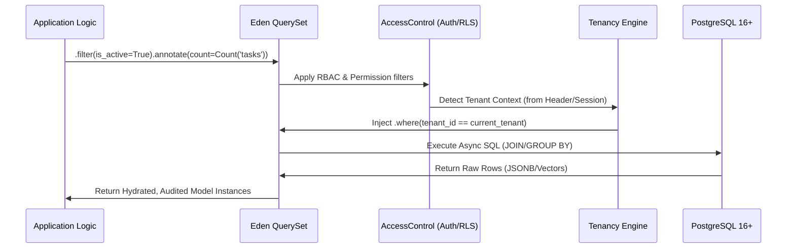

# 🗄️ Database & The Eden ORM

**Eden features a zero-config, async-first ORM built on SQLAlchemy 2.0. It bridges the gap between raw SQL performance and a developer-friendly, high-level declarative API known as the "Data Forge."**

---

## 🧠 The Eden "Data Forge" Pipeline

The Eden ORM is designed to handle the complexity of modern SaaS data—automatically applying multi-tenant isolation, audit tracking, and reactive synchronization as data flows through your application.



---

## 💎 Modern: Zero-Boilerplate Models (Type-Only)

For maximum brevity and developer speed, Eden supports **Inferred Models**. By using the `SchemaInferenceEngine`, you can define your data architecture using only Python type hints. Eden automatically maps these to the correct SQL types and constraints.

```python
from eden.db import Model

class Developer(Model):
    # No f() or Mapped[] needed for simple fields
    name: str 
    email: str 
    github_handle: str | None = None
    is_admin: bool = False
    
    # Relationships are also inferred from type hints
    profile: "Profile"
```

> [!TIP]
> Use the Modern syntax for rapid prototyping or simple data structures. For production fields requiring specific labels, indices, or validation rules, use the `f()` helper as shown below.

---

## ⚡ 60-Second Data Setup

Bootstrap your data layer in under a minute with `f()` helpers and `Mapped` types.

```python
from eden.db import Model, f, Mapped

# 1. Define your Elite Model
class Project(Model):
    __tablename__ = "projects"
    
    title: Mapped[str] = f(max_length=100, index=True, label="Project Title")
    description: Mapped[str | None] = f(nullable=True)
    is_active: Mapped[bool] = f(default=True)

# 2. High-Performance Querying in a View
async def list_projects():
    # Eden supports Django-style intuitive filtering
    projects = await Project.filter(is_active=True).all()
    return projects
```

> [!IMPORTANT]
> **Async by Default**: Every database interaction in Eden is `awaitable`. This ensures your event loop is never blocked, even under extreme load.

---

## 🏗️ Model Architecture: The "Forge"

Models in Eden inherit from `eden.db.Model`. You define fields using the `f()` helper which synchronizes your **Database Schema**, **Pydantic Validation**, and **UI Forms** in one declaration.

### The Reference & Relationship Pattern
Relationships are traditionally verbose. Eden's `Reference` helper creates the Foreign Key column and the Relationship link simultaneously.

```python
from eden.db import Model, f, Mapped, Reference, Relationship

class Brand(Model):
    __tablename__ = "brands"
    name: Mapped[str] = f(unique=True, label="Brand Name")
    
    # Standard Relationship link (One-to-Many)
    products: Mapped[list["Product"]] = Relationship(back_populates="brand")

class Product(Model):
    __tablename__ = "products"
    title: Mapped[str] = f(max_length=255)
    
    # 🌟 Reference creates 'brand_id' FK + 'brand' relationship (Many-to-One)
    brand: Mapped[Brand] = Reference(back_populates="products")
```

---

## 🔍 Advanced Querying: Performance at Scale

Eden's `QuerySet` API is designed for expressive, complex data analysis without dropping down to raw SQL.

### 1. Complex Business Logic (Q & F)
Use `Q` objects for complex `OR`/`NOT` logic and `F` expressions for record-level field comparisons.

```python
from eden.db import Q, F

# Find featured posts OR posts with high engagement
posts = await Post.filter(Q(featured=True) | Q(views__gt=1000)).all()

# Find products where stock is below the safety threshold
low_stock = await Product.filter(stock__lt=F("warning_threshold")).all()
```

### 2. Industrial-Grade Annotations
Annotations allow you to calculate values on-the-fly (e.g., counts, sums) for every record in a result set using database-level aggregation.

```python
from eden.db import Count

# Fetch all brands and include 'product_count' for each one
brands = await Brand.query().annotate(
    product_count=Count("products")
).all()

for brand in brands:
    print(f"Brand: {brand.name}, Products: {brand.product_count}")
```

### 3. Global Aggregation
Aggregations return a single summary dictionary for the entire QuerySet.

```python
from eden.db import Sum, Avg

report = await Order.filter(status="paid").aggregate(
    total_revenue=Sum("total_price"),
    avg_order_value=Avg("total_price")
)
# Output: {"total_revenue": 54000.50, "avg_order_value": 120.00}
```

---

## 🛡️ Industrial Multi-Tenancy

Eden is a SaaS-first framework. Multi-tenancy is baked into the ORM core via the `TenantModel`.

```python
from eden.tenancy import TenantModel

class Invoice(TenantModel):
    __tablename__ = "invoices"
    amount: Mapped[float] = f()

# IN YOUR VIEW:
# The tenant isolation is applied AUTOMATICALLY based on the request context.
# No manual .filter(tenant_id=...) required.
invoices = await Invoice.all() 
```

---

## 📄 Pagination & N+1 Prevention

### Professional Pagination
Eden's `paginate()` method is optimized for massive datasets and returns a metadata-rich object.

```python
# Get 20 products for page #2
page = await Product.filter(is_active=True).paginate(page=2, per_page=20)

print(f"Total Records: {page.total}")
print(f"Items: {page.items}") # List of Model instances
```

### N+1 Prevention (Optimization)
Eden handles relationship loading intelligently to prevent the "N+1 Query" performance trap.
- **`select_related()`**: Uses an SQL JOIN (Best for Foreign Keys).
- **`prefetch()`**: Uses a second optimized SELECT (Best for Collections).

```python
# Fetch products and their brands in a single JOIN query
products = await Product.query().select_related("brand").all()

# Fetch brands and all their products in two optimized queries
brands = await Brand.query().prefetch("products").all()
```

---

---

## 📚 Comprehensive Query Documentation

Eden's ORM query language is incredibly flexible. Explore the full documentation:

### **Quick Links to Query Guides**
- **[Query Syntax Guide](orm-query-syntax.md)** — Learn all three query syntaxes (Django-style, modern q, Q objects)
- **[Complex Patterns](orm-complex-patterns.md)** — Real-world production patterns with optimization tips
- **[Querying & Lookups](orm-querying.md)** — QuerySet API and lookup reference
- **[ORM Index](ORM_INDEX.md)** — Complete navigation guide with decision trees

### **Choose Your Query Style**
```python
# Django-style (familiar to Django developers)
users = await User.filter(age__gte=30, status__in=["active", "trial"]).all()

# Modern q proxy (SQL-like, IDE autocomplete)
from eden.db import q
users = await User.filter(q.age >= 30, q.status.in_(["active", "trial"])).all()

# Q objects (complex boolean logic)
from eden.db import Q
users = await User.filter(
    Q(age__gte=30) & Q(status__in=["active", "trial"])
).all()
```

**All three syntaxes produce identical SQL and performance. Choose the one that feels most natural.**

---

## 💡 Best Practices

1. **Explicit Schemas**: Always use `Mapped[T]` type hints for strict type safety in your IDE.
2. **Atomic Context**: Use `async with app.db.transaction():` for multi-model writes to ensure "All-or-Nothing" success.
3. **Audit Readiness**: Inherit from `AuditableMixin` to track every change (Creation, Update, Deletion) automatically.
4. **Choose One Query Syntax**: Pick one query syntax (Django-style, modern q, or Q objects) and use it consistently throughout your codebase.
5. **Index Filter Fields**: Any field used frequently in `.filter()` should have `index=True` in your model definition.

---

**Next Steps**: [Query Syntax Guide](orm-query-syntax.md) | [Relationship Patterns](orm-relationships.md) | [Multi-Tenancy Guide](tenancy-postgres.md) | [ORM Index](ORM_INDEX.md)
