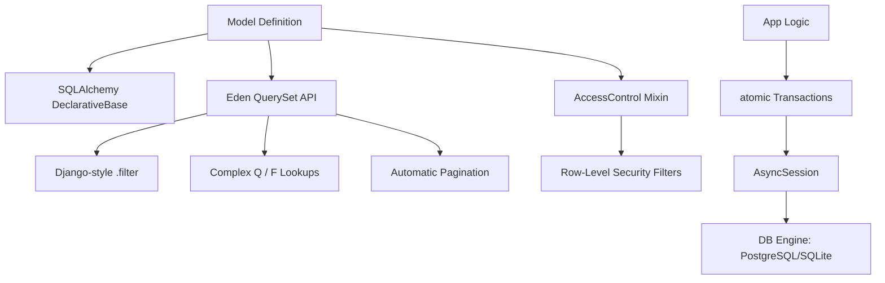

# 🗄️ Database & The Eden ORM

**Eden features a zero-config, async-first ORM built on SQLAlchemy 2.0. It bridges the gap between raw SQL performance and a developer-friendly, high-level declarative API.**

---

## 🧠 Conceptual Overview

The Eden ORM provides a thin but extremely powerful layer over SQLAlchemy. It introduces **QuerySets**, **Lookups**, and **Access Control** to simplify complex data operations.

### The Data Layer Architecture



### Core Philosophy

1.  **Async-First**: Every database interaction (`.all()`, `.first()`, `.save()`) is natively `async`.
2.  **Single Source of Truth**: Define your schema once; use it for migrations, validation, and UI generation.
3.  **Elite Productivity**: Common tasks like soft deletes, slug generation, and pagination are handled by built-in Mixins.

---

## ⚡ 60-Second Data Setup

Bootstrap your data layer in under a minute with `f()` helpers and `Mapped` types.

```python
from eden.db import Model, f, Mapped

class Project(Model):
    __tablename__ = "projects"
    
    title: Mapped[str] = f(max_length=100, index=True)
    is_active: Mapped[bool] = f(default=True)

# Usage in a View

projects = await Project.filter(is_active=True).all()
```

---

## 🏗️ Model Architecture

Models in Eden inherit from `eden.db.Model`. You define fields using the `f()` helper or explicit field types.

```python
from eden.db import Model, f, Mapped, relationship

class Brand(Model):
    name: Mapped[str] = f(unique=True, index=True, label="Brand Name")
    logo_url: Mapped[str | None] = f(default=None)

class Product(Model):
    # Field inference with metadata
    title: Mapped[str] = f(max_length=255, placeholder="Enter product title...")
    price: Mapped[float] = f(min=0.0)
    
    # Relationships & References
    brand_id: Mapped[int] = f(foreign_key="brands.id")
    brand: Mapped[Brand] = relationship(back_populates="products")
```

### Field Helpers: The `f()` Shorthand

The `f()` helper is the recommended way to define model columns. It wraps SQLAlchemy's `mapped_column` while adding Eden-specific UI and validation metadata.

| Param | Description |
| :--- | :--- |
| `max_length` | Sets DB length and Pydantic validation. |
| `unique` | Adds a unique constraint to the DB. |
| `index` | Creates a database index. |
| `label` | Human-readable name for UI generation. |
| `widget` | Hints which form widget to use (e.g., `textarea`). |
| `choices` | Enforces specific values via DB CheckConstraint and enum validation. |

---

## 🔍 querying & Lookups

Eden provides a high-level `QuerySet` API inspired by Django, allowing for complex queries without writing boilerplate SQLAlchemy `select()`.

### Basic Filtering

```python

# Simple equality

active_users = await User.filter(is_active=True).all()

# Using lookups (icontains, gte, lte, in)

pro_users = await User.filter(subscription__lte=3).all()
search_results = await Post.filter(title__icontains="Eden").all()
```

### Complex Logic with `Q` and `F`

Use `Q` objects for complex `OR` and `NOT` logic, and `F` expressions for field-to-field comparisons.

```python
from eden.db import Q, F

# Find posts that are either featured OR have high views

posts = await Post.filter(Q(featured=True) | Q(views__gt=1000)).all()

# Find products where stock is less than the warning threshold

low_stock = await Product.filter(stock__lt=F("threshold")).all()
```

---

## 🛡️ Row-Level Security: `AccessControl`

The `AccessControl` mixin allows you to define who can see or modify specific records directly on the model.

```python
from eden.db import AccessControl, AllowOwner, AllowPublic, AllowRoles

class Document(Model, AccessControl):
    owner_id: Mapped[int] = f(foreign_key="users.id")
    
    __rbac__ = {
        "read": AllowPublic(),
        "update": AllowOwner(field="owner_id"),
        "delete": AllowRoles("admin")
    }

# In your view, security is applied automatically

docs = await Document.filter_for_user(request.user).all()
```

---

## ⚡ Productivity Mixins

### 1. `SoftDeleteMixin`

Instead of deleting records, marks them with `deleted_at`.
```python
class Project(Model, SoftDeleteMixin):
    title: Mapped[str] = f()

# await project.delete()  -> Sets deleted_at

# await Project.all()     -> Excludes soft-deleted items automatically

```

### 2. `SlugMixin`

Automatically generates SEO-friendly slugs from a source field.
```python
from eden.db import SlugMixin

class Article(Model, SlugMixin):
    title: Mapped[str] = f()
    # slug is auto-generated from 'title' on save
```

---

## 📄 Pagination

The `paginate()` method returns a `Page` object containing a slice of items and metadata.

```python
page = await Product.filter(category="electronics").paginate(page=1, per_page=20)

print(f"Showing items {page.offset} to {page.offset + len(page.items)}")
print(f"Total Pages: {page.total_pages}")

# page.links generates HATEOAS URLs for your API

links = page.generate_links("/api/products")
```

---

## 📖 API Reference

### `Model` (Base Class)

| Method | Description |
| :--- | :--- |
| `save(session)` | Insert or update the current instance. |
| `delete(session)`| Remove the record (or soft-delete if mixin is present). |
| `to_dict()` | Serializes the model to a dictionary. |
| `to_schema()` | Generates a Pydantic `Schema` from this model. |

### `QuerySet` (Static Access via `Model`)

| Method | Returns | Description |
| :--- | :--- | :--- |
| `filter(**kwargs)` | `QuerySet` | Adds WHERE clauses using field lookups. |
| `order_by(*args)` | `QuerySet` | Sets the sorting order. |
| `limit(n)` | `QuerySet` | Restricts the number of results. |
| `all()` | `list[Model]` | Executes the query and returns all matches. |
| `first()` | `Model \| None`| Returns the first match or `None`. |
| `get(id)` | `Model` | High-performance primary key lookup. |
| `paginate()` | `Page` | Returns a paginated result set. |
| `aggregate(**kw)` | `dict` | Performs Sum, Avg, Count operations. |

---

## 💡 Best Practices

1.  **Use `f()` for Everything**: It keeps your models clean and ensures your UI layer stays in sync with your DB layer.
2.  **Explicit Transactions**: Use the `@atomic` decorator for any operation involving multiple write steps.
3.  **Default Selectin Loading**: Eden uses `selectinload` for relationships by default to avoid N+1 issues in async environments.

---

**Next Steps**: [Relationship Patterns](orm-relationships.md)
