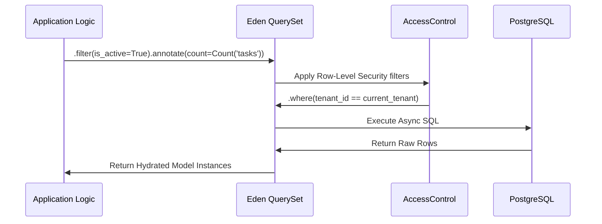

# 🗄️ Database & The Eden ORM

**Eden features a zero-config, async-first ORM built on SQLAlchemy 2.0. It bridges the gap between raw SQL performance and a developer-friendly, high-level declarative API known as the "Data Forge."**

---

## 🧠 Conceptual Overview

The Eden ORM provides a thin but extremely powerful layer over SQLAlchemy. It introduces **QuerySets**, **Lookups**, and **Access Control** to simplify complex data operations.

### The Data Lifecycle



---

## ⚡ 60-Second Data Setup

Bootstrap your data layer in under a minute with `f()` helpers and `Mapped` types.

```python
from eden.db import Model, f, Mapped

class Project(Model):
    __tablename__ = "projects"
    
    title: Mapped[str] = f(max_length=100, index=True, label="Project Title")
    is_active: Mapped[bool] = f(default=True)

# Usage in a View
async def list_projects():
    # Eden matches Django's intuitive filtering
    projects = await Project.filter(is_active=True).all()
    return projects
```

---

## 🏗️ Model Architecture: The "Forge"

Models in Eden inherit from `eden.db.Model`. You define fields using the `f()` helper which synchronizes your **Database Schema**, **Pydantic Validation**, and **UI Forms** in one declaration.

### The Reference Helper
Relationships are traditionally verbose. Eden's `Reference` helper creates the Foreign Key column and the Relationship link simultaneously.

```python
from eden.db import Model, f, Mapped, Reference, Relationship

class Brand(Model):
    __tablename__ = "brands"
    name: Mapped[str] = f(unique=True, label="Brand Name")
    
    # Standard Relationship link
    products: Mapped[list["Product"]] = Relationship(back_populates="brand")

class Product(Model):
    __tablename__ = "products"
    title: Mapped[str] = f(max_length=255)
    
    # 🌟 Reference creates 'brand_id' FK + 'brand' relationship
    brand: Mapped[Brand] = Reference(back_populates="products")
```

> [!TIP]
> Use `Reference` whenever you need a standard Many-to-One relationship. It reduces boilerplate by 60%.

---

## 🔍 Advanced Querying: The Data Forge

Eden's `QuerySet` API is designed for expressive, complex data analysis without dropping down to raw SQL.

### 1. Complex Lookups (Q & F)
Use `Q` objects for `OR`/`NOT` logic and `F` expressions for comparing two fields on the same record.

```python
from eden.db import Model, f, Mapped, Q, F

# Schema Definition for this example
class Post(Model):
    __tablename__ = "posts_example"
    featured: Mapped[bool] = f(default=False)
    views: Mapped[int] = f(default=0)

class Product(Model):
    __tablename__ = "products_example"
    stock: Mapped[int] = f(default=0)
    warning_threshold: Mapped[int] = f(default=10)

# 1. Complex logic with Q
posts = await Post.filter(Q(featured=True) | Q(views__gt=1000)).all()

# 2. Field comparisons with F
low_stock = await Product.filter(stock__lt=F("warning_threshold")).all()
```

### 2. Powerful Annotations

Annotations allow you to calculate values on-the-fly for every record in a result set.

```python
from eden.db import Model, f, Mapped, relationship, Count

class UserSnippet(Model):
    __tablename__ = "users_example_ann"
    is_active: Mapped[bool] = f(default=True)
    posts: Mapped[list["DraftPostSnippet"]] = relationship(back_populates="user")

class DraftPostSnippet(Model):
    __tablename__ = "posts_draft_example_ann"
    user_id: Mapped[int] = f(foreign_key="users_example_ann.id")
    user: Mapped[UserSnippet] = relationship(back_populates="posts")

# Fetch users and include a 'post_count' for each one
users = await UserSnippet.filter(is_active=True).annotate(
    post_count=Count("posts")
).all()
```

### 3. Global Aggregation

Aggregations return a single summary dictionary for the entire QuerySet.

```python
from eden.db import Model, f, Mapped, Sum, Max

class Order(Model):
    __tablename__ = "orders_example"
    status: Mapped[str] = f()
    total_price: Mapped[float] = f()

report = await Order.filter(status="paid").aggregate(
    total_revenue=Sum("total_price"),
    highest_sale=Max("total_price")
)

# Output: {"total_revenue": 5400.50, "highest_sale": 1200.00}
```

---

## 🛡️ Security: Automated Tenancy & RBAC

Eden is built for multi-tenant SaaS. By using `AccessControl`, you ensure that users only see the data they own, **automatically**.

```python
from eden.db import Model, f, Mapped, AccessControl, AllowOwner, AllowPublic, AllowRoles

class SecureDocument(Model, AccessControl):
    __tablename__ = "documents_secure_final"
    owner_id: Mapped[int] = f()
    
    __rbac__ = {
        "read": AllowPublic(),
        "update": AllowOwner(field="owner_id"),
        "delete": AllowRoles("admin")
    }

# In your view, security is enforced natively in the database query
# This automatically injects .where(owner_id=user.id) for updates
# await SecureDocument.for_user(request.user).all()
```

---

## 📄 Pagination & Performance

### Async Pagination
Eden's `paginate()` method is optimized for large datasets and returns a HATEOAS-ready metadata object.

```python
from eden.db import Model, f, Mapped, Page

class ProductPage(Model):
    __tablename__ = "products_page_example"
    name: Mapped[str] = f()
    is_active: Mapped[bool] = f(default=True)

# Get 20 products for page #2
page = await ProductPage.filter(is_active=True).paginate(page=2, per_page=20)

print(f"Total Pages: {page.total_pages}")
# for p in page.items: ...
```

### N+1 Prevention
Eden handles relationship loading intelligently.
- **`prefetch()`**: Separate SELECT (ideal for Many-to-Many).
- **`select_related()`**: SQL JOIN (ideal for Foreign Keys).

```python
from eden.db import Model, f, Mapped, relationship

class BrandPerf(Model):
    __tablename__ = "brands_perf"
    products: Mapped[list["ProductPerf"]] = relationship(back_populates="brand")

class ProductPerf(Model):
    __tablename__ = "products_perf"
    brand: Mapped[BrandPerf] = relationship(back_populates="products")

# select_related (JOIN): Best for One-to-One or Many-to-One
products = await ProductPerf.query().select_related("brand").all()

# prefetch (Second Query): Best for One-to-Many or Many-to-Many
brands = await BrandPerf.query().prefetch("products").all()
```

---

## 💡 Best Practices

1. **Always use `f()`**: It is the single source of truth for the entire framework (ORM, Forms, API).
2. **Context-Aware Queries**: Prefer `Model.for_user(request.user)` over `Model.all()` to ensure security rules are applied.
3. **Atomic Transactions**: Use the `@atomic` decorator for operations involving multiple writes to ensure data integrity.

---

**Next Steps**: [Relationship Patterns](orm-relationships.md) | [Migrations](orm-migrations.md)
