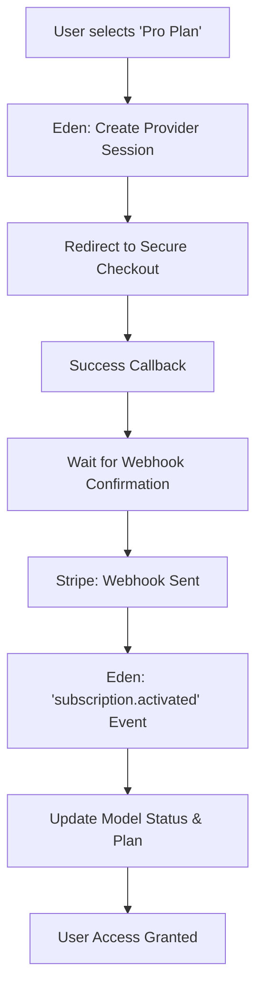

# 💳 SaaS Payments & Subscription Management

**Monetize with confidence. Eden provides a robust, provider-agnostic abstraction layer for handling subscriptions, one-time payments, and self-serve billing portals—allowing you to scale from your first dollar to global enterprise revenue.**

---

## 🧠 Conceptual Overview

Eden separates your business logic from payment provider implementation. Whether you use Stripe (default), PayPal, or Paddle, your application code remains clean and focused on your product.

### The Payment Lifecycle



---

## 🏗️ The `BillableMixin`

The fastest way to monetize a model (usually `User` or `Tenant`) is to inherit from `BillableMixin`. This adds all necessary fields for customer tracking and subscription status automatically.

```python
from eden.db import Model, f
from eden.payments import BillableMixin

class Organization(TenantMixin, Model, BillableMixin):
    """
    Inherits fields like:
    - customer_id: The ID in the payment provider (e.g. 'cus_123')
    - subscription_id: Active subscription ID
    - billing_status: 'active', 'past_due', 'canceled'
    - plan_id: The current tier identifier
    """
    name: str = f()
```

---

## 🚀 Setting Up the Stripe Provider

Eden treats Stripe as a first-class citizen. Configuration is handled via the `StripeProvider`.

### 1. Registration
Initialize the provider during your app bootstrap (e.g., in `app.py`).

```python
from eden.payments import StripeProvider

provider = StripeProvider(
    api_key=os.getenv("STRIPE_SECRET_KEY"),
    webhook_secret=os.getenv("STRIPE_WEBHOOK_SECRET")
)

app.configure_payments(provider)
```

### 2. Launching Checkout
Redirect users to a secure, provider-hosted checkout session with a single call.

```python
from eden.payments import get_payment_provider

@app.post("/subscribe/pro")
async def start_pro_subscription(request):
    provider = get_payment_provider()
    
    # 1. Ensure customer exists
    if not request.user.customer_id:
        customer_id = await provider.create_customer(email=request.user.email)
        request.user.customer_id = customer_id
        await request.user.save()

    # 2. Redirect to Checkout
    url = await provider.create_checkout_session(
        customer_id=request.user.customer_id,
        price_id="price_H5ggv909sdj",  # From Stripe Dashboard
        success_url=f"{request.base_url}/billing/success",
        cancel_url=f"{request.base_url}/billing/cancel"
    )
    
    return RedirectResponse(url=url)
```

---

## ⚡ Elite Patterns

### 1. Event-Driven Billing
Decouple payment processing from your views using Eden’s event system. This ensures your database stays in sync even if a user closes their browser during checkout.

```python
# Create a dedicated listener for billing events
@app.on("subscription.activated")
async def grant_pro_access(event):
    data = event.data
    customer_id = data["customer"]
    
    # Update the local record
    org = await Organization.get_by(customer_id=customer_id)
    org.billing_status = "active"
    org.plan_id = "pro"
    await org.save()

    # Trigger welcome logic
    await app.notify(org.id, "Welcome to the Pro Plan!")
```

### 2. Self-Serve Billing Portal
Let users manage their own credit cards and invoices. Eden can generate a time-limited link to the provider's billing portal.

```python
@app.get("/billing/manage")
async def open_portal(request):
    provider = get_payment_provider()
    
    portal_url = await provider.create_portal_session(
        customer_id=request.user.customer_id,
        return_url=f"{request.base_url}/settings"
    )
    
    return RedirectResponse(url=portal_url)
```

---

## 📄 API Reference

### `PaymentProvider` Interface

| Method | Parameters | Description |
| :--- | :--- | :--- |
| `create_customer` | `email, name, metadata` | Creates a customer record in the provider. |
| `create_checkout_session`| `customer_id, price_id, urls` | Generates a secure checkout link. |
| `create_portal_session` | `customer_id, return_url` | Generates a link to the self-serve billing portal. |
| `verify_webhook_signature`| `payload, signature` | Validates a webhook event against the secret key. |

### `BillableMixin` Fields

| Field | Description |
| :--- | :--- |
| `customer_id` | Unique identifier in the payment system (e.g., Stripe ID). |
| `subscription_id` | The ID of the currently active subscription. |
| `billing_status` | Current standing: `active`, `trialing`, `past_due`, `canceled`. |

---

## 💡 Best Practices

1.  **Idempotency**: Webhooks may be sent multiple times. Always check if a subscription is already "active" before processing an activation event.
2.  **Graceful Recovery**: If a payment fails (`subscription.payment_failed`), use Eden's `connection_manager` to send a real-time toast to the user.
3.  **Environment Sync**: Use Stripe's CLI (`stripe listen --forward-to ...`) during local development to test your webhook handlers.
4.  **Tax Compliance**: Always pass the `customer_id` during checkout to ensure regional tax rules (VAT/GST) are applied correctly by the provider.

---

**Next Steps**: [Multi-Tenancy & SaaS Architecture](tenancy.md)
