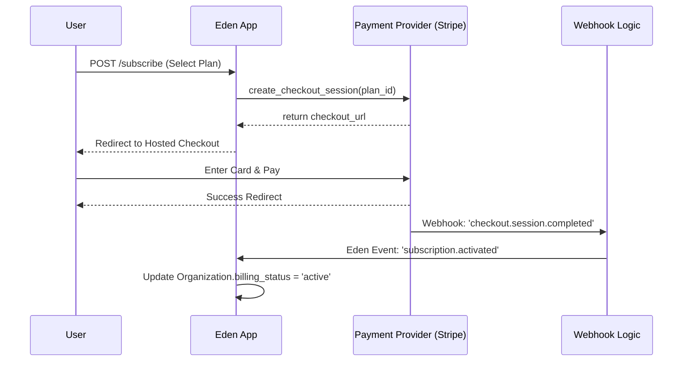

# 💳 SaaS Payments & Subscription Management

**Monetize with industrial confidence. Eden provides a provider-agnostic abstraction layer for handling subscriptions, one-time payments, and self-serve billing portals.**

---

> [!TIP]
> **🚀 Live Demo Available!**
> You can see Stripe integration in action in the Eden Framework example application. Run `python app/support_app.py` and visit **`http://localhost:8001/demo/stripe`** to see Checkout session creation and the billing portal pattern.

## 🧠 The Eden Payment Pipeline

Eden separates your business logic from payment provider implementation (Stripe, Paddle, etc.). This ensures your application remains clean, testable, and ready to scale.



---

## ⚡ 60-Second Monetization

The fastest way to monetize a model (User or Organization) is to inherit from `BillableMixin`.

```python
from eden.db import Model, f
from eden.payments import BillableMixin

class Organization(Model, BillableMixin):
    __tablename__ = "organizations"
    name: Mapped[str] = f()

# fields inherited automatically:
# - customer_id (e.g. cus_123)
# - subscription_id (e.g. sub_abc)
# - billing_status (e.g. 'active', 'past_due')
```

---

## 🏗️ Registering the Stripe Provider

Eden treats Stripe as a first-class citizen with safe, non-blocking wrappers.

```python
from eden.payments import StripeProvider

# Initialize in your app bootstrap
stripe = StripeProvider(
    api_key="sk_test_...",
    webhook_secret="whsec_..."
)

app.configure_payments(stripe)
```

---

## 🚀 Industrial Usage Patterns

### 1. The Global Subscription Flow
Handle multi-currency and regional tax compliance by passing the local customer identity.

```python
@app.post("/billing/subscribe")
async def start_subscription(request):
    provider = app.payments.get_provider()
    
    # 1. Ensure customer is synced with Provider
    if not request.tenant.customer_id:
        c_id = await provider.create_customer(email=request.tenant.owner_email)
        request.tenant.customer_id = c_id
        await request.tenant.save()

    # 2. Launch checkout (Handles VAT/GST automatically in Stripe)
    url = await provider.create_checkout_session(
        customer_id=request.tenant.customer_id,
        price_id="price_H5ggv909sdj",
        success_url="https://myapp.com/success",
        cancel_url="https://myapp.com/pricing"
    )
    return RedirectResponse(url)
```

### 2. Metered Billing (Usage-Based)
For AI or API companies, you can charge per-request or per-token.

```python
async def log_api_usage(user_id: str, tokens: int):
    provider = app.payments.get_provider()
    user = await User.get(id=user_id)
    
    # Report usage to Stripe (Metered Price)
    await provider.report_usage(
        subscription_item_id=user.sub_item_id,
        quantity=tokens
    )
```

### 3. Webhook Security & Idempotency
Webhooks are asynchronous. Eden ensures they are verified and processed exactly once.

```python
@app.on("payment.succeeded")
async def handle_payment(event):
    # 'idempotency_key' from provider ensures we don't process twice
    if await is_processed(event.id):
        return

    org = await Organization.get_by(customer_id=event.data.customer)
    org.billing_status = "active"
    await org.save()
```

---

## 📄 API Reference

### `PaymentProvider` Interface

| Method | Returns | Description |
| :--- | :--- | :--- |
| `create_customer` | `str` | Creates a record in the provider return `id`. |
| `create_checkout_session` | `str` | Generates a secure checkout link. |
| `create_portal_session` | `str` | Returns a self-serve billing portal link. |
| `get_subscription` | `dict` | Fetches real-time status from the provider. |

---

## 💡 Best Practices

1. **Async Safety**: Eden's `StripeProvider` uses `asyncio.to_thread` for all network calls—ensuring your app stays responsive even during heavy traffic.
2. **Local Testing**: Use the Stripe CLI (`stripe listen --forward-to localhost:8000/webhooks`) to test your handlers locally.
3. **Idempotency**: Always verify if a subscription change was already applied by a previous webhook before executing expensive logic.
4. **Portal First**: Don't build your own credit-card update forms. Use `create_portal_session()` to let users manage billing securely on Stripe's infrastructure.

---

**Next Steps**: [SaaS Multi-Tenancy](tenancy.md) | [Background Tasks](background-tasks.md)
