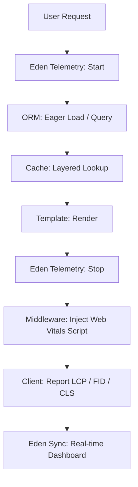

# 🏎️ Web Vitals & Performance Engineering

**Performance is the cornerstone of SaaS success. Eden provides a comprehensive performance suite—from server-side telemetry and database eager-loading to client-side Web Vitals tracking—ensuring your application remains lightning-fast at scale.**

---

## 🧠 Conceptual Overview

Eden’s performance philosophy is "Observability-First." We provide the tools to measure every millisecond of the request lifecycle, allowing you to identify bottlenecks before they impact your users.

### The Observability Pipeline



---

```python
from eden.telemetry import get_telemetry

@app.get("/dashboard")
async def dashboard_view(request):
    # Perform logic...
    data = get_telemetry()
    
    print(f"Request took {data.total_duration_ms:.2f}ms")
    print(f"Executed {data.db_queries} queries totaling {data.db_time_ms:.2f}ms")
    
    return app.render("dashboard.html")
```

---

## 📈 Production Metrics (Prometheus)

While Request-Scoped Telemetry is excellent for debugging individual requests, **Production Metrics** provide a holistic view of your application's health and performance across all users and worker processes.

Eden includes a unified metrics engine that automatically exports data in the **Prometheus text format**, ready for scraping by Prometheus, Grafana, or Datadog agents.

### Unified Metrics Pipeline

Eden bridges request-scoped telemetry directly into a global registry. This means every database query, template render, and API call automatically updates the application-wide performance counters.

| Metric Name | Type | Description |
| :--- | :--- | :--- |
| `http_requests_total` | `Counter` | Total number of HTTP requests processed. |
| `http_request_duration_seconds` | `Histogram` | Latency distribution of HTTP requests. |
| `db_queries_total` | `Counter` | Total number of SQL queries executed. |
| `template_renders_total` | `Counter` | Total number of Jinja2/Eden templates rendered. |
| `system_memory_usage_bytes` | `Gauge` | Current memory usage of the application process. |

### Configuration

You can configure the metrics engine using environment variables or your `eden.config.Config` object.

```bash
# Enable the Prometheus exporter (enabled by default)
EDEN_METRICS_ENABLED=true

# Change the metrics endpoint URL (default: /metrics)
EDEN_METRICS_URL=/internal/prometheus/metrics
```

### Accessing the Endpoint

When enabled, Eden automatically mounts a public `/metrics` endpoint (or your custom URL).

```bash
curl http://localhost:8000/metrics
```

> [!TIP]
> **Security Note**: We recommend restricting access to the `/metrics` endpoint at the infrastructure level (e.g., via Nginx allow-lists or VPC rules), or by checking for a specific header in a custom middleware.

---

## ⚡ Database Performance

Optimizing the data layer is the highest-leverage performance activity in any SaaS.

### 1. Eager Loading (N+1 Prevention)
Never iterate over a collection and fetch relationships one-by-one. Use `.include()` to fetch everything in a single optimized join.

```python
# ❌ SLOW: Triggers a query for every post's author
posts = await Post.all()
for post in posts:
    print(post.author.name)

# ✅ FAST: Fetches posts and authors in ONE query
posts = await Post.all().include("author")
```

### 2. Selective Field Loading (Sparse Fieldsets)
Reduce the payload size and database memory usage by only pulling the columns you actually need.

```python
# Only fetch specific columns
users = await User.all().with_only("id", "email", "full_name")
```

### 3. Connection Pooling
Eden manages a high-performance connection pool out of the box. Configure it in your `Database` setup.

```python
db = Database(
    url=settings.DATABASE_URL,
    pool_size=20,       # Initial connections
    max_overflow=10,    # Dynamic scaling
    pool_recycle=3600   # Prevent stale connections
)
```

---

## 🌐 Web Vitals & Client Performance

Eden provides built-in support for tracking Core Web Vitals (LCP, FID, CLS) to help you maintain a premium User Experience and improve SEO.

### Injecting the Vitals Collector
Add the `@eden_vitals` directive to your base layout's `<head>`. This injects a lightweight observer that reports vitals back to your `/vitals` endpoint.

```html
<!-- layouts/base.html -->
<head>
    @eden_vitals
</head>
```

### Monitoring CLI
Use the Eden CLI to monitor live performance metrics from your terminal.

```bash
eden metrics --live
```

---

## 🛡️ Response Optimization

### 1. GZip & Brotli Compression
Eden includes high-performance compression middleware to reduce the size of your HTML and JSON payloads.

```python
from starlette.middleware.gzip import GZIPMiddleware

app.add_middleware(GZIPMiddleware, minimum_size=500)
```

### 2. Request Timeouts
Prevent "Zombies" from hanging your worker processes. Use the `TimeoutMiddleware` to automatically kill requests that exceed your performance budget.

```python
@app.middleware("http")
async def timeout_guard(request, call_next):
    try:
        return await asyncio.wait_for(call_next(request), timeout=30.0)
    except asyncio.TimeoutError:
        return JsonResponse({"error": "Request Budget Exceeded"}, status_code=504)
```

---

## 📄 API Reference: Telemetry

### `TelemetryData` object

| Property | Type | Description |
| :--- | :--- | :--- |
| `total_duration_ms` | `float` | Wall-clock time for the entire request. |
| `db_queries` | `int` | Count of SQL queries executed. |
| `db_time_ms` | `float` | Cumulative time spent waiting for the database. |
| `memory_delta_mb` | `float` | Memory growth during the request. |

---

## 💡 Best Practices

1.  **Paginate Everything**: Never allow `SELECT *` without a limit. Eden's `.paginate()` helper is mandatory for any SaaS list view.
2.  **Indexes are Free**: Any column used in a `.where()` clause should be indexed in your model definition.
3.  **Cache Heavy Views**: For complex dashboards, use **View Caching**. See the [Caching Guide](caching.md).
4.  **Lazy Assets**: Use Eden's `asset()` helper to ensure your CSS/JS is served with long-lived cache headers and version hashes.

---

**Next Steps**: [Background Tasks & Workers](background-tasks.md)
