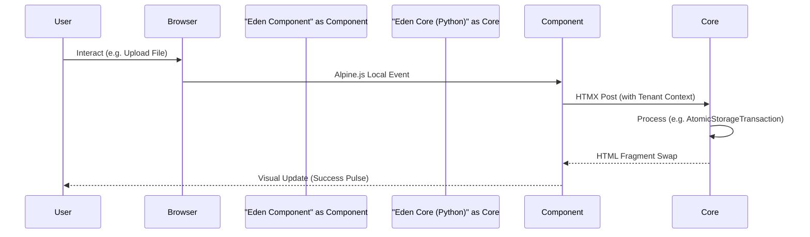

# 💎 Premium SaaS Components

**Build industrial-grade, aesthetics-first interfaces with Eden's Elite Component library. These components are more than just HTML; they are deeply integrated into the framework's Multi-Tenancy, Storage, and Real-time layers.**

---

## 🏗️ The Component Lifecycle

Eden components bridge the gap between static templates and dynamic framework logic. They utilize **Alpine.js** for frontend state and **HTMX** for seamless server communication.



---

## 🧪 1. `<x-live-sync />` (The Pulse)

The `live-sync` component provides a high-fidelity visual indicator that a page or specific record is "Live." It pulses green when a websocket update is received and yellow during background task processing.

### 📋 Live-Sync Usage

Wrap any important metric or status with `live-sync` to give users confidence in the data's freshness.

```html
<div class="flex items-center gap-2">
    <h2 class="text-xl font-bold">Revenue Dashboard</h2>
    @component("live-sync", channel="reports.revenue")
</div>
```

### 🔗 Eden Integration: Real-time Sync

This component automatically subscribes to the **Eden ConnectionManager** via a lightweight Alpine.js watcher.

- **Green Pulse**: Triggered when a message arrives on the specified `channel`.
- **Yellow Pulse**: Triggered when a `Taskiq` background job references the current `request.id`.

> [!TIP]
> Use this in **Admin Dashboards** next to "Active Users" or "Server Load" to create a high-speed, interactive feel.

---

## 🏢 2. `<x-tenant-selector />` (The Multi-Tenant Switcher)

For B2B SaaS applications, switching between organizations must be fluid and secure. The `tenant-selector` provides a glassmorphic dropdown that handles the complexity of cross-tenant routing.

### 📋 Tenant Selector Usage

Place this in your navigation sidebar or top bar. It automatically discovers the user's accessible tenants.

```html
@component("tenant-selector", search=true, glass=true)
```

### 🔗 Eden Integration: Tenancy Engine

The selector interacts directly with `eden.tenancy.context`. When a user selects a new tenant:

1. It validates the user's membership in that organization.

2. It performs a **Soft-Redirect** using HTMX to the tenant's specific subdomain or path prefix.

3. It refreshes the `ContextVar`-based tenant ID globally.

```python
# Behind the scenes, Eden ensures the selector only shows authorized tenants
tenants = await request.user.get_authorized_tenants()
```

---

## 🛡️ 3. `<x-atomic-dropzone />` (The Resilient Uploader)

Data integrity is critical. If a user uploads a file but the database save fails, you end up with "orphaned" files in S3. The `atomic-dropzone` prevents this by hooking into Eden's storage transactions.

### 📋 Atomic Dropzone Usage

A sleek, drag-and-drop area with progress tracking.

```html
@component("atomic-dropzone", 
    action="@url('api:upload')", 
    accept="image/*", 
    max_size="10MB"
)
```

### 🔗 Eden Integration: Atomic Storage

When a file is dropped:

1. The component initiates a chunked upload.
2. The backend opens an `AtomicStorageTransaction`.

3. If the final form submission fails (e.g., validation error), the `atomic-dropzone` triggers a **Rollback Event** that instructs the storage backend to delete the temporary file immediately.

> [!IMPORTANT]
> **Zero Orphans**: This ensures your S3 buckets stay clean and your costs remain predictable by never storing files for failed operations.

---

## 🔍 4. `<x-command-bar />` (The Global Search)

The `command-bar` (triggered by `CMD+K`) is the ultimate tool for power users. It provides an overlay for navigating the app and searching records.

### 📋 Command-Bar Usage

Include this once in your `base.html`.

```html
@component("command-bar")
```

### 🔗 Eden Integration: Semantic AI

Beyond simple text matching, the `command-bar` can perform **Semantic Search** using `pgvector`. 

- **Patterns**: "Find the invoice from last Tuesday about the coffee machine."
- **Logic**: It sends the query to an Eden endpoint that utilizes `VectorModel.semantic_search`, providing results based on meaning, not just keywords.

```python
# The Search Endpoint powering the x-command-bar
@app.get("/api/search")
async def global_search(q: str):
    results = await Document.semantic_search(q, limit=5)
    return results
```

---

## 💡 Best Practices

1. **Lazy Loading**: Use `@push('scripts')` to load the Alpine.js logic for these components only when they are used on a page.
2. **Permission Scoping**: Always wrap `tenant-selector` and `command-bar` in an `@auth` block.
3. **Glassmorphism**: When using the `glass=true` prop, ensure the background has a `bg-slate-900/50` or similar dark-tinted base for readability.

---

**Next Steps**: [Mastering the Admin Dashboard](admin.md) | [Real-time Pipelines](realtime.md)
