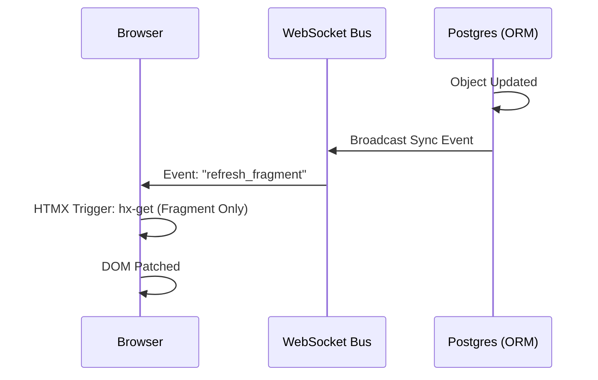

# ⚡ Reactivity & Real-time Synchronization

**Eden turns static HTML into dynamic, living interfaces with zero boilerplate. By combining the `@reactive` template directive with a built-in WebSocket event bus, your UI stays in sync with your database automatically.**

---

## 🧠 The Reactive Loop

When you mark a block of HTML as `@reactive`, Eden establishes a three-way link between the **Data Model**, the **WebSocket Bus**, and the **Browser**.



---

## ⚡ The `@reactive` Directive

The easiest way to implement real-time updates is the `@reactive` directive. It wraps a section of your template and automatically configures it to listen for updates to a specific object.

```html
@reactive(project) {
<div class="p-6 border rounded-xl">
    <h2 class="text-xl font-bold">{{ project.name }}</h2>
    <p>Status: <span class="badge">{{ project.status }}</span></p>
    
    <!-- This section will refresh via HTMX whenever 'project' changes in the DB -->
</div>
}
```

### How it works

1. Eden detects the `@reactive` tag during template compilation.
2. It generates a unique `id` and `hx-get` attribute for the container.
3. It adds a `hx-ext="ws"` and `ws-connect` logic to listen for the object's sync channel.
4. When the object is saved in Python, Eden broadcasts a message to that channel, triggering the HTMX refresh.

---

## 🏗️ Managing Sync Channels

Eden automatically calculates "Sync Channels" based on the object's identity and its tenancy.

| Object Type | Channel Pattern |
| :--- | :--- |
| **Global Model** | `model:table_name:id` |
| **Tenant Model** | `tenant={tenant_id}:table_name:id` |
| **Org Model** | `org={org_id}:table_name:id` |
| **Collection** | `model:table_name` (Refreshes on any create/delete) |

### Custom Channel Resolution

You can override the `get_sync_channels()` method on your model to define custom broadcast groups.

```python
class Message(Model, TenantMixin):
    def get_sync_channels(self):
        # Notify both the specific thread and the global inbox
        return [
            f"thread:{self.thread_id}",
            f"tenant:{self.tenant_id}:inbox"
        ]
```

---

## 🛠️ Manual Real-time Control

If you need more control than the automatic `@reactive` tag provides, you can use the `eden_sync` helper in your views.

```python
from eden.db.reactive import broadcast_update

@app.post("/projects/{id}/approve")
async def approve_project(id: int):
    project = await Project.get(id)
    project.status = "approved"
    await project.save()
    
    # Manually trigger a refresh for all clients watching this project
    await broadcast_update(project)
    
    return RedirectResponse("/projects")
```

---

## 💡 Best Practices

1. **Granularity**: Keep reactive blocks small. Instead of making the whole page reactive, wrap individual cards or rows.
2. **Security**: Eden's WebSocket router automatically validates that the user has access to the tenant/org before allowing them to subscribe to a sync channel.
3. **Throttling**: For high-frequency updates (e.g., progress bars), Eden automatically debounces refreshes to prevent UI flickering.

---

**Next Steps**: [Multi-Tenancy Guide](tenancy-postgres.md) | [HTMX Deep Dive](htmx.md)
