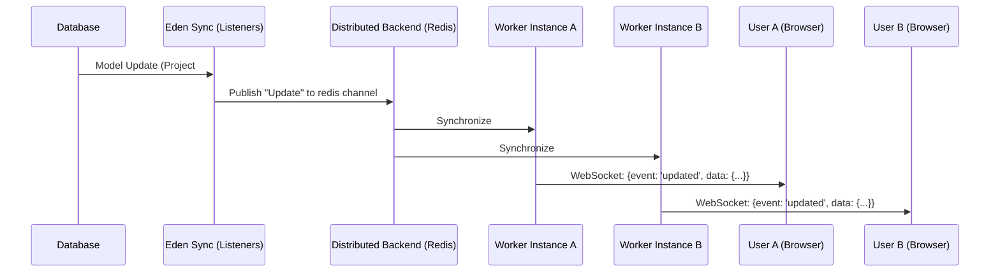

# ⚡ Real-time Synchronization & WebSockets

**Experience the "Live-Wired" SaaS. Eden provides a high-performance synchronization engine that bridges your database models directly to your UI, along with a robust WebSocket infrastructure for custom real-time patterns.**

---

## 🧠 The Real-time Pipeline

Eden employs a dual-layer approach to real-time communication:

1.  **Eden Sync (High-Level)**: Automatic, event-driven broadcasts triggered by ORM model changes. Ideal for lists, status indicators, and live dashboards.
2.  **WebSocket Engine (Low-Level)**: A distributed, security-hardened `ConnectionManager` for custom bi-directional logic like chat, gaming, or collaborative editing.



---

## 🛠️ Eden Sync: Reactive UI with Zero Boilerplate

Eden Sync eliminates the need for manual WebSocket orchestration. By marking a model as reactive, the framework automatically broadcasts `created`, `updated`, and `deleted` events to all connected clients.

### 1. Activating the Model
Simply set `__reactive__ = True` in your model class.

```python
from eden.db import Model, f

class Task(Model):
    __tablename__ = "tasks"
    __reactive__ = True  # <--- Core Sync Activation
    
    title: str = f()
    is_completed: bool = f(default=False)
    tenant_id: int = f()

    def get_sync_channels(self) -> list[str]:
        # Isolate broadcasts to the specific tenant
        return [f"tenant:{self.tenant_id}:tasks"]
```

### 2. Frontend Consumption
Use Eden's high-level `hx-sync` attribute (powered by HTMX and Alpine.js) to live-update your UI.

```html
<!-- Automatically subscribe to the tasks channel -->
<div x-data="{ tasks: [] }" 
     hx-sync="tenant:123:tasks" 
     @sync:created="tasks.push($event.detail.data)"
     @sync:deleted="tasks = tasks.filter(t => t.id !== $event.detail.data.id)">
    
    <template x-for="task in tasks">
        <div class="p-2 border-b border-white/5 flex justify-between">
            <span x-text="task.title"></span>
            <span class="text-xs opacity-50" x-text="task.created_at | time_ago"></span>
        </div>
    </template>
</div>
```

---

## 🏰 The `ConnectionManager`

For custom bi-directional logic, use the unified `connection_manager`. It handles security (Origin/CSRF) and distributed scale out-of-the-box.

### Custom WebSocket Handler
```python
from eden.websocket import connection_manager

@app.websocket("/ws/project/{project_id}")
async def project_collaboration(websocket, project_id: str):
    # 1. Accept and Validate (Security checks handled automatically)
    await connection_manager.connect(websocket, user_id=request.user.id)
    
    # 2. Subscribe to a specific channel
    await connection_manager.subscribe(websocket, f"project:{project_id}")
    
    try:
        while True:
            # 3. Receive collaboration events (e.g. cursor moves)
            data = await websocket.receive_json()
            
            # 4. Global broadcast (reaches all users across all workers)
            await connection_manager.broadcast(
                {"event": "cursor_move", "user": request.user.name, "coords": data},
                channel=f"project:{project_id}"
            )
    except WebSocketDisconnect:
        await connection_manager.disconnect(websocket)
```

---

## ⚡ Elite Patterns

### 1. The "Toast" System
Broadcast global notifications directly to a user's browser, even if they aren't on a specific page.

```python
# From a background task or view
await connection_manager.send_to_user(target_user_id, {
    "type": "notification",
    "title": "Build Complete",
    "message": "Your project is now live!",
    "intent": "success"
})
```

### 2. Distributed Scale (Redis)
Ensure a broadcast from Worker A reaches a user connected to Worker B by enabling the Redis backend.

```python
from eden.core.backends.redis import RedisBackend
from eden.websocket import connection_manager

await connection_manager.set_distributed_backend(
    RedisBackend(url="redis://localhost:6379")
)
```

---

## 📄 API Reference

### `ConnectionManager`

| Method | Parameters | Description |
| :--- | :--- | :--- |
| `broadcast` | `message, channel, exclude` | Sens to all subscribers of a channel. Distributed by default. |
| `send_to_user`| `user_id, message` | Sends to *all* active sockets owned by a specific user. |
| `subscribe` | `websocket, channel` | Adds a socket to a named room/channel. |

---

## 💡 Best Practices

1. **Explicit Security**: Always wrap your `@app.websocket` handler in an auth check before calling `connect()`.
2. **Channel Isolation**: Use scoped names like `tenant:{id}:model` instead of global IDs to prevent cross-tenant data leakage.
3. **Lean Payload**: Send the model ID and minimal changed fields via sync broadcasts. Let the frontend fetch full updates if needed.
4. **JSON Only**: Always broadcast standard Python dictionaries to ensure seamless integration with the frontend Alpine.js runtime.

---

**Next Steps**: [Admin Dashboard](admin.md) | [Background Tasks](background-tasks.md)
