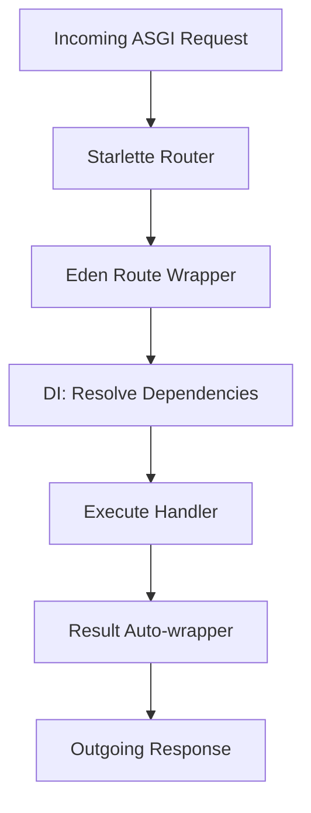

# 🌿 Routing & Navigation

**Expressive, hierarchical, and type-safe routing that bridges the power of Starlette with Eden's "Elite" developer experience.**

---

## 🚀 Quick Start

Define your first routes in seconds using intuitive decorators on the `app` or `Router` instances.

```python
from eden import Eden, Request

app = Eden()

@app.get("/")
async def home(request: Request):
    return {"message": "Welcome to Eden"}

@app.get("/greet/{name}")
async def greet(request: Request, name: str):
    return {"greeting": f"Hello, {name}!"}
```

---

## 🧠 Conceptual Overview

Eden's routing system isn't just a way to map URLs to functions; it's a high-performance **orchestration layer**. Built on top of **Starlette**, it extends the base routing with:

1.  **Dependency Injection (DI)**: Every route handler is automatically injected with its requirements (Request, User, Database Sessions, etc.) via the `DependencyResolver`.
2.  **Type-Safe Path Parameters**: Automatic casting of path segments to `int`, `uuid`, `float`, or recursive `path` types.
3.  **Hierarchical Composition**: Deeply nested sub-routers with inherited middleware and naming conventions.
4.  **Starlette Bridge**: Seamless conversion to native Starlette `Route` objects for 100% ecosystem compatibility.

### Architectural Flow

When a request enters Eden, it undergoes a transformation from a raw ASGI scope to a high-level `EdenRequest` before being dispatched to your handler.



---

## 🛠️ Detailed Usage

### 1. Basic Routing (Decorators)
Routes are defined using the standard HTTP method decorators. Eden supports `@get`, `@post`, `@put`, `@patch`, `@delete`, `@options`, and `@head`.

### Parameter Types

| Type | Syntax | Description |
| :--- | :--- | :--- |
| `str` | `{name}` | Captures as a string (default). |
| `int` | `{id:int}` | Captures and casts to integer. |
| `float` | `{val:float}` | Captures and casts to float. |
| `uuid` | `{id:uuid}` | Captures and casts to a UUID object. |
| `path` | `{file:path}` | Captures everything, including slashes. |

```python
# Single parameter
@app.get("/posts/{id:int}")
async def get_post(request, id: int):
    post = await Post.get(id=id)
    if not post:
        return {"error": "Not found"}, 404
    return post.to_dict()

# Multiple parameters (commonly used for relationships)
@app.get("/users/{user_id:int}/posts/{post_id:int}")
async def get_user_post(request, user_id: int, post_id: int):
    user = await User.get(id=user_id)
    if not user:
        return {"error": "User not found"}, 404
    
    post = await Post.get(id=post_id, user_id=user_id)
    if not post:
        return {"error": "Post not found"}, 404
    return post.to_dict()

# Slug-based (common for SEO)
@app.get("/blog/{slug}")
async def get_blog_post(request, slug: str):
    post = await BlogPost.get_by(slug=slug)
    return request.render("post.html", {"post": post})

# Path parameters (captures entire remaining path)
@app.get("/files/{filepath:path}")
async def serve_file(request, filepath: str):
    return FileResponse(f"uploads/{filepath}")
```

> [!TIP]
> Use **Path Parameter Types** (e.g., `{id:int}`) to ensure your handlers only receive valid data.

### 2. Query Parameters & Search
Query parameters are accessed via `request.query_params`.

```python
# Single query parameter for search
@app.get("/search")
async def search(request):
    q = request.query_params.get("q", "")  # Default to ""
    results = await Post.filter(title__contains=q)
    return {"results": [r.to_dict() for r in results]}

# Paging and Filtering (REST API pattern)
@app.get("/products")
async def list_products(request):
    page = int(request.query_params.get("page", 1))
    sort_by = request.query_params.get("sort", "created_at")
    
    products = await Product.filter(is_active=True).order_by(sort_by).limit(20)
    return {"products": [p.to_dict() for p in products], "page": page}
```

---

## 📦 Request Body & Payload Handling

### JSON Request Body
```python
@app.post("/posts")
async def create_post(request: Request):
    data = await request.json()
    post = await Post.create(
        title=data["title"],
        content=data["content"]
    )
    return {"post": post.to_dict()}, 201
```

### Form Data & File Uploads
```python
@app.post("/upload")
async def upload_file(request: Request):
    form_data = await request.form_data()
    file = form_data.get("file")  # UploadedFile object
    
    # Access file properties
    print(f"Filename: {file.filename}, Size: {file.size}")
    
    # Save file
    file_path = f"uploads/{file.filename}"
    with open(file_path, "wb") as f:
        f.write(await file.read())
    
    return {"filename": file.filename}, 201
```

---

## 🚥 Status Codes & Response Types

Eden supports multiple response types. You can return a dictionary (auto-JSON), a string (auto-HTML), or an explicit Response object.

```python
from eden import status, redirect

# Explicit status codes
@app.post("/tasks")
async def create_task(request):
    return {"task": "..." }, status.HTTP_201_CREATED

# Redirections
@app.get("/old-path")
async def old_url(request):
    return redirect("/new-path", status_code=status.HTTP_301_MOVED_PERMANENTLY)

# Error Response Codes
@app.get("/private-item/{id}")
async def get_private(request, id: int):
    if not request.user.is_authenticated:
        return {"error": "Auth required"}, status.HTTP_401_UNAUTHORIZED
    return {"id": id}
```

---

## 🏗️ Building Professional Routers

### Intermediate Scenarios (Routers & Namespaces)
As your application grows, use `Router` to group related logic. Routers can have their own prefixes, tags, and middleware.

```python
# api/users.py
users_router = Router(name="users")

@users_router.get("/", name="list")
async def list_users():
    return await User.all()

# app_api.py
api_router = Router(prefix="/api/v1", name="api")
api_router.include_router(users_router, prefix="/users")

# app.py
app.include_router(api_router)
```

Now your routes are available at:
- `GET /api/v1/users` (via `api:users:list`)

**Namespace Reversal**: You can generate URLs using the `namespace:name` convention, which makes your code resistant to path changes.

```python
# Generates '/api/v1/users'
url = app.url_for("api:users:list")
```

### Recursive Middleware
Apply security middleware (like `AuthMiddleware`) at the `Router` level to protect a group of routes instantly.

```python
from eden.middleware import AuthMiddleware

admin_router = Router(name="admin", prefix="/admin")
admin_router.add_middleware(AuthMiddleware)

@admin_router.get("/dashboard")
async def dashboard(request):
    return {"admin": True}
```

---

## 🚀 Advanced Pattern: Auto-CRUD Generation
One of Eden's "Killer Features" is the ability to generate a full suite of professional CRUD routes directly from an ORM model.

```python
from eden import Router
from app.models import Product

# This single line generates list, show, create, update, and delete routes!
product_router = Router(prefix="/products", model=Product)

app.include_router(product_router)
```

> [!IMPORTANT]
> The `model` argument in `Router` automatically handles template rendering (at `{table_name}/list.html`), redirection, and validation error propagation.

---

## 📖 API Reference

### `Router` Class
The `Router` class is the primary interface for route registration and organization. Information sourced from `eden/routing.py`.

| Method | Parameters | Return Type | Description |
| :--- | :--- | :--- | :--- |
| `get(path, name, ...)` | `path: str`, `name: str` | `Callable` | Registers a GET route. |
| `post(path, name, ...)` | `path: str`, `name: str` | `Callable` | Registers a POST route. |
| `add_view(path, view_class, ...)` | `path: str`, `view_class: type[View]` | `None` | Registers a Class-Based View (CBV). |
| `include_router(router, prefix)` | `router: Router`, `prefix: str` | `None` | Merge another router's routes into this one. |
| `url_for(name, **params)` | `name: str` | `str` | Generates a fully-interpolated path string. |

### Class-Based Views (CBVs)
For complex logic, inheritance provides a cleaner structure than decorators.

```python
from eden.routing import View

class UserProfileView(View):
    async def get(self, user_id: int):
        return {"id": user_id, "action": "viewing"}

    async def post(self, user_id: int):
        return {"id": user_id, "action": "updating"}

router.add_view("/users/{user_id:int}", UserProfileView)
```

---

## 🛡️ Validation & Error Handling

### Request Validation with Schemas
The Eden way is to validate request data using Schemas declaratively:

```python
from eden.forms import Schema, field

class CreateUserSchema(Schema):
    name: str = field(min_length=2)
    email: str = field()

@app.post("/users")
@app.validate(CreateUserSchema)
async def create_user(request, data: CreateUserSchema):
    user = await User.create(**data.to_dict())
    return {"user": user.to_dict()}, 201
```

### Global Exception Handlers
```python
from eden.exceptions import HTTPException

# Handle 404 globally
@app.exception_handler(404)
async def handle_not_found(request, exc):
    return {"error": "Resource not found", "path": request.url.path}, 404
```

---

## ⚡ HTMX & Targeted Fragments

One of Eden's elite features is the ability to render specific template sections (fragments) based on the request state.

```python
@app.get("/search")
async def search(request):
    results = await Post.search(request.query_params.get("q"))
    
    if request.headers.get("HX-Request"):
        # Returns ONLY the <ul> part of the template
        return request.render("search.html", {"results": results}, fragment="result-list")
        
    return request.render("search.html", {"results": results})
```

---

## 💡 Best Practices

- **Naming Matters**: Always provide a `name` to your routers and routes. This enables the use of `@url()` in templates and `redirect_to()` in code.
- **Middleware Placement**: Apply security middleware at the `Router` level to protect a group of routes instantly.
- **Trailing Slashes**: Eden is flexible with trailing slashes. For the best SEO consistency, stick to the pattern defined in your `prefix`.

---

**Next Steps**: [Modern Templating Architecture](templating.md)
