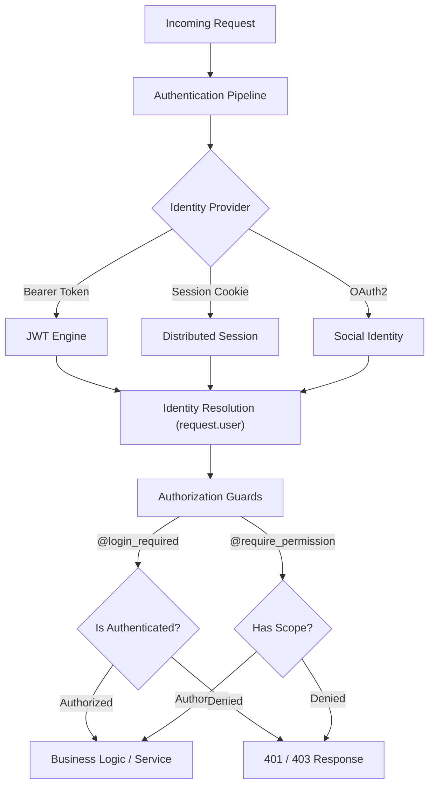

# 🔒 Security, Identity & Access Control

**Eden provide a unified, industrial-grade security suite that handles identity management, multi-backend authentication, and hierarchical RBAC with zero-friction integration. This guide is the single source of truth for securing your Eden application.**

---

## 🧠 The Eden Security Architecture

Security in Eden is built on a "Three Pillars" architecture. Each layer is independent yet works in harmony to provide end-to-end protection from the request edge to the database query.



---

## 👤 1. Core Identity: The User Model

Beyond authentication, Eden provides a robust identity system for managing users, passwords, and profile data. 

### The Built-in `User` Model

Eden provides a fully-featured, built-in `User` model out of the box (linked to the `eden_users` table). **You do not need to create your own User table.** It comes pre-configured with `email`, `password_hash`, `is_active`, `is_superuser`, and RBAC relationships.

```python
# Import the built-in user model
from eden.auth.models import User

# Fetch all users
users = await User.all()

# Get the currently authenticated user in a route
@app.get("/me")
async def get_me(request):
    return {"email": request.user.email}
```

### Extending via a 1-to-1 Profile

If you need to store additional application-specific data (like a bio, avatar, or preferences), the best practice is to create a `Profile` model with a **One-to-One** relationship to the built-in `User` model, rather than creating a whole new users table.

```python
from eden.db import Model, f, Mapped, Reference
from eden.auth.models import User

class Profile(Model):
    """
    Application-specific data linked 1-to-1 with the built-in User.
    """
    __tablename__ = "profiles"
    
    # Custom fields
    full_name: Mapped[str] = f(max_length=150)
    bio: Mapped[str | None] = f(nullable=True)
    
    # 🌟 1-to-1 Link to the built-in Eden User
    # Reference creates the user_id foreign key automatically
    user: Mapped[User] = Reference(unique=True)
```

*(Advanced): If you completely want to override the base auth behavior, you can extend `eden.auth.BaseUser` and `Model` to create a custom user implementation, but the 1-to-1 Profile approach is recommended for 95% of applications.*

### Password Management: Argon2id

Eden uses **Argon2id** (the winner of the Password Hashing Competition) by default. 

*   **Set Password**: `user.set_password("raw_string")` hashes securely.
*   **Verify Password**: `user.check_password("input")` returns a boolean.

### Initializing Users

1.  **CLI**: `eden auth createsuperuser` for your first account.
2.  **Service Helper**: `from eden.auth.actions import create_user` handles validation and hashing in one call.

---

## ⚡ 2. Authentication: Logging In

Eden supports multiple authentication strategies out of the box.

### Stateful (Sessions)

Perfect for traditional web apps. You can use the built-in `authenticate()` and `login()` actions to securely validate credentials and bind the user to the current session.

```python
from eden.auth.actions import authenticate, login
from eden.responses import redirect, json

@app.post("/login")
async def do_login(request):
    # 1. Grab credentials from the form submission
    form = await request.form_data()
    email = form.get("email")
    password = form.get("password")
    
    # 2. Authenticate checks if the user exists and the password is correct
    # It automatically uses the built-in User model
    user = await authenticate(email=email, password=password)
    
    if not user:
        return json({"error": "Invalid email or password"}, status_code=401)
        
    # 3. Log the user in to create a secure session
    await login(request, user)
    
    return redirect("/dashboard")
```

### Stateless (JWT)

Ideal for mobile apps or external APIs. Eden's `JWTEngine` handles signing and verification automatically.

### Logging out
Logging out a user simply destroys the current session state.
```python
from eden.auth.actions import logout

@app.post("/logout")
async def do_logout(request):
    await logout(request)
    return redirect("/login")
```

### The 60-Second Auth Setup

Protect your routes with simple decorators:

```python
from eden.auth import login_required

@app.get("/dashboard")
@login_required # Redirects to /login or returns 401 based on Accept header
async def dashboard(request):
    return {"user": request.user.full_name}
```

---

## 🛡️ 3. Authorization (RBAC Master Class)

Eden supports two modes of Role-Based Access Control (RBAC). You can even mix them.

### Mode A: JSON-Light (Lightweight)

Perfect for simple apps. Roles and permissions are stored as JSON lists directly on the `User` record.
*   **Attributes**: `user.roles_json`, `user.permissions_json`.

### Mode B: Relational RBAC (Enterprise)

Best for complex apps requiring role inheritance and dynamic permission mapping.

```python
from eden.auth.models import Role, Permission

# Roles can inherit from parents!
editor_role = Role(name="editor")
admin_role = Role(name="admin", parents=[editor_role])

# Permissions are atomic
edit_perm = Permission(name="post:edit")
editor_role.permissions.append(edit_perm)
```

### Enforcing Permissions

Use the core guard decorators or template directives:

*   **Python**: `@require_permission("post:edit")`
*   **Templates**: `@can("post:edit") { <button>Edit</button> }`

---

## 🌐 4. Social Login (OAuth 2.0)

Eden provides a seamless integration for Google, GitHub, and custom providers with **Automated Account Linking**.

```python
from eden.auth.oauth import OAuthManager

oauth = OAuthManager()
oauth.register_google(client_id="...", client_secret="...")
oauth.mount(app) # Mounts /auth/oauth/google/login automatically
```

### Strategic Features

*   **Account Linking**: If a user logs in via Google with the same email as an existing account, Eden automatically links them.
*   **CSRF State Guard**: Every OAuth handshake is verified with a unique session state to prevent replay attacks.

---

## 🔒 5. Defensive Security Suite

Eden includes a robust middleware stack to protect against common web vulnerabilities.

| Middleware | Protection | Description |
| :--- | :--- | :--- |
| **CSRFMiddleware** | Cross-Site Request Forgery | Enforces `@csrf` tokens on all POST/PUT/DELETE requests. |
| **SecurityMiddleware** | CSP / XSS / HSTS | Sets modern security headers by default. |
| **RateLimitMiddleware** | Brute-Force Prevention | Throttles authentication attempts and expensive endpoints. |

### CSRF Protection in Templates

Simply add the `@csrf` directive to your forms:

```html
<form method="POST">
    @csrf
    <input name="title">
    <button>Submit</button>
</form>
```

---

## 🚀 Performance & Best Practices

1.  **Permission Caching**: Eden caches resolved permissions in the `EdenContext` for the duration of a request, preventing redundant database hits during complex RBAC checks.
2.  **SQL Optimization**: When using Relational RBAC, use `selectinload` to fetch user roles and permissions in a single optimized query.
3.  **Fail-Secure**: Use **Model-Level RBAC** by extending `AccessControl` on your models to ensure data is protected even if a developer forgets a check in the View layer.

---

**Next Steps**: [SaaS Multi-Tenancy Master Class](multi-tenancy-masterclass.md) | [Built-in Admin Panel](admin.md)
