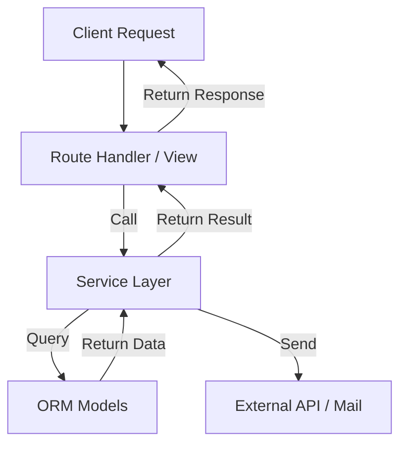

# The Service Layer pattern in Eden ensures your business logic remains isolated and testable:

1.  **Isolation**: Route handlers stay "thin," focusing only on HTTP concerns.
2.  **Reusability**: Logic can be called from APIs, CLI commands, or Background Tasks.
3.  **Atomic Transactions**: Complex operations are wrapped in single units of work.

The **Service Layer** pattern provides a clean abstraction for your domain logic, separating it from the HTTP routing and data persistence layers.

---

## Mental Model: Separation of Concerns

-   **Views/Controllers**: Handle HTTP requests, parse inputs, and return responses. They should be "thin."
-   **Models**: Represent the data structure and basic database operations.
-   **Services**: Encapsulate the "How" of your business. They coordinate multiple models, external APIs, and complex validations.



---

## Foundational: Creating a Service

Inherit from the `Service` base class. Services in Eden are designed to be lightweight and easy to initialize.

```python
from eden.services import Service
from app.models import User, Profile

class UserService(Service):
    async def register_user(self, email: str, password: str) -> User:
        # 1. Complex Validation
        if await User.filter(email=email).exists():
            raise ValueError("Email already in use")
        
        # 2. Coordinate multiple models
        user = await User.create(email=email, password=password)
        await Profile.create(user=user, bio="Welcome to Eden!")
        
        # 3. Side Effects (optional)
        # await send_welcome_email(user)
        
        return user
```

---

## Integration: Dependency Injection

The best way to use services in your route handlers is via Eden's **Dependency Injection** system. This makes your code more testable and handles service lifecycle automatically.

```python
from eden import Eden, Depends
from app.services import UserService

app = Eden()

# Define a dependency provider
async def get_user_service():
    return UserService()

@app.post("/register")
async def register(
    data: dict, 
    user_service: UserService = Depends(get_user_service)
):
    try:
        user = await user_service.register_user(data["email"], data["password"])
        return {"status": "success", "id": user.id}
    except ValueError as e:
        return {"error": str(e)}, 400
```

---

## Scalability: Transaction Management

Services should often be atomic. Use the `db.transaction()` context manager within your service methods to ensure data integrity.

```python
from eden.db import db

class OrderService(Service):
    async def place_order(self, user_id: int, items: list):
        async with db.transaction():
            # If any part fails, the whole transaction rolls back
            order = await Order.create(user_id=user_id)
            for item in items:
                await order.add_item(item)
                await Inventory.reduce_stock(item.id, item.qty)
            
            return order
```

---

## Best Practices

1.  **Keep Services Pure**: Avoid touching `request` or `response` objects inside a service. Pass the raw data instead.
2.  **Granularity**: Create specific services (e.g., `PaymentService`, `AuthService`) rather than one giant `AppService`.
3.  **Cross-Service Calls**: Services can depend on other services. Use DI to inject them!

```python
class BillingService(Service):
    def __init__(self, stripe_provider):
        self.stripe = stripe_provider

async def get_billing_service():
    from eden.payments import StripeProvider
    return BillingService(StripeProvider())
```

---

## Related Guides

- [Dependency Injection](dependencies.md)
- [Unit Testing](testing.md)
- [ORM Querying](orm-querying.md)
- [Admin Panel](admin.md)
