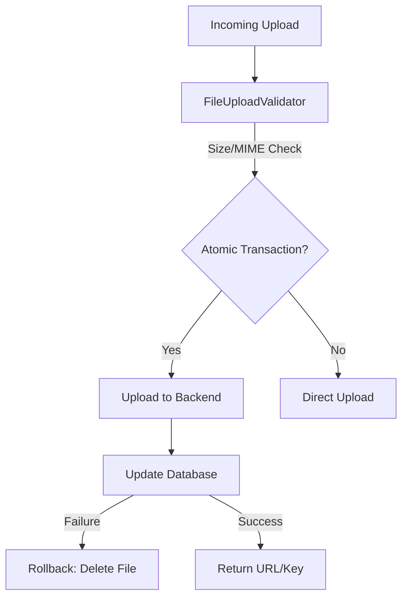

# 📁 File Storage & Object Persistence

**Eden provides a unified, industrial-grade storage abstraction. Whether you are serving local media or managing petabytes in AWS S3, Eden ensures your file operations are atomic, secure, and developer-friendly.**

---

## 🧠 Conceptual Overview

The storage system is built around a **Pluggable Backend** architecture. Your application interacts with a standard `StorageManager` that routes operations to the active provider (Local, S3, or Supabase).

### The Storage Lifecycle



---

## 🏗️ Storage Backends

Eden supports multiple backends out of the box. You can register multiple backends and switch between them dynamically.

| Backend | Typical Use | Configuration |
| :--- | :--- | :--- |
| **`LocalStorage`** | Dev / Single Server | Base path on disk. |
| **`S3Storage`** | Production / Scalable | AWS S3 or MinIO. |
| **`SupabaseStorage`**| Serverless / Mobile | Supabase Storage API. |

### Registering Backends
Register your backends during app initialization (usually in `app.py`).

```python
from eden.storage import storage, LocalStorageBackend, S3StorageBackend

# Register Local for development
storage.register("local", LocalStorageBackend(path="./media"), default=True)

# Register S3 for production
if app.env == "production":
    storage.register("s3", S3StorageBackend(
        bucket="my-app-uploads",
        region="us-east-1"
    ), default=True)
```

---

## 🛡️ Industrial Security: `FileUploadValidator`

Never trust user-supplied files. Eden's validator provides deep inspection before a single byte hits your storage.

```python
from eden.storage import FileUploadValidator

validator = FileUploadValidator(
    max_size_bytes=10 * 1024 * 1024,  # 10MB
    allowed_types={"image/jpeg", "image/png", "application/pdf"},
    enable_virus_scan=True  # Optional ClamAV integration
)

# Usage in a view
await storage.save(request.files['avatar'], validator=validator)
```

---

## ⚡ Elite Patterns

### 1. Atomic Storage Transactions (`AtomicStorageTransaction`)
A common "Gotcha" in web apps: a file is uploaded to S3, but the database saves fails, leaving an orphaned file. Eden solves this with atomic transactions.

```python
async with storage.transaction() as txn:
    # 1. Upload file (tracked by transaction)
    file_key = await txn.save(upload_file, folder="invoices")
    
    # 2. Save to Database
    invoice = await Invoice.create(file_path=file_key, ...)
    
    # If any exception occurs here, file_key is automatically 
    # deleted from the storage backend!
```

### 2. Large File Progress Tracking
Provide real-time feedback for large uploads using the `ProgressCallback` protocol.

```python
async def on_progress(bytes_written: int, total_bytes: int | None):
    if total_bytes:
        percent = (bytes_written / total_bytes) * 100
        print(f"Uploaded: {percent:.1f}%")

await storage.save(large_file, progress=on_progress)
```

### 3. Private Files & Presigned URLs
Keep sensitive data secure by storing files in private buckets and generating time-limited access URLs.

```python
# Generate a URL that expires in 1 hour
secure_url = await storage.get().get_presigned_url(
    "contracts/signed_123.pdf", 
    expires_in=3600
)
```

---

## 📄 API Reference

### `StorageManager` (`eden.storage.storage`)

| Method | Parameters | Description |
| :--- | :--- | :--- |
| `save` | `content, name, folder` | Saves a file to the default backend. Returns the file key. |
| `url` | `key` | Returns the public URL for a given key. |
| `delete` | `key` | Permanently removes a file from storage. |
| `transaction` | `backend_name` | Context manager for atomic storage operations. |

### `FileUploadValidator`

| Init Parameter | Default | Description |
| :--- | :--- | :--- |
| `max_size_bytes` | `50MB` | Reject files larger than this size. |
| `allowed_types` | `Common Media` | Set of allowed MIME types. |
| `enable_virus_scan`| `False` | Scan files using connected ClamAV daemon. |

---

## 💡 Best Practices

1.  **Unique Keys**: Eden automatically generates unique filenames by default to prevent collisions. Always rely on these rather than user-provided names.
2.  **CDN Integration**: For public assets, point your CDN to the `base_url` of your storage backend for optimal performance.
3.  **Cleanup**: Use `AtomicStorageTransaction` for any upload tied to a database record.
4.  **Folder Partitioning**: Use the `folder` parameter in `.save()` to organize files (e.g., `users/123/avatars/`).

---

**Next Steps**: [Background Tasks & Task Queues](background-tasks.md)
